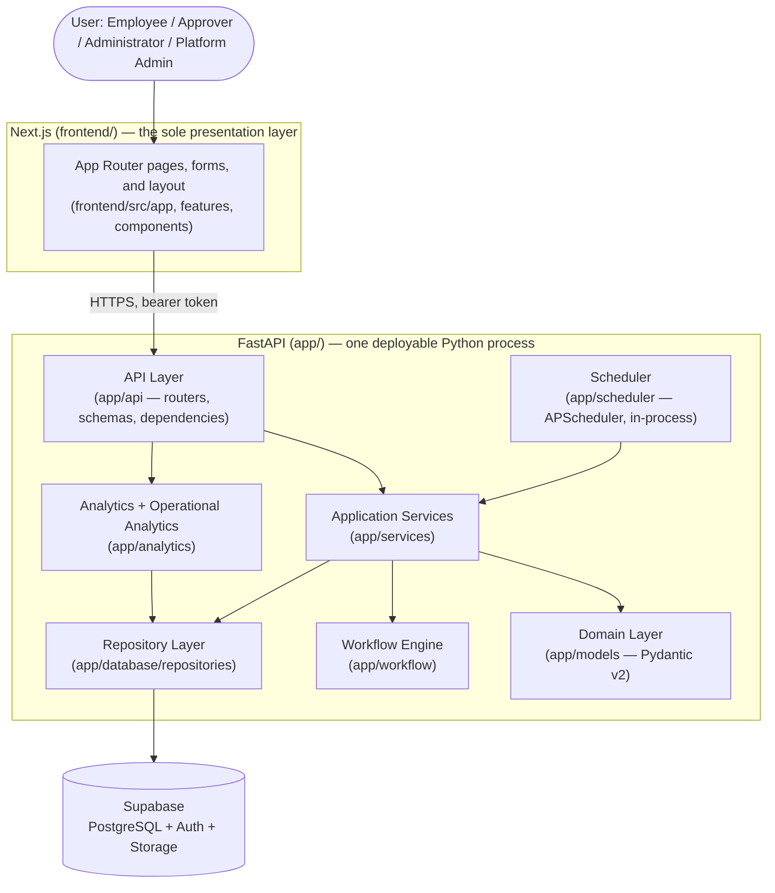

# Enterprise Automation Hub (EAH)

[](https://github.com/ayeshashahzad565-dev/enterprise-automation-hub/actions/workflows/ci.yml)
[](https://www.python.org/downloads/release/python-3110/)
[](https://nextjs.org/)
[](https://supabase.com/)
[](https://docs.pydantic.dev/latest/)
[](https://github.com/ayeshashahzad565-dev/enterprise-automation-hub/actions/workflows/e2e.yml)
[](#running-tests)
[](#license)
[](#architecture-overview)

**Enterprise Automation Hub (EAH)** is a modular monolithic application for managing internal business requests, configurable multi-stage approval workflows, and organizational automation — a FastAPI backend and Supabase-managed database behind a versioned REST API (`/api/v1`), with a Next.js/React frontend as the sole presentation layer. It is multi-tenant: every company (organization) using EAH is fully data-isolated from every other, enforced both in application code and via PostgreSQL Row-Level Security.

This repository is documented to enterprise architecture standards: every design decision below is traceable to a corresponding architecture document in [`/docs`](#documentation-index), and nothing described here goes beyond what those documents specify.

---

## Table of Contents

- [Overview](#overview)
- [Key Features](#key-features)
- [Architecture Overview](#architecture-overview)
- [Technology Stack](#technology-stack)
- [Repository Structure](#repository-structure)
- [Installation](#installation)
- [Environment Setup](#environment-setup)
- [Running Locally](#running-locally)
- [Running Tests](#running-tests)
- [Project Configuration](#project-configuration)
- [Documentation Index](#documentation-index)
- [Security](#security)
- [Contributing](#contributing)
- [License](#license)
- [Roadmap](#roadmap)
- [Future Enhancements](#future-enhancements)

---

## Overview

EAH lets an organization define approval workflows as configuration rather than code, submit and track requests against those workflows, and give employees, approvers, and administrators a single interface for the entire request lifecycle — submission, discussion, attachments, multi-stage approval, escalation, and completion — with a full, immutable audit trail behind every action.

The backend is deliberately architected as a **modular monolith**: one deployable FastAPI application with strict internal layering (Application → Domain → Repository → Database), rather than a distributed set of services, sitting behind a separately deployed Next.js/React frontend. This keeps the system operable by a small team while still enforcing the separation of concerns, type safety, and testability expected of a production system.

## Key Features

- **Configurable, versioned approval workflows** — approval chains are authored as JSON, not hard-coded, and are resolved and pinned per request at submission time so in-flight requests are never affected by a later configuration change.
- **Role-based access control** — three roles (`employee`, `approver`, `admin`), enforced both in application code and at the database level via PostgreSQL Row-Level Security.
- **Immutable audit trail** — every state-changing action is recorded in an append-only audit log; no code path, including administrative ones, can update or delete an audit entry.
- **Optimistic concurrency control** — every mutable table carries a row-version column, so concurrent approval attempts and profile edits are detected and rejected safely rather than silently lost.
- **Escalation and reminders** — an in-process scheduler reassigns overdue approval stages and sends reminder notifications, including email, without any external job queue.
- **Threaded comments and attachments** — contextual discussion and file uploads scoped to each request, backed by Supabase Storage with checksum validation and sanitized storage paths.
- **In-app and email notifications** — every notification is persisted and mirrored as an email as part of the baseline experience, not a future add-on.
- **Executive and operational analytics** — request volume, approval throughput, SLA compliance, bottleneck detection, approval-delay tracking, workload distribution, and executive KPIs, visualized in the Next.js frontend.
- **Multi-tenancy** — every company is a first-class, isolated tenant: users, requests, workflow definitions, and analytics are scoped to a company at both the application and database (RLS) level.
- **Platform administration** — a platform-admin-only surface (`profiles.is_platform_admin`, orthogonal to the per-company role) for company lifecycle management (create/suspend/delete/restore, settings, license metadata), cross-tenant statistics, platform health, and a platform-wide audit history/activity timeline — see [Platform Administration](docs/platform_administration.md).
- **Enterprise-wide search** — fuzzy, filterable, keyboard-first search (`Cmd/Ctrl+K` command palette and a dedicated `/search` page) across requests, workflows, users, departments, notifications, audit logs, and attachments, backed by Postgres trigram and full-text indexes, with backend-persisted saved filters and search history — see [Enterprise-Wide Search](docs/enterprise_search.md).
- **AI-generated insights** — request/approval summaries, workflow-improvement and policy recommendations, bottleneck/operational-insight explanations, executive summaries, and a natural-language dashboard assistant, behind a swappable multi-provider (OpenAI/Anthropic) abstraction with graceful, deterministic fallback whenever no provider is configured or a call fails — see [AI Integration](docs/ai_integration.md).
- **Self-service invitation flow** — administrators invite users by email; acceptance provisions a Supabase Auth account and profile scoped to the inviting company.
- **A fully specified REST contract** — every operation the frontend performs is served by a versioned API (`/api/v1`) over HTTP, documented independently of any single client.

## Architecture Overview

EAH follows a strict layered architecture. Each layer depends only on the layer beneath it; the Domain layer has no outward dependencies at all.



- **Frontend (`frontend/`)** — a Next.js/React application (App Router, TanStack Query, Tailwind CSS) and the sole presentation layer; it holds no business logic and calls the backend exclusively through the versioned REST API, authenticating with a Supabase-issued bearer token.
- **API Layer (`app/api`)** — FastAPI routers, Pydantic request/response schemas, and dependency-injected authentication/authorization; every route delegates to an Application Service and contains no business logic of its own.
- **Application Services (`app/services`)** — orchestrate use cases (`RequestService`, `ApprovalService`, `CommentService`, `AttachmentService`, `NotificationService`, `InvitationService`, `CompanyService`, and others).
- **Domain Layer (`app/models`)** — Pydantic v2 models defining valid data shapes and invariants; zero external dependencies.
- **Workflow Engine (`app/workflow`)** — resolves active workflow definitions, generates approval stages incrementally, resolves assignments, and plans escalation.
- **Repository Layer (`app/database/repositories`)** — the only layer that talks to Supabase; translates between domain models and the database, and is where every tenant (`company_id`) scoping filter is applied.
- **Scheduler (`app/scheduler`)** — runs escalation checks and reminder dispatch in-process, on the single instance configured as leader (`SCHEDULER_LEADER=true`).
- **Analytics (`app/analytics`)** — the base multi-tenant analytics engine plus the Operational Analytics engine built on top of it (SLA, bottlenecks, workload, trends, executive KPIs, department comparisons), all company-scoped.

Full rationale for every layer, component, and design decision is documented in the [Architecture Design Document](docs/architecture.md) and [Workflow Engine Design Document](docs/workflow_engine.md).

## Technology Stack

| Layer | Technology |
|---|---|
| Language / Runtime | Python 3.11+ (backend), Node.js 22+ (frontend) |
| API | FastAPI |
| UI | Next.js (App Router) / React, TanStack Query, Tailwind CSS |
| Data Validation | Pydantic v2 |
| Database | Supabase-managed PostgreSQL |
| Authentication | Supabase Auth (GoTrue) |
| File Storage | Supabase Storage |
| Background Jobs | APScheduler (in-process) |
| Data Visualization | Recharts |
| Testing | pytest (backend), Vitest (frontend unit/component), Playwright (browser end-to-end), ESLint + tsc |
| Schema Migrations | Alembic |

No message broker, container orchestration platform, distributed cache, or microservices architecture is used anywhere in this system — see the [Architecture Design Document](docs/architecture.md) for the full rationale behind keeping this a modular monolith.

## Repository Structure

```
app/
├── api/                 # FastAPI app factory, routers, request/response schemas, rate limiting
├── services/            # Application Services — orchestrate use cases
├── models/              # Pydantic v2 domain models, enums, and value objects
├── database/
│   ├── repositories/    # Data access layer — the only layer that talks to Supabase
│   └── migrations/      # Alembic migrations (schema, RLS policies, indexes)
├── workflow/            # Workflow Engine — definition resolution, stage generation, assignment
├── scheduler/           # APScheduler job definitions (escalation, reminders)
├── analytics/           # Analytics + Operational Analytics engines
├── auth/                # Authentication, authorization (RBAC), token verification
├── notifications/       # Email dispatch (SMTP)
├── config/              # Configuration loading, environment detection, constants
└── utils/               # Small, stateless, reusable helpers

frontend/
├── src/app/             # Next.js App Router pages
├── src/features/        # Feature-scoped hooks and components (analytics, requests, admin, ...)
├── src/components/      # Shared UI primitives and design-system patterns
├── src/services/        # Typed HTTP clients for the backend REST API
├── src/types/           # Frontend-owned TypeScript types (independent of backend schemas)
└── e2e/                 # Playwright browser end-to-end suite (specs, fixtures, auth setup)

tests/
├── unit/          # Fast, isolated tests — services, workflow engine, models, utils, API contracts
├── integration/   # Repository, Supabase, and scheduler tests against a real test database
├── security/      # RBAC, RLS, and injection-prevention tests
├── performance/   # Load, stress, and concurrency tests
└── acceptance/    # SRS-traced full-lifecycle scenarios through the real service
                   #   and Workflow Engine classes, wired to in-memory fakes
                   #   (browser end-to-end lives in frontend/e2e/)

docs/              # Full architecture documentation set (see below)
scripts/           # Database bootstrap, reset, and demo-data seed scripts
```

## Installation

**Prerequisites:** Python 3.11+, Node.js 22+, a Supabase project (see [Environment Setup](#environment-setup)), and `pip`/`npm`.

```bash
# Clone the repository
git clone https://github.com/<your-org>/enterprise-automation-hub.git
cd enterprise-automation-hub

# Backend: create and activate a virtual environment
python3.11 -m venv .venv
source .venv/bin/activate  # Windows: .venv\Scripts\activate

# Install backend dependencies
pip install -e ".[dev]"

# Install frontend dependencies
cd frontend && npm install && cd ..
```

## Environment Setup

The backend loads all configuration through a single Configuration Loader at startup — no component reads environment variables directly. Copy the example file and populate it with your Supabase project's values:

```bash
cp .env.example .env
```

| Variable | Description |
|---|---|
| `APP_ENVIRONMENT` | `development` \| `testing` \| `staging` \| `production` — gates hardening behavior (interactive API docs, rate limiting, email) |
| `SUPABASE_URL` | Your Supabase project's API URL |
| `SUPABASE_ANON_KEY` | Client-facing key, subject to Row-Level Security |
| `SUPABASE_SERVICE_ROLE_KEY` | Elevated, server-side-only key — never expose this to a browser context |
| `SMTP_HOST`, `SMTP_PORT`, `SMTP_USERNAME`, `SMTP_PASSWORD` | Email dispatch configuration for the Notification Service |
| `SCHEDULER_LEADER` | `true` on exactly one running instance, to enable background job registration |
| `SCHEDULER_ESCALATION_INTERVAL_MINUTES`, `SCHEDULER_REMINDER_INTERVAL_HOURS` | Scheduler job intervals |
| `RATE_LIMIT_READ_PER_MINUTE`, `RATE_LIMIT_WRITE_PER_MINUTE`, `RATE_LIMIT_UPLOAD_PER_MINUTE`, `RATE_LIMIT_NOTIFICATION_POLL_PER_MINUTE` | Per-authenticated-user rate limits, enforced on every API route |
| `CORS_ALLOWED_ORIGINS` | Comma-separated list of allowed frontend origins |
| `LOG_LEVEL` | Logging verbosity |

The frontend has its own, separate environment file:

```bash
cp frontend/.env.local.example frontend/.env.local
```

| Variable | Description |
|---|---|
| `NEXT_PUBLIC_SUPABASE_URL`, `NEXT_PUBLIC_SUPABASE_ANON_KEY` | Same Supabase project, browser-safe anon key only |
| `NEXT_PUBLIC_API_BASE_URL` | The backend's base URL, defaults to `http://localhost:8000/api/v1` for local development |

**Deploying the frontend separately from the backend** (e.g. frontend on Vercel, backend on a container host): set all three `NEXT_PUBLIC_*` variables above as environment variables in that platform's project settings — they are inlined into the JS bundle at `next build` time, so they must be present *before* the build runs, not just at runtime. `NEXT_PUBLIC_API_BASE_URL` must include the `/api/v1` suffix, e.g. `https://your-backend-host.example.com/api/v1`. Omitting it silently falls back to `http://localhost:8000/api/v1`, which only works when the browser itself can reach that address (i.e. never in a deployed environment).

Apply the database schema before first run:

```bash
alembic upgrade head
```

Full configuration reference, secret-handling guidance, and multi-instance considerations are documented in the [Deployment Guide](docs/deployment.md).

## Running Locally

```bash
# Backend API (from the repository root)
uvicorn app.api.main:create_app --factory --reload

# Frontend (in a separate terminal)
cd frontend
npm run dev
```

The backend registers the Escalation Check and Reminder Dispatch jobs in-process if `SCHEDULER_LEADER=true`. Interactive API docs are available at `/api/docs` in Development/Testing only — disabled in Staging/Production. Navigate to the frontend's local URL (`http://localhost:3000` by default) and sign in via Supabase Auth.

## Running with Docker

An alternative to the above — nothing about running directly on the host changes.

```bash
cp .env.example .env
cp frontend/.env.local.example frontend/.env.local

# Local development (hot-reload, bind-mounted source):
docker compose -f docker-compose.development.yml up --build

# Production-shaped stack (backend, worker-default, worker-escalation, frontend, Redis, Prometheus, Grafana):
docker compose -f docker-compose.production.yml up -d --build
```

Redis is optional in both — every rate limiter, the analytics cache, and the job system (background email/invitation delivery, escalation, reminders — retry/backoff/dead-letter, priority; see `app/jobs/`) fall back to their original single-process/synchronous behavior when `REDIS_URL` is unset. See the [Docker Deployment Guide](docs/docker_deployment.md) for the full command reference, migrations, scaling, and troubleshooting, and [Job System Migration Notes](docs/job_system_migration.md) if upgrading an existing deployment.

## Running Tests

```bash
# Backend: fast unit suite — no database required (also runs API contract
# tests, against in-memory fakes, not a real Supabase project)
pytest tests/unit

# Backend: full suite, including integration tests against a disposable
# test database (skipped automatically if TEST_SUPABASE_URL etc. are unset)
pytest

# Backend: with coverage
pytest --cov=app --cov-report=term-missing

# Frontend: lint, type-check, unit/component tests, production build
cd frontend
npm run lint
npm run typecheck
npm test
npm run build
```

The Playwright browser suite needs a real Supabase stack, because both the frontend (`supabase.auth.signInWithPassword`) and the backend (`SupabaseTokenVerifier`) delegate authentication to a real project — there is no local-JWT shortcut it can use instead. Bring up an ephemeral local stack, migrate and seed it, then run the suite:

```bash
# From the repository root: start, migrate, and seed the local Supabase stack
supabase start
alembic upgrade head
python scripts/seed_e2e_fixtures.py

# Frontend: browser end-to-end suite (first run only: install the browser)
cd frontend
npx playwright install --with-deps chromium
npm run test:e2e        # or: npm run test:e2e:ui for the interactive runner
```

Once Supabase is up and seeded, `npm run test:e2e` is the only command needed: `playwright.config.ts` boots the two remaining dependencies itself — the FastAPI backend and a production Next.js build, not `next dev`, so the suite exercises the same artifact CI/CD actually ships. See [`frontend/e2e/README.md`](frontend/e2e/README.md) for the full local workflow.

Backend unit tests cover Application Services, the Workflow Engine, Domain models, utilities, and every API route's contract in isolation, using in-memory fake repositories — no network dependency. Integration, security, and performance tests require a migrated, disposable Supabase test project (`TEST_SUPABASE_URL`, `TEST_SUPABASE_SERVICE_ROLE_KEY`, `TEST_DATABASE_URL`) and are skipped when it isn't configured. The Playwright suite in `frontend/e2e/` covers authentication, the dashboard, request submission, approvals, analytics, platform administration, session expiry, error handling, and cross-tenant isolation, driving a real browser against the assembled stack. The complete testing strategy — including transaction, concurrency, optimistic-locking, tenant-isolation, and RLS verification — is documented in the [Testing Strategy Document](docs/testing_strategy.md).

Each suite runs in its own CI workflow: [`ci.yml`](.github/workflows/ci.yml) (lint, type checks, backend unit tests, frontend unit tests and build), [`integration.yml`](.github/workflows/integration.yml) (backend integration tests), and [`e2e.yml`](.github/workflows/e2e.yml) (the Playwright suite against an ephemeral Supabase stack, publishing an HTML report as a build artifact).

## Project Configuration

- **Workflow definitions** are authored as JSON (not YAML) and stored in the `workflow_definitions` table, versioned per request type. See the [Database Schema Design Document](docs/database_schema.md) for the JSON schema and the [Workflow Engine Design Document](docs/workflow_engine.md) for how definitions are resolved and executed.
- **Role assignment** (`employee`, `approver`, `admin`) is managed through user profiles and enforced by application-level checks; a verified subset of tables additionally run under real PostgreSQL RLS enforcement — see the [Tenant Isolation Architecture](docs/tenant_isolation.md) document for exactly which, and why the rest are hardened differently.
- **Notifications** are configured to be delivered in-app and via email by default; SMS and additional channels are documented as future extensions, not current behavior.

## Documentation Index

This repository's full architecture documentation lives in `/docs`. Each document is the authoritative source for its respective concern; this README summarizes, but does not replace, them. Several of these documents predate the FastAPI + Next.js rewrite and carry a "Superseded note" at the top correcting their stack description — the requirements/design substance below that note remains current.

| Document | Covers |
|---|---|
| [Requirements](docs/requirements.md) | Functional and non-functional requirements |
| [Architecture](docs/architecture.md) | Layering, components, design principles, security and scalability philosophy |
| [Database Schema](docs/database_schema.md) | Table structure, constraints, RLS policies, transactions, indexing |
| [Tenant Isolation Architecture](docs/tenant_isolation.md) | The dual-client model: which repositories run under real per-request RLS enforcement vs. the service-role client, why, and the mechanical/CI-enforced safeguards for the latter |
| [API Design](docs/api_design.md) | The full REST contract, resource schemas, error codes, rate limiting, and state transitions |
| [Workflow Engine Design](docs/workflow_engine.md) | Workflow Engine internals, stage generation, assignment resolution, escalation, versioning |
| [Approval Recovery Strategy](docs/approval_recovery_strategy.md) | Every write in the approval/rejection/escalation flow, its compensation (or why it has none), idempotency and retry-safety guarantees, and the one known race-window limitation |
| [Testing Strategy](docs/testing_strategy.md) | Unit, integration, API, database, workflow, security, performance, and browser end-to-end testing strategy, the CI workflow map, and the disclosed coverage gaps |
| [Deployment Guide](docs/deployment.md) | Deployment topology, environment configuration, migrations, monitoring, backup, and recovery |
| [Scheduler Distributed Coordination](docs/scheduler_distributed_coordination.md) | Redis-backed leader election and per-job distributed locking for multi-instance Scheduler deployments: the two lock primitives, automatic crash/failover recovery, and the one disclosed split-brain edge case |
| [Docker Deployment Guide](docs/docker_deployment.md) | Command-level guide: building/running images and Compose stacks, migrations, the job system's background workers, Prometheus/Grafana, CD, troubleshooting |
| [Job System Migration Notes](docs/job_system_migration.md) | Upgrading an existing deployment to the Redis+Postgres-backed job system: required migration, Compose topology change, behavior changes |
| [Platform Administration](docs/platform_administration.md) | Platform-admin-only company lifecycle (create/suspend/delete), enforcement semantics, license/feature-flag scope, platform stats/health/audit |
| [Enterprise-Wide Search](docs/enterprise_search.md) | Cross-entity search entity coverage, trigram/full-text indexing rationale, pagination bounds, saved filters/history data model |
| [AI Integration](docs/ai_integration.md) | Provider abstraction, multi-provider config, graceful fallback design, caching, authorization, and the full `/ai/*` endpoint reference |
| [Design Philosophy](docs/design_philosophy.md) | Frontend interaction principles and page-level design conventions |
| [Deployment Checklist](docs/deployment_checklist.md) | The practical pre-deploy, deploy, and post-deploy checklist for taking a specific commit to production, plus the dependency-pinning and image-scanning guarantees behind it |

## Security

- **Authentication** is delegated entirely to Supabase Auth; no password handling or session storage is implemented by this application.
- **Authorization** is enforced twice — once in application code, once independently via PostgreSQL Row-Level Security — so a defect in either layer alone does not expose unauthorized data.
- **Multi-tenancy** is enforced at both layers too: every tenant-scoped repository query filters by `company_id`, and RLS policies apply the same boundary independently.
- **Rate limiting** is enforced per authenticated user (per IP for the two unauthenticated invitation endpoints) across every read, write, upload, and administrative route.
- **Audit logging** is immutable and append-only at the database grant level; no role, including administrator, can update or delete an audit entry.
- **Secrets** are never committed to source control; the Supabase service-role key is confined to server-side code paths and is never reachable from the browser.
- **File uploads** are validated by content-type allow-list, size limit (checked incrementally as the upload streams in, not after buffering it in full), MIME sniffing, and checksum, with sanitized, request-scoped storage paths.

See the [Architecture Design Document](docs/architecture.md), [Database Schema Design Document](docs/database_schema.md), and [Deployment Guide](docs/deployment.md) for full detail. If you discover a security issue, please report it privately rather than opening a public issue.

## Contributing

Contributions are welcome. Before opening a pull request:

1. Review the [Architecture Design Document](docs/architecture.md) — changes should preserve the existing layering and modular monolith design rather than introduce new infrastructure or patterns.
2. Ensure new code is placed in the correct layer per [Repository Structure](#repository-structure); business logic belongs in `app/services` or `app/workflow`, never in `app/api` route handlers or the frontend.
3. Add or update tests per the [Testing Strategy Document](docs/testing_strategy.md) — new behavior should be traceable to a specific test category, and every fixed defect should include a regression test.
4. Run the full test suite locally before submitting — `pytest` for the backend, `npm run lint && npm run typecheck && npm test && npm run build` for the frontend, and `npm run test:e2e` for the Playwright suite if your change touches a user-facing flow (see [Running Tests](#running-tests) for its Supabase prerequisites).
5. Keep documentation in `/docs` consistent with any architectural change — this project treats its architecture documents as a source of truth, not after-the-fact description.

## License

This project is licensed under the MIT License. See [`LICENSE`](LICENSE) for details.

## Roadmap

The following extensions are anticipated by the existing architecture and are documented as deliberate, additive future work — not implemented in the current baseline:

- **Parallel approval stages** — multiple simultaneous reviewers required before a workflow advances.
- **Conditional branching** — stages that are automatically skipped based on request attributes.
- **Manager hierarchy modeling** — a proper reporting-line relationship in user profiles, replacing the current department-based approximation for manager assignment.
- **Dynamic workflow generation** — programmatically generated approval chains (e.g., based on monetary thresholds).
- **Additional notification channels** — Slack and Microsoft Teams integration alongside the existing in-app and email notifications.

## Future Enhancements

- **GraphQL and WebSocket support** — alternative query and real-time delivery interfaces layered over the same Application Services.
- **Mobile client support** — enabled by the API's transport-agnostic design.
- **Self-service company sign-up** — company creation is currently platform-admin-gated (via a narrow `/platform/companies` API surface); a self-serve flow is a natural, additive extension.

Two items previously listed here have since shipped and are no longer future work: **dynamic, Redis-backed scheduler leader election** (replacing the original static `SCHEDULER_LEADER=true`-only design — see [Scheduler Distributed Coordination](docs/scheduler_distributed_coordination.md)) and **containerized deployment** (`Dockerfile`, `docker-compose.production.yml`, and the CI/CD pipeline under `.github/workflows/` — see the [Deployment Guide](docs/deployment.md)).

For the rationale behind GraphQL/WebSocket support and mobile clients, see the *Future Evolution* section of the [API Design](docs/api_design.md) document (Section 32); for the current platform-admin-only company-creation gating that self-service sign-up would replace, see [Platform Administration](docs/platform_administration.md).