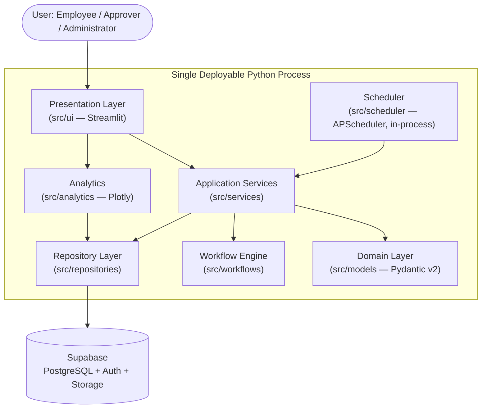

# Enterprise Automation Hub (EAH)

[](https://www.python.org/downloads/release/python-3110/)
[](https://streamlit.io/)
[](https://supabase.com/)
[](https://docs.pydantic.dev/latest/)
[](https://docs.pytest.org/)
[](#license)
[](#architecture-overview)

**Enterprise Automation Hub (EAH)** is a modular monolithic application for managing internal business requests, configurable multi-stage approval workflows, and organizational automation — built as a single, maintainable Python codebase on top of Streamlit and Supabase.

This repository is documented to enterprise architecture standards: every design decision below is traceable to a corresponding architecture document in [`/docs`](#documentation-index), and nothing described here goes beyond what those documents specify.

---

## Table of Contents

- [Overview](#overview)
- [Key Features](#key-features)
- [Architecture Overview](#architecture-overview)
- [Technology Stack](#technology-stack)
- [Repository Structure](#repository-structure)
- [Installation](#installation)
- [Environment Setup](#environment-setup)
- [Running Locally](#running-locally)
- [Running Tests](#running-tests)
- [Project Configuration](#project-configuration)
- [Documentation Index](#documentation-index)
- [Security](#security)
- [Contributing](#contributing)
- [License](#license)
- [Roadmap](#roadmap)
- [Future Enhancements](#future-enhancements)

---

## Overview

EAH lets an organization define approval workflows as configuration rather than code, submit and track requests against those workflows, and give employees, approvers, and administrators a single interface for the entire request lifecycle — submission, discussion, attachments, multi-stage approval, escalation, and completion — with a full, immutable audit trail behind every action.

The system is deliberately architected as a **modular monolith**: one deployable Python application with strict internal layering (Presentation → Application → Domain → Repository → Database), rather than a distributed set of services. This keeps the system operable by a small team while still enforcing the separation of concerns, type safety, and testability expected of a production system.

## Key Features

- **Configurable, versioned approval workflows** — approval chains are authored as JSON, not hard-coded, and are resolved and pinned per request at submission time so in-flight requests are never affected by a later configuration change.
- **Role-based access control** — three roles (`employee`, `approver`, `admin`), enforced both in application code and at the database level via PostgreSQL Row-Level Security.
- **Immutable audit trail** — every state-changing action is recorded in an append-only audit log; no code path, including administrative ones, can update or delete an audit entry.
- **Optimistic concurrency control** — every mutable table carries a row-version column, so concurrent approval attempts and profile edits are detected and rejected safely rather than silently lost.
- **Escalation and reminders** — an in-process scheduler reassigns overdue approval stages and sends reminder notifications, including email, without any external job queue.
- **Threaded comments and attachments** — contextual discussion and file uploads scoped to each request, backed by Supabase Storage with checksum validation and sanitized storage paths.
- **In-app and email notifications** — every notification is persisted and mirrored as an email as part of the baseline experience, not a future add-on.
- **Analytics dashboards** — request volume, approval throughput, and completion metrics visualized with Plotly, pre-aggregated nightly for fast dashboard loads.
- **A fully specified REST contract** — every operation the UI performs is independently documented as a versioned API (`/api/v1`), even though it currently executes as an in-process call, so the same contract can be exposed over HTTP without redesigning the application layer.

## Architecture Overview

EAH follows a strict layered architecture. Each layer depends only on the layer beneath it; the Domain layer has no outward dependencies at all.



- **Presentation Layer** — Streamlit pages and forms; delegates every meaningful action to Application Services and contains no business logic.
- **Application Services** — orchestrate use cases (`RequestService`, `ApprovalService`, `CommentService`, `AttachmentService`, `AuditService`, `NotificationService`, `AnalyticsService`, `AuthService`).
- **Domain Layer** — Pydantic v2 models defining valid data shapes and invariants; zero external dependencies.
- **Workflow Engine** — resolves active workflow definitions, generates approval stages incrementally, resolves assignments, and plans escalation.
- **Repository Layer** — the only layer that talks to Supabase; translates between domain models and the database.
- **Scheduler** — runs escalation checks, reminder dispatch, and nightly analytics aggregation in-process, alongside the Streamlit application.

Full rationale for every layer, component, and design decision is documented in the [Architecture Design Document](docs/ADD.md) and [Workflow Engine Design Document](docs/WEDD.md).

## Technology Stack

| Layer | Technology |
|---|---|
| Language / Runtime | Python 3.11 |
| UI | Streamlit |
| Data Validation | Pydantic v2 |
| Database | Supabase-managed PostgreSQL |
| Authentication | Supabase Auth (GoTrue) |
| File Storage | Supabase Storage |
| Background Jobs | APScheduler (in-process) |
| Data Visualization | Plotly |
| Testing | pytest |
| Schema Migrations | Alembic |

No message broker, container orchestration platform, distributed cache, or microservices architecture is used anywhere in this system — see the [Architecture Design Document](docs/ADD.md) for the full rationale behind keeping this a modular monolith.

## Repository Structure

```
src/
├── ui/            # Streamlit pages, forms, and layout (Presentation Layer)
├── services/      # Application Services — orchestrate use cases
├── models/        # Pydantic v2 domain models, enums, and value objects
├── repositories/  # Data access layer — the only layer that talks to Supabase
├── workflows/     # Workflow Engine — definition resolution, stage generation, assignment
├── scheduler/      # APScheduler job definitions (escalation, reminders, analytics)
├── analytics/     # Data aggregation and shaping for Plotly dashboards
└── utils/         # Configuration loading and small stateless helpers

tests/
├── unit/          # Fast, isolated tests — services, workflow engine, models, utils
├── integration/   # Repository, Supabase, and scheduler tests against a real test database
├── api/           # Contract tests against the documented REST specification
├── security/      # RBAC, RLS, and injection-prevention tests
├── performance/   # Load, stress, and concurrency tests
└── acceptance/    # End-to-end scenarios traced to the SRS

docs/              # Full architecture documentation set (see below)
```

## Installation

**Prerequisites:** Python 3.11, a Supabase project (see [Environment Setup](#environment-setup)), and `pip`.

```bash
# Clone the repository
git clone https://github.com/<your-org>/enterprise-automation-hub.git
cd enterprise-automation-hub

# Create and activate a virtual environment
python3.11 -m venv .venv
source .venv/bin/activate  # Windows: .venv\Scripts\activate

# Install dependencies
pip install -r requirements.txt
```

## Environment Setup

EAH loads all configuration through a single Configuration Loader at startup — no component reads environment variables directly. Copy the example file and populate it with your Supabase project's values:

```bash
cp .env.example .env
```

| Variable | Description |
|---|---|
| `SUPABASE_URL` | Your Supabase project's API URL |
| `SUPABASE_ANON_KEY` | Client-facing key, subject to Row-Level Security |
| `SUPABASE_SERVICE_ROLE_KEY` | Elevated, server-side-only key — never expose this to a browser context |
| `SMTP_HOST`, `SMTP_PORT`, `SMTP_USERNAME`, `SMTP_PASSWORD` | Email dispatch configuration for the Notification Service |
| `SCHEDULER_LEADER` | `true` on exactly one running instance, to enable background job registration |
| `SCHEDULER_ESCALATION_INTERVAL`, `SCHEDULER_REMINDER_INTERVAL` | Scheduler job intervals |
| `LOG_LEVEL` | Logging verbosity |
| `STREAMLIT_SERVER_ADDRESS`, `STREAMLIT_SERVER_PORT` | Streamlit bind configuration |

Apply the database schema before first run:

```bash
alembic upgrade head
```

Full configuration reference, secret-handling guidance, and multi-instance considerations are documented in the [Deployment Guide](docs/DG.md).

## Running Locally

```bash
streamlit run src/ui/app.py
```

This starts the Streamlit server and, if `SCHEDULER_LEADER=true`, registers the Escalation Check, Reminder Dispatch, and Nightly Analytics Aggregation jobs in-process. Navigate to the local URL Streamlit prints on startup and sign in via Supabase Auth.

## Running Tests

```bash
# Fast unit suite — no database required
pytest tests/unit

# Full suite, including integration tests against a disposable test database
pytest

# With coverage
pytest --cov=src --cov-report=term-missing
```

Unit tests cover Application Services, the Workflow Engine, Domain models, and utilities in isolation. Integration, API, database, workflow, security, and performance tests require a migrated, disposable Supabase test project. The complete testing strategy — including transaction, concurrency, optimistic-locking, and RLS verification — is documented in the [Testing Strategy Document](docs/TSD.md).

## Project Configuration

- **Workflow definitions** are authored as JSON (not YAML) and stored in the `workflow_definitions` table, versioned per request type. See the [Database Schema Design Document](docs/DSD.md) for the JSON schema and the [Workflow Engine Design Document](docs/WEDD.md) for how definitions are resolved and executed.
- **Role assignment** (`employee`, `approver`, `admin`) is managed through user profiles and enforced by both application-level checks and PostgreSQL RLS policies.
- **Notifications** are configured to be delivered in-app and via email by default; SMS and additional channels are documented as future extensions, not current behavior.

## Documentation Index

This repository's full architecture documentation lives in `/docs`. Each document is the authoritative source for its respective concern; this README summarizes, but does not replace, them.

| Document | Covers |
|---|---|
| [Software Requirements Specification (SRS)](docs/SRS.md) | Functional and non-functional requirements |
| [Architecture Design Document (ADD)](docs/ADD.md) | Layering, components, design principles, security and scalability philosophy |
| [Database Schema Design Document (DSD)](docs/DSD.md) | Table structure, constraints, RLS policies, transactions, indexing |
| [API Design Document (API-ADD)](docs/API-ADD.md) | The full REST contract, resource schemas, error codes, and state transitions |
| [Workflow Engine Design Document (WEDD)](docs/WEDD.md) | Workflow Engine internals, stage generation, assignment resolution, escalation, versioning |
| [Testing Strategy Document (TSD)](docs/TSD.md) | Unit, integration, API, database, workflow, security, and performance testing strategy |
| [Deployment Guide (DG)](docs/DG.md) | Deployment topology, environment configuration, migrations, monitoring, backup, and recovery |

## Security

- **Authentication** is delegated entirely to Supabase Auth; no password handling or session storage is implemented by this application.
- **Authorization** is enforced twice — once in application code, once independently via PostgreSQL Row-Level Security — so a defect in either layer alone does not expose unauthorized data.
- **Audit logging** is immutable and append-only at the database grant level; no role, including administrator, can update or delete an audit entry.
- **Secrets** are never committed to source control; the Supabase service-role key is confined to server-side code paths and is never reachable from the browser.
- **File uploads** are validated by content-type allow-list, size limit, MIME sniffing, and checksum, with sanitized, request-scoped storage paths.

See the [Architecture Design Document](docs/ADD.md#security-architecture), [Database Schema Design Document](docs/DSD.md#row-level-security), and [Deployment Guide](docs/DG.md#security-hardening) for full detail. If you discover a security issue, please report it privately rather than opening a public issue.

## Contributing

Contributions are welcome. Before opening a pull request:

1. Review the [Architecture Design Document](docs/ADD.md) — changes should preserve the existing layering and modular monolith design rather than introduce new infrastructure or patterns.
2. Ensure new code is placed in the correct layer per [Repository Structure](#repository-structure); business logic belongs in `src/services` or `src/workflows`, never in `src/ui`.
3. Add or update tests per the [Testing Strategy Document](docs/TSD.md) — new behavior should be traceable to a specific test category, and every fixed defect should include a regression test.
4. Run the full test suite locally (`pytest`) before submitting.
5. Keep documentation in `/docs` consistent with any architectural change — this project treats its architecture documents as a source of truth, not after-the-fact description.

## License

This project is licensed under the MIT License. See [`LICENSE`](LICENSE) for details.

## Roadmap

The following extensions are anticipated by the existing architecture and are documented as deliberate, additive future work — not implemented in the current baseline:

- **Parallel approval stages** — multiple simultaneous reviewers required before a workflow advances.
- **Conditional branching** — stages that are automatically skipped based on request attributes.
- **Manager hierarchy modeling** — a proper reporting-line relationship in user profiles, replacing the current department-based approximation for manager assignment.
- **Dynamic workflow generation** — programmatically generated approval chains (e.g., based on monetary thresholds).
- **Additional notification channels** — Slack and Microsoft Teams integration alongside the existing in-app and email notifications.

## Future Enhancements

- **REST API exposed over HTTP** — the API contract is already fully specified; a thin network-facing entry point could expose it without any change to the Application layer.
- **GraphQL and WebSocket support** — alternative query and real-time delivery interfaces layered over the same Application Services.
- **Mobile client support** — enabled by the API's transport-agnostic design.
- **Multi-tenancy** — additive schema and Row-Level Security extensions, not a redesign.
- **Dynamic scheduler leader election** — replacing the current static leader configuration with a lightweight, database-backed mechanism, without introducing external coordination infrastructure.

For the full rationale behind each of these, see the *Future Evolution* sections of the [ADD](docs/ADD.md), [DSD](docs/DSD.md), [API-ADD](docs/API-ADD.md), [WEDD](docs/WEDD.md), and [Deployment Guide](docs/DG.md).