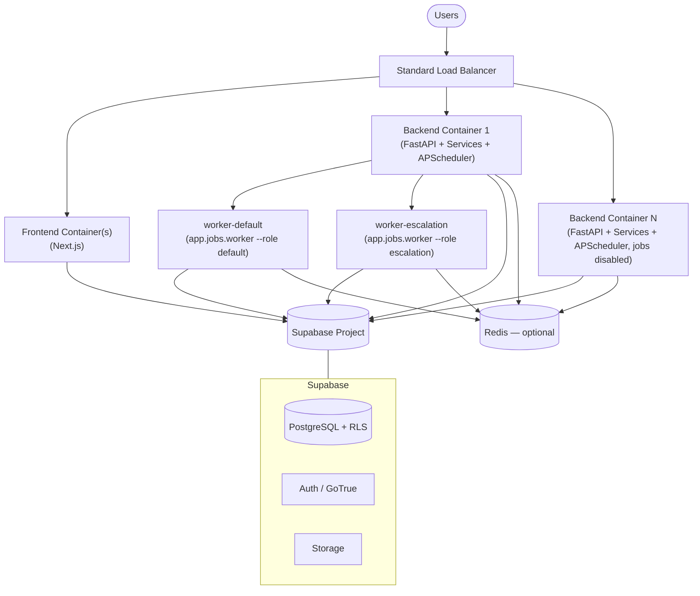
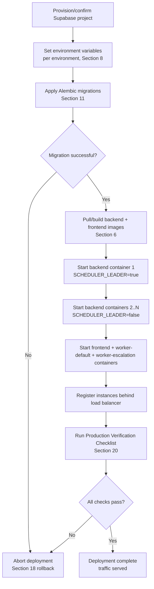
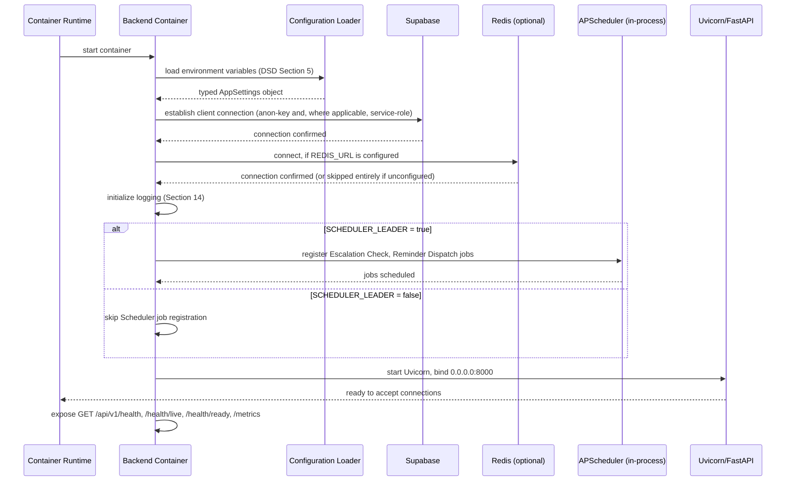
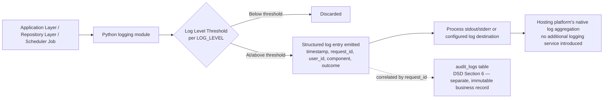
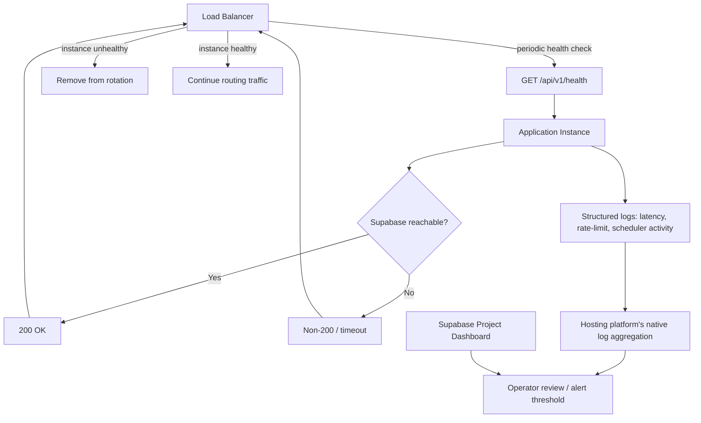
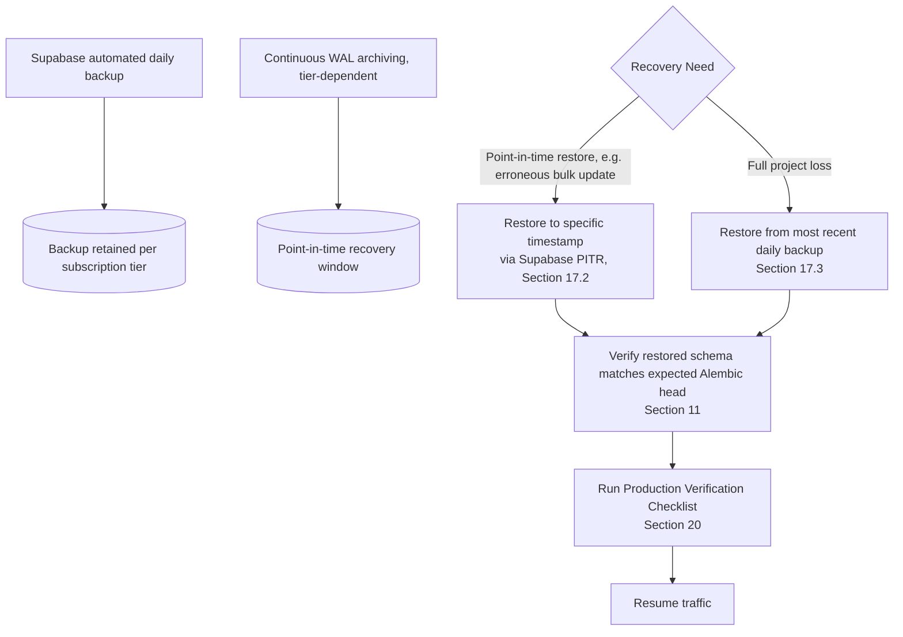

# Enterprise Automation Hub (EAH)
## Deployment Guide (DG)

**Version:** 2.0
**Status:** Finalized — consistent with the SRS, Architecture Design Document (ADD), Database Schema Design Document (DSD), API Design Document (API-ADD), Workflow Engine Design Document (WEDD), and Testing Strategy Document (TSD)
**Author:** Principal DevOps Architect
**Deployment Model:** Containerized FastAPI backend + Next.js frontend + background worker, horizontally replicated behind a standard load balancer, backed by Supabase (Postgres/Auth/Storage) and an optional shared Redis (rate limiting, analytics caching, background email queue)

> **Version 2.0 note:** This revision replaces every reference to the original Streamlit Presentation Layer, fully removed in favor of the FastAPI + Next.js split described throughout `docs/architecture.md`, and adds the production infrastructure layer introduced alongside it: Docker/Docker Compose, Redis, Prometheus/Grafana, and a GitHub Actions CD pipeline. See `docs/docker_deployment.md` for the concrete, command-level operational guide this document's Section 6 now points to; the sections below remain the architectural/policy-level deployment reference.

---

## Table of Contents

1. Overview
2. Deployment Architecture
3. Environment Strategy
4. Infrastructure Overview
5. Application Deployment
6. Application Deployment: FastAPI + Next.js + Docker
7. Supabase Configuration
8. Environment Variables
9. Secret Management
10. Authentication Configuration
11. Database Migration Process
12. Workflow Deployment Considerations
13. Scheduler Deployment
14. Logging Configuration
15. Monitoring
16. Backup Strategy
17. Disaster Recovery
18. Rollback Procedures
19. Security Hardening
20. Production Verification Checklist
21. Maintenance Procedures
22. Upgrade Strategy
23. Troubleshooting
24. Mermaid Diagram Index
25. Future Deployment Improvements

---

## 1. Overview

### 1.1 Purpose

This document specifies exactly how the Enterprise Automation Hub is deployed, configured, secured, operated, monitored, backed up, and maintained across its full environment lifecycle. It translates the architectural decisions already made in the ADD, DSD, API-ADD, WEDD, and TSD into concrete operational practice — it does not make new architectural decisions, and any deployment choice below that is not already implied by those five documents is explicitly noted as such rather than presented as new.

### 1.2 Scope

This document covers deployment topology, environment configuration, Supabase project setup, secret and credential handling, database migrations, the operational treatment of the Workflow Engine and Scheduler, logging and monitoring, backup and disaster recovery, rollback, security hardening at the deployment layer, and ongoing maintenance. It does not cover application-level design (owned by the ADD and WEDD), schema design (owned by the DSD), the API contract (owned by the API-ADD), or test design (owned by the TSD) — it assumes all five as given and describes how the resulting artifact is run.

### 1.3 Audience

Principal and senior engineers responsible for deploying, operating, and maintaining EAH in a production capacity; any engineer configuring a new environment (Section 3); and any on-call responder using this document's troubleshooting guidance (Section 23).

### 1.4 Relationship with Other Documents

| Document | What It Establishes | What This Document Adds |
|---|---|---|
| SRS | Functional and non-functional requirements, including the stated scale (100,000+ requests, 50 concurrent users) | The operational configuration sized to meet that scale |
| ADD | Modular monolith layering, in-process Scheduler, stateless horizontal scaling via a standard load balancer (ADD Section 10) | The concrete deployment topology realizing that design (Section 2) |
| DSD | Supabase/PostgreSQL schema, RLS, migration strategy (Alembic), backup and PITR assumptions | The operational procedure for applying migrations (Section 11) and executing backup/recovery (Sections 16–17) |
| API-ADD | The REST contract, health endpoint, rate limiting, observability fields | Monitoring and logging configuration realizing those specifications (Sections 14–15) |
| WEDD | Workflow Engine internals, running-workflow isolation, Scheduler job design | Deployment-time guidance for safe workflow-definition activation and safe multi-instance Scheduler operation (Sections 12–13) |
| TSD | Test categories and the CI pipeline's migration verification step | The production verification checklist (Section 20) that extends TSD Section 18 into a deployment-specific procedure |

As of Version 2.0, this document's fixed stack is: Python 3.11 (FastAPI backend), Node 20 (Next.js frontend), Supabase (PostgreSQL, Auth, Storage), Pydantic v2, APScheduler, pytest, Docker/Docker Compose as the containerization and local-orchestration mechanism, and an optional shared Redis instance (rate limiting, analytics response caching, and the job system's live dispatch layer — retry/backoff, dead-letter, priority, for email/invitation delivery and escalation/reminder execution — see Section 4). No message broker beyond that single Redis instance, no full container-orchestration platform (Kubernetes or equivalent), and no dedicated infrastructure-as-code tool is introduced — Docker Compose is deliberately the ceiling of this document's orchestration scope, not a stepping stone assumed to lead there.

---

## 2. Deployment Architecture

EAH is deployed as containerized services: one or more identical `backend` containers (FastAPI + Application Services + Domain Layer + Repository Layer + an in-process APScheduler), one or more identical `frontend` containers (Next.js), the job system's two worker roles (`worker-default`, `worker-escalation` — Section 13.7), and the shared infrastructure they depend on (Supabase, and an optional Redis). This is the direct realization of the ADD's Scalability Considerations (ADD Section 10): stateless horizontal scaling of the application containers behind a standard load balancer, with durable business state held exclusively in Supabase (including every job's own status/history, in the `jobs` table) — Redis, where configured, holds only rate-limit counters, a short-TTL analytics cache, and each job's ephemeral live-dispatch pointer, none of which is a system of record.



Each backend container is identical in code and configuration except for one deliberate difference — whether its in-process Scheduler is the active leader (Section 13) — which is itself an environment-variable-driven configuration difference, not a code difference, consistent with the ADD's statement that Scheduler jobs "can be tuned or disabled per deployment... using a simple leader flag in configuration." Neither worker role has a leader concept of its own (Section 13.7) since Redis's per-priority-list semantics already guarantee each job is delivered to exactly one consumer — running more than one replica of either role is safe.

No backend or frontend container holds business state locally: every request, workflow stage, comment, attachment reference, notification, job, and audit entry lives in Supabase, per the DSD. This is what makes the topology above safe to scale horizontally without session affinity beyond the user's own authenticated session token (managed by Supabase Auth, not by any individual instance). Redis, when configured, is itself a single shared instance every backend/worker container connects to — not sharded or replicated per container — consistent with Section 4's "one small, optional, shared cache/queue" scope.

---

## 3. Environment Strategy

| Environment | Purpose | Supabase Project | Scheduler | Notes |
|---|---|---|---|---|
| Development | Individual engineer iteration | A local or per-developer disposable Supabase project | Enabled, single instance | Mirrors production configuration at small scale; used for the local unit/integration test loop described in TSD Section 2.4 |
| Testing (CI) | Automated verification on every commit | A disposable, migration-applied test project, provisioned and torn down per TSD Section 13.1 | Invoked directly by test code (TSD Section 4.6), not run on its own timer | Never shares data or credentials with any other environment |
| Staging | Pre-production acceptance and manual testing (TSD Sections 16–17) | A dedicated Supabase project mirroring production configuration (RLS policies, Auth settings, Storage buckets), seeded with representative, synthetic test data | Enabled, single designated leader instance | The last environment before production; the Production Verification Checklist (Section 20) is executed here before promotion |
| Production | Live system | The production Supabase project | Enabled, single designated leader instance among N application instances | Subject to every hardening measure in Section 19 |

Configuration differences between environments are expressed entirely through environment variables (Section 8), loaded by the same Configuration Loader described in the ADD — there is no environment-specific code path anywhere in `src/`, consistent with the ADD's principle that all components read configuration exclusively through that loader.

---

## 4. Infrastructure Overview

| Component | Technology | Notes |
|---|---|---|
| Application runtime | Python 3.11 (FastAPI + Uvicorn) | The fixed backend language/runtime version; no alternate runtime is supported |
| Frontend runtime | Node 20 (Next.js, standalone output) | Runs as its own containerized server (`next start` via the standalone build); no separate web server or reverse-proxy technology is introduced beyond the load balancer already established in ADD Section 10 |
| Database | Supabase-managed PostgreSQL | Per the DSD; schema, RLS, and constraints as specified there |
| Authentication | Supabase Auth (GoTrue) | Per the ADD and DSD; no separate identity provider is introduced |
| File Storage | Supabase Storage | Per the DSD and API-ADD Section 23 |
| Cache / Rate Limiting / Job System | Redis 7 — **optional** | Absent `REDIS_URL`, every rate limiter and the analytics response cache fall back to their original single-process, in-memory implementations, and every job type dispatches synchronously (see `app.bootstrap`). Configured, Redis backs a shared, multi-instance-safe rate limiter and analytics cache, plus the job system's live dispatch layer (`app.jobs`) — retry/backoff, dead-letter, priority, consumed by the `worker-default`/`worker-escalation` containers (Section 13.7). One instance only — not sharded/replicated — and holds no business data; the `jobs` table (Postgres) is the durable record (Section 16.5) |
| Background Jobs (scheduled + queued) | APScheduler, in-process (backend container), plus `app.jobs` (Redis+Postgres) | Per the ADD and WEDD; a leader-elected job *scheduler* discovers eligible work (escalations, reminders, stuck-job recovery) and enqueues it; the job system's workers (or, with no Redis configured, the Scheduler leader's own thread) execute it |
| Metrics | Prometheus (`GET /metrics`, plus each worker's own `:9100/metrics`) + Grafana | Enabled by default (`METRICS_ENABLED=true`); see Section 15.6 |
| Containerization | Docker (multi-stage `Dockerfile`/`frontend/Dockerfile`), Docker Compose | `docker-compose.production.yml` and `docker-compose.development.yml` — see `docs/docker_deployment.md`. No full container-orchestration platform (Kubernetes or equivalent) is introduced; Compose is this document's orchestration ceiling |
| CD (image publishing) | GitHub Actions (`.github/workflows/cd.yml`) | Builds and pushes backend/frontend images to GHCR on every push to `main`; deploying a published image to a specific host remains a manual/pluggable operator step (no target host is assumed) |
| Load Distribution | A standard load balancer (ADD Section 10) | Vendor-agnostic by design; any load balancer capable of routing HTTP traffic to multiple stateless backend/frontend containers satisfies this requirement, and none is prescribed beyond that capability |
| Process Hosting | One or more container instances (backend, frontend, worker-default, worker-escalation), each running one of the images `cd.yml` publishes | Docker Compose is the reference orchestration mechanism (Section 6); any host capable of running Docker containers and reaching Supabase (and, if configured, Redis) over the network satisfies this architecture |

This table is deliberately free of a named cloud vendor or hosting product, because the ADD and DSD establish only the *logical* infrastructure (Supabase, a load balancer, containerized processes) and not a specific commercial hosting choice — any hosting environment capable of running Docker containers and reaching the Supabase project over HTTPS satisfies this architecture.

---

## 5. Application Deployment

### 5.1 Deployment Artifact

The deployment artifact is a pair of Docker images — `Dockerfile` (backend: FastAPI, Uvicorn, the Supabase client library, Pydantic v2, APScheduler, Redis client, and their transitive dependencies) and `frontend/Dockerfile` (Next.js standalone build) — each built via a multi-stage build (Section 6) so the final image contains only the runtime dependency set, never the build toolchain. `.github/workflows/cd.yml` builds and publishes both to GHCR on every push to `main`; deployment is "pull an image tag and run it," not "install source and dependencies onto a host directly."

### 5.2 Deployment Steps

| Step | Action | Owner Document |
|---|---|---|
| 1 | Provision or confirm the target Supabase project (Section 7) | DSD |
| 2 | Set environment variables for the target environment (Section 8) | ADD (Configuration Loader) |
| 3 | Apply pending Alembic migrations against the target database (Section 11) | DSD Section 15 |
| 4 | Pull (or build) the backend/frontend images for the commit/tag being deployed (Section 6) | This document / `docs/docker_deployment.md` |
| 5 | Start the containers — with `REDIS_URL` configured, every `backend` replica may run with `SCHEDULER_LEADER=true` (Redis-backed election picks the live leader automatically, Section 13.2); without it, exactly one replica must — and, if `REDIS_URL` is configured, at least one `worker-default` and one `worker-escalation` container (Section 13.7) | ADD Section 10 |
| 6 | Register all backend/frontend containers behind the load balancer (Section 2) | This document |
| 7 | Execute the Production Verification Checklist (Section 20) | TSD Section 18 (extended) |

### 5.3 Deployment Workflow Diagram



### 5.4 Startup Sequence

On container start, each backend container performs the same, deterministic sequence, regardless of environment:



A failure at any step above (configuration validation failure, inability to reach Supabase) prevents the instance from reporting healthy on `GET /api/v1/health` (Section 15.5), which keeps the load balancer from routing traffic to a not-yet-ready or misconfigured instance.

---

## 6. Application Deployment: FastAPI + Next.js + Docker

The backend (FastAPI/Uvicorn) and frontend (Next.js) are each built as a multi-stage Docker image (`Dockerfile`, `frontend/Dockerfile`) and run as non-root containers, orchestrated locally/on a single host via Docker Compose (`docker-compose.production.yml`, `docker-compose.development.yml`). This section covers the architectural guidance; **`docs/docker_deployment.md` is the concrete, command-level operational guide** (build/run commands, environment variable reference, migration execution, troubleshooting) and should be treated as this section's companion, not a duplicate.

| Configuration Aspect | Guidance |
|---|---|
| Bind address/port | Backend binds `0.0.0.0:8000`, frontend `0.0.0.0:3000`, both fixed in their respective Dockerfiles and `docker-compose.production.yml`; the load balancer routes to whichever host ports those containers are published on |
| Session state | Held entirely client-side (the Supabase browser client's own session, per the ADD/API-ADD) — no server-side session store is introduced, and no container persists session data to disk or to Supabase |
| Multiple instances | `docker compose up --scale backend=N` (or an equivalent instance count on whatever host runs the published images) runs N identical, stateless backend containers; the load balancer, not Docker Compose itself, is responsible for distributing users across them. `worker-default`/`worker-escalation` may each be scaled independently of `backend` replica count and of each other (Section 13.7) |
| Static assets | Served by Next.js's own standalone server (`.next/static`, copied into the frontend image per `frontend/Dockerfile`); no separate CDN or static-file service is introduced |
| TLS termination | Performed at the load balancer (Section 19.2), not within either container, keeping each image's own configuration surface minimal |
| Non-root execution | Both images run as a fixed non-root user (`appuser` in the backend image, Node's built-in `node` user in the frontend image) — neither container ever runs as root |
| Health checks | Each image declares a `HEALTHCHECK` (backend: `GET /api/v1/health/live`; frontend: `GET /api/health`) so `docker ps`/Compose/an orchestrator can observe container health directly, independent of the load balancer's own probe (Section 15.2) |
| Image publishing | `.github/workflows/cd.yml` builds and pushes both images to GHCR on every push to `main`; see `docs/docker_deployment.md` for pulling a specific tag on a target host |

---

## 7. Supabase Configuration

### 7.1 Project Setup

Each environment (Section 3) corresponds to exactly one Supabase project, configured identically in structure (schema, RLS policies, Storage buckets, Auth settings) but with environment-appropriate scale and data.

### 7.2 Configuration Checklist

| Area | Configuration |
|---|---|
| Database | Schema applied via Alembic migrations (Section 11), matching the DSD exactly; `pgcrypto` extension enabled (DSD Section 1.6) for `gen_random_uuid()` |
| RLS | Every policy in DSD Section 9.2 enabled and enforced on every applicable table; RLS is never disabled in staging or production, even temporarily, per the ADD's defense-in-depth principle |
| Auth | Supabase Auth (GoTrue) enabled; JWT expiry and refresh-token settings configured per Section 10 of this document; no third-party OAuth provider is introduced beyond what Supabase Auth natively supports and the API-ADD assumes (API-ADD Section 3) |
| Storage | A single bucket for attachments, namespaced per DSD Section 7.3's path convention (`attachments/{request_id}/{attachment_id}_{sanitized_file_name}`); bucket-level access rules mirror the RLS policies applied to the `attachments` table |
| Connection Pooling | Supabase's own managed connection pooling used as-is, per DSD Section 12.4 — no additional pooling layer is introduced |
| Backups | Supabase's automated daily backups enabled at the project's subscription tier (Section 16); point-in-time recovery enabled where the tier supports it (Section 17) |

### 7.3 Environment Parity

Staging and production Supabase projects are configured identically in every structural respect (schema version, RLS policies, bucket configuration) — the only permitted differences are data volume, credentials, and subscription tier sizing. This parity is what makes the Production Verification Checklist (Section 20), executed in staging, a meaningful predictor of production behavior.

---

## 8. Environment Variables

All configuration is supplied via environment variables, read exclusively through the Configuration Loader (ADD Section 4, DSD Section 1) into typed Pydantic settings objects at startup — no component in `src/` reads `os.environ` directly, per the ADD.

| Variable | Purpose | Present In |
|---|---|---|
| `APP_ENVIRONMENT` | The master switch every other hardening check in this table is keyed off (`Environment.requires_production_grade_hardening`, `app/config/environment.py`): `staging`/`production` require `CORS_ALLOWED_ORIGINS`/`APP_BASE_URL`/every `SMTP_*` variable and disable interactive API docs; `development`/`testing` do not. **Defaults to `development` if unset — there is no runtime cross-check that this was set intentionally in a real deployment.** Setting this correctly is the first, load-bearing step of any Staging/Production deployment; see the Deployment Checklist's first item | All environments; one of `development`/`testing`/`staging`/`production` |
| `SUPABASE_URL` | The target Supabase project's API URL | All environments |
| `SUPABASE_ANON_KEY` | Client-facing key, subject to RLS (DSD Section 9.3) | All environments |
| `SUPABASE_SERVICE_ROLE_KEY` | Elevated, server-side-only key for legitimately cross-cutting operations (DSD Section 9.3) | All environments; never exposed to the browser |
| `SMTP_HOST`, `SMTP_PORT`, `SMTP_USERNAME`, `SMTP_PASSWORD` | Email dispatch configuration for the Notification Service (ADD Notification Service description) | All environments where email is enabled (Development may disable email dispatch, Section 8.1) |
| `SCHEDULER_LEADER` | Boolean flag; `true` on exactly one instance per environment, enabling APScheduler job registration (Section 13) | Staging, Production (multi-instance); Development and CI set this `true` on their single instance |
| `SCHEDULER_ESCALATION_INTERVAL`, `SCHEDULER_REMINDER_INTERVAL` | Job scheduling intervals for the Escalation Check and Reminder Dispatch jobs (WEDD Section 8.3) | All environments |
| `WORKFLOW_CONFIG_PATH` (or equivalent database-backed resolution, per DSD Section 5) | Resolution source for workflow definitions | All environments |
| `LOG_LEVEL` | Logging verbosity (Section 14) | All environments |
| `RATE_LIMIT_*` | Per-endpoint-category rate limits (API-ADD Section 15) | Staging, Production (Development and CI may relax or disable these) |
| `REDIS_URL` | Enables Redis-backed rate limiting, analytics caching, and the job system's live dispatch layer (Section 4) | Optional in every environment; absent means every fallback described in Section 4's Redis row applies |
| `EMAIL_DISPATCH_MODE` | `direct` (default) or `queue` — selects synchronous vs. job-system-queued email/invitation dispatch (Section 13.7) | Optional; `queue` requires `REDIS_URL` |
| `WORKER_ROLE` | Which `queue_name`(s) `python -m app.jobs.worker` consumes when run with no `--role` flag: `default`, `escalation`, or `all` | Only meaningful for a worker container; `docker-compose.production.yml` sets it via `--role` instead |
| `JOB_DEFAULT_MAX_ATTEMPTS`, `WORKER_METRICS_PORT`, `STUCK_JOB_THRESHOLD_MINUTES`, `STUCK_JOB_REAPER_INTERVAL_MINUTES` | Job system retry-budget default, each worker's own Prometheus port, and `StuckJobReaperJob`'s orphan-detection threshold/interval (Section 13.7) | Optional everywhere; all have sensible defaults — see `.env.example` |
| `METRICS_ENABLED` | Whether `GET /metrics` is mounted (Section 15.6) | Optional, defaults to `true` in every environment |
| `GRAFANA_ADMIN_PASSWORD` | Grafana's initial admin password (`docker-compose.production.yml` only). Required, mechanically: this variable has no fallback default in the compose file, so `docker compose up` refuses to start if it is unset or empty, rather than silently running Grafana with its well-known `admin` default password | Staging, Production |

### 8.1 Environment-Specific Overrides

Development and CI environments are permitted to disable outbound email dispatch (a configuration value, not a code branch) so that automated test runs and local iteration never send real email, consistent with the TSD's test data strategy (TSD Section 11) never touching real external systems. Staging and production always have email dispatch enabled, since the Notification Service's email-in-MVP behavior (ADD) is a production requirement, not an optional feature.

---

## 9. Secret Management

### 9.1 Principles

No secret (Supabase keys, SMTP credentials) is ever committed to source control, hard-coded, or logged, per the ADD's Security Architecture. Every secret is supplied as an environment variable at deployment time, sourced from whatever secret-storage facility the hosting platform natively provides — this document does not prescribe a specific secret-management product, since none is established in the fixed stack, and introducing one (e.g., a dedicated vault service) would be new infrastructure this document is scoped not to add.

### 9.2 Secret Handling Table

| Secret | Storage | Access Scope |
|---|---|---|
| `SUPABASE_SERVICE_ROLE_KEY` | Environment variable, injected only into server-side application instances | Never present in any Presentation Layer/browser-reachable context (DSD Section 9.3, API-ADD Section 24) |
| `SUPABASE_ANON_KEY` | Environment variable | May be present in client-reachable configuration, since it is subject to RLS by design and is not, itself, a sensitive credential in the same sense as the service-role key |
| SMTP credentials | Environment variable, server-side only | Used exclusively by the Notification Service's email-dispatch path |
| Database connection details | Not separately managed — access is exclusively through the Supabase client libraries using the keys above, never a raw PostgreSQL connection string held by the application | N/A |

### 9.3 Secret Rotation

Rotating `SUPABASE_SERVICE_ROLE_KEY` or `SUPABASE_ANON_KEY` is a two-step operation: issue the new key in the Supabase project, then update the environment variable and restart each application instance (Section 22's rolling-restart procedure) — no code change or migration is required, since the Configuration Loader reads the key fresh at each instance's startup.

---

## 10. Authentication Configuration

| Setting | Configuration | Rationale |
|---|---|---|
| JWT expiry | A short-lived access token (Supabase default or an explicitly configured value), with refresh handled transparently by Supabase's client library, per API-ADD Section 3.5 | Limits the window of exposure for a leaked access token without requiring the application to manage its own session store |
| Refresh token handling | Managed entirely by Supabase Auth; the application never persists a refresh token outside the browser session, per the ADD's session-handling description | Keeps session state genuinely stateless from the application's own perspective (ADD Section 10) |
| Role claim resolution | `AuthService` resolves `profiles.role` on every request from the validated JWT's subject claim, never trusting a role embedded directly in the token itself | Ensures a role change (API-ADD Section 19.2.2) takes effect immediately, without requiring the affected user's existing token to be reissued |
| Login rate limiting | Configured per API-ADD Section 15 (10 requests per 5 minutes per email address) | Slows credential-guessing attempts without introducing a separate authentication-security product |
| Password policy | Delegated entirely to Supabase Auth's own configuration; EAH does not implement or enforce a separate password policy | Consistent with the ADD's decision to delegate all identity management to Supabase Auth |

---

## 11. Database Migration Process

### 11.1 Migration Tooling

Per DSD Section 15, schema changes are managed through Alembic, used strictly as a development-time and deployment-time tool with no runtime presence in `src/`. This document specifies precisely when, in the deployment sequence, migrations are applied.

### 11.2 Migration Execution Order

Migrations are always applied **before** the new application code starts serving traffic (Section 5.3, step 3), never concurrently with a running deployment and never after. This ordering is what makes the DSD's forward-only migration philosophy operationally safe: a new version of the application code is only ever run against a schema that already matches its expectations.

### 11.3 Backward-Compatible Migration Practice

Because EAH is deployed with multiple instances and a rolling upgrade strategy (Section 22), a schema migration that a new application version depends on must not break the *previous* version of the application code that may still be serving traffic on other instances during the rollout window. Migrations are therefore written, wherever a breaking change would otherwise be required, as an additive "expand" step deployed ahead of the application change that depends on it, with any corresponding "contract" step (removing a now-unused column, for example) deployed only in a later release once every instance is confirmed running the new code — the same forward-only, non-destructive philosophy the DSD already establishes (DSD Section 15), applied specifically to the rolling-deployment scenario this document introduces.

### 11.4 Migration Verification

Per TSD Section 13.3, the CI pipeline already applies the full migration history from empty to head against a disposable test project on every commit. This document adds the deployment-time counterpart: before applying a pending migration to staging or production, the exact migration set already verified in CI is applied — no migration is ever hand-run or modified between CI verification and production application.

### 11.5 Migration Failure Handling

If a migration fails partway through applying to staging or production, the deployment halts immediately (Section 5.3's diagram, node `D1`) before any application code referencing the new schema is started — the database is left in whatever state PostgreSQL's own transactional DDL guarantees for the specific migration statement that failed, and the corrective action is a new, forward migration (or, in the rare catastrophic case, point-in-time recovery, Section 17.2), never a hand-edited fix to the failed migration itself, per the DSD's forward-only philosophy.

---

## 12. Workflow Deployment Considerations

### 12.1 Running Workflow Isolation During Deployment

WEDD Section 9.6 establishes that no request ever re-reads `workflow_definitions` after creation — it operates permanently against the specific version pinned to it at submission time. This guarantee is what makes deploying new application code, or activating a new workflow definition version, safe to do while thousands of requests are mid-flight: neither action can retroactively alter an in-progress request's behavior.

### 12.2 Deploying Code Changes to the Workflow Engine

A code change to `src/workflows` (for example, adding a new assignment strategy, per WEDD Section 7.7) is deployed exactly like any other application code change (Section 22) — no special migration or data transformation is required, because the Workflow Engine's behavior is driven by data (`workflow_definitions.definition`) it reads at runtime, not by state it owns independently. The one discipline this requires operationally: a new assignment strategy must be deployed (code) before any workflow definition referencing it is activated (data), never the other way around, since an active definition referencing an unrecognized strategy would fail stage generation for any request submitted against it.

### 12.3 Activating New Workflow Definitions in Production

Activating a new `WorkflowDefinition` version (API-ADD Section 19.9.3) is a data operation, not a deployment operation, and can be performed at any time without coordinating an application deployment — this is a direct benefit of the versioning design in WEDD Section 9. Operationally, this document recommends activating a new version only after confirming, in staging, that the definition's JSON validates successfully (WEDD Section 13.1) and that every `assigned_user_id` it references resolves to a real profile in the target environment — since profile identifiers differ between staging and production, a definition validated in staging must still be re-validated against production's own `profiles` table before activation there.

### 12.4 Scheduler Awareness of Workflow Changes

Because the Escalation Check and Reminder Dispatch jobs (WEDD Section 8.3) query `workflow_stages` directly rather than holding any cached notion of a workflow definition, no Scheduler restart or reconfiguration is required when a new workflow definition is activated — the next scheduled run simply observes whatever stages exist at that time, consistent with the recovery-after-restart property in WEDD Section 8.6.

---

## 13. Scheduler Deployment

### 13.1 The Multi-Instance Problem

APScheduler runs in-process, per the ADD. In a multi-instance deployment (Section 2), every instance shares the same code and would, by default, independently register and run the Escalation Check (`escalation_check`), Reminder Dispatch (`reminder_dispatch`), and — where Redis-backed jobs are active — Stuck Job Reaper (`stuck_job_reaper`) jobs (`app.bootstrap`) — which would cause each job to execute once per instance, per scheduling interval, rather than once overall.

### 13.2 Leader Election

`SCHEDULER_LEADER=true` (Section 8) means an instance **participates in the Scheduler pool** — registers its jobs at all — never set on an `app.jobs.worker` process, which consumes the job queue, not the Scheduler. What happens among participating instances depends on whether Redis is configured:

- **`REDIS_URL` unset**: the original, static design this document has described since v1 — exactly one participating instance is started with `SCHEDULER_LEADER=true`; every other instance is started with `SCHEDULER_LEADER=false` and never registers any APScheduler job at all. A manual, deployment-time designation, not a runtime-elected protocol — the operator must ensure uniqueness themselves.
- **`REDIS_URL` set**: leader election is dynamic and self-healing. More than one instance may (and, in the reference production topology, does — `docker-compose.production.yml`'s `backend`/`backend-2`) set `SCHEDULER_LEADER=true`; every one of them registers its jobs and continuously contends for a single shared Redis lock (`app.scheduler.leader_election.LeaderElection`). Whichever instance holds it is the live leader; every other participating instance's ticks are skipped outright (`JobStatistics.skipped_not_leader_count`), never even attempting execution. See `docs/scheduler_distributed_coordination.md` for the full mechanism, including a second, independent per-job Redis lock that guards against duplicate execution even in a theoretical split-brain window.

### 13.3 Leader Instance Availability and Failover

- **Without Redis**: leader designation is static, so the leader instance's own availability directly determines whether scheduled jobs run at all during any period it is down — an accepted trade-off, not an oversight, since per WEDD Section 8.6 no scheduled job's correctness depends on continuous execution (every job re-evaluates durable database state fresh on each run, so a missed interval is fully compensated for by the next successful one).
- **With Redis**: a crashed leader's lock expires automatically within one TTL window (`SCHEDULER_LEADER_LOCK_TTL_SECONDS`, default 30s, Section 8) and another participating instance is elected within roughly a third of that window — automatic failover, no manual step. A gracefully stopped leader (a normal deploy/restart) releases its lock immediately rather than waiting out the TTL.

### 13.4 Reassigning Leadership (no-Redis fallback only)

This section applies only when `REDIS_URL` is not set — with Redis configured, failover is automatic (Section 13.3) and this manual procedure is unnecessary. If the designated leader instance is being taken down for an extended period (e.g., a full redeployment cycle, Section 22), operational procedure is to set `SCHEDULER_LEADER=true` on a different, remaining instance and restart it before the original leader is stopped, ensuring at least one instance always has Scheduler jobs registered during the transition.

### 13.5 Scheduler Verification at Deployment Time

Per TSD Section 9.4 and Section 20 of this document, deployment verification confirms exactly one instance reports its Scheduler as active (via the health/status detail described in Section 15.5) — both that at least one instance reports `scheduler_active: true` (no environment is ever left with escalation and reminders silently not running) and that no more than one does (avoiding duplicate job execution). With Redis-backed election active, this check is self-correcting on every subsequent poll rather than a one-time deployment-time snapshot; the accompanying `scheduler_leader_election` field (`"redis"` or `"static"`) makes which mode is in effect explicit.

### 13.6 Configuration Reference

| Variable | Meaning | Default |
|---|---|---|
| `SCHEDULER_LEADER` | Whether this instance participates in the Scheduler pool (13.2) | `false` |
| `SCHEDULER_ESCALATION_INTERVAL_MINUTES` | Escalation Check interval | `60` |
| `SCHEDULER_REMINDER_INTERVAL_HOURS` | Reminder Dispatch interval | `24` |
| `SCHEDULER_LEADER_LOCK_TTL_SECONDS` | Redis leader lock TTL (only meaningful with `REDIS_URL` set) | `30` |
| `SCHEDULER_JOB_LOCK_TTL_SECONDS` | Redis per-job execution lock TTL (only meaningful with `REDIS_URL` set) — keep comfortably above the slowest registered job's realistic runtime | `300` |

### 13.7 The Job System's Worker Containers (production infrastructure layer)

Distinct from the in-process APScheduler above: the job system (`app.jobs`) is a Redis+Postgres-backed background job queue with retry/exponential-backoff, a dead-letter state, and job priority — the durable record of every job's status/history lives in the `jobs` table (migration `0015_jobs`, `app.database.repositories.job_repository`), while Redis (per-`queue_name`, per-priority ready lists plus a delayed/retry sorted set) is only ever the live dispatch mechanism, never a system of record (Section 16.5).

`docker-compose.production.yml` runs **two** worker roles from the same backend image, differing only in which `queue_name` each consumes (`python -m app.jobs.worker --role default|escalation`):

- **`worker-default`** consumes `send_email` and `send_invitation_email` jobs — enqueued by `NotificationService`'s and `InvitationService`'s email senders when `EMAIL_DISPATCH_MODE=queue` (Section 4/8, requires `REDIS_URL`).
- **`worker-escalation`** consumes `escalate_stage` and `send_reminder` jobs — enqueued by the Scheduler's Escalation Check and Reminder Dispatch jobs (Sections 13.1–13.5) whenever Redis is configured. **Unlike every other job type**, these two do not require `EMAIL_DISPATCH_MODE=queue` or even a `worker-escalation` container to function at all: when Redis is not configured, `EscalationJob`/`ReminderJob` fall back to executing synchronously, in-process, in the Scheduler leader's own thread (`app.jobs.job_service.SynchronousJobDispatcher`) — byte-for-byte the behavior that existed before the job system was introduced. A `worker-escalation` container only takes over that work (with retry/backoff/dead-letter, and off the Scheduler leader's own thread) once `REDIS_URL` is set.

Like the retired single-worker container, neither role has a leader concept to configure: Redis's per-priority list semantics (`BRPOP`) already guarantee each job is delivered to exactly one consumer, so running more than one replica of either role is safe (throughput scaling, not a correctness concern) — the operational discipline is "run at least one of each role you rely on," not "run exactly one." A `StuckJobReaperJob`, registered on the Scheduler leader alongside Escalation Check/Reminder Dispatch whenever Redis is configured, recovers any job left orphaned by a worker that crashed mid-execution (or a Redis push that failed after its Postgres row was already committed) — see `app.scheduler.stuck_job_reaper_job` for the exact recovery path (the same retry-or-dead-letter transition a worker itself applies on an ordinary handler failure).

With the default `EMAIL_DISPATCH_MODE=direct` and Redis unconfigured, no worker container is needed at all — every job type's dispatch happens synchronously, exactly as before this layer was introduced. Operators can inspect job status/history, retry a dead-lettered job, and manage scheduled jobs (enable/disable/trigger-now) via the admin API (`/api/v1/admin/jobs`, `/api/v1/admin/scheduled-jobs`) and its frontend page (`/admin/jobs`) — see `docs/job_system_migration.md` for upgrade notes.

### 13.8 Platform Administration Module

Company (tenant) management — create/suspend/delete, per-tenant settings and license metadata, platform-wide statistics/health/audit history — is gated by `profiles.is_platform_admin`, a capability orthogonal to the ordinary `UserRole.ADMIN` company-scoped role (`app.auth.authorization.authorize_platform_admin`). There is no self-service way to become a platform admin; an operator promotes the first one directly against the database:

```sql
update public.profiles set is_platform_admin = true where id = '<profile-id>';
```

Requires migration `0017_platform_admin` (companies' soft-delete/settings columns, `company_licenses`, `feature_flags`). Suspending a company (`is_active=false`) takes effect immediately — every user in it is rejected on their very next authenticated request (`app.auth.supabase_verifier.SupabaseTokenVerifier`), not just at next login; deleting one is a soft-delete (data retained, reversible via restore). Feature flags and per-company license limits are informational/platform-admin-managed only in this baseline — nothing in the application enforces them yet. See `docs/platform_administration.md` for the full endpoint reference and operator notes.

### 13.9 Enterprise-Wide Search

Cross-entity search (`GET /api/v1/search`, `app.services.search_service.GlobalSearchService`) spans requests, approvals, workflow definitions, users, departments, comments, notifications, attachments, and audit entries — each already scoped by the same role/tenant authorization the rest of the application enforces (no new visibility rule is introduced by search itself). Requires migrations `0018_search_indexes` (`pg_trgm` extension, trigram GIN indexes on every searchable text column, generated `tsvector` columns + GIN indexes on `requests`/`comments` for true full-text ranking) and `0019_saved_search` (`saved_filters`, `search_history` — per-user, per-company, RLS-protected). `create extension if not exists pg_trgm;` requires the extension be enabled on the target Postgres instance (already true by default on Supabase). See `docs/enterprise_search.md` for the full endpoint reference, indexing rationale, and data model.

### 13.10 AI Integration

AI-generated summaries, recommendations, and a dashboard assistant (`GET/POST /api/v1/ai/*`, `app.services.ai_insight_service.AiInsightService`) are strictly opt-in and require **no migration** — with `AI_PROVIDER` unset (the default in every environment), the application behaves byte-for-byte as it did before this layer was introduced, and every `/ai/*` endpoint returns a deterministic, non-AI fallback instead of erroring. To enable it, set:

| Variable | Required when enabled | Notes |
|---|---|---|
| `AI_PROVIDER` | — | `openai` or `anthropic`; unset disables every AI feature |
| `AI_API_KEY` | Yes, if `AI_PROVIDER` is set | The provider's API key |
| `AI_MODEL` | Yes, if `AI_PROVIDER` is set | No default is guessed — model identifiers go stale, so an operator enabling this feature chooses one explicitly |
| `AI_TIMEOUT_SECONDS` | No (default `20`) | Per-call request timeout |
| `AI_MAX_OUTPUT_TOKENS` | No (default `600`) | Upper bound on generated response length |

Setting `AI_PROVIDER` to anything other than `openai`/`anthropic`, or setting it without `AI_API_KEY`/`AI_MODEL`, fails application startup (`InvalidConfigurationValueError`/`MissingEnvironmentVariableError`) — a provider is never constructed from partial configuration. See `docs/ai_integration.md` for the full endpoint reference, provider abstraction, caching, and fallback design.

---

## 14. Logging Configuration

### 14.1 Logging Framework

Per the ADD, EAH uses Python's standard `logging` module exclusively — no external logging framework or agent is introduced. Every application instance configures logging once at startup, via the Configuration Loader, reading `LOG_LEVEL` (Section 8) and any environment-specific output target.

### 14.2 Structured Log Fields

Consistent with the ADD's logging philosophy and API-ADD Section 27, every log entry carries a consistent set of structured fields:

| Field | Description |
|---|---|
| `timestamp` | UTC, ISO-8601 |
| `request_id` | Correlation id, matching `meta.request_id` in the corresponding API response where applicable (API-ADD Section 9) |
| `user_id` | The authenticated caller, where applicable |
| `component` | Which layer/service emitted the entry (e.g., `RequestService`, `EscalationCheck`) |
| `outcome` | Success/failure and, on failure, the internal exception type (never a raw stack trace exposed to any external consumer — Section 19.4) |
| `duration_ms` | For request-handling and Scheduler job entries |

### 14.3 Logging Flow Diagram



### 14.4 Distinction from Audit Logging

Per the ADD and DSD, operational logs (this section) and `audit_logs` (DSD Section 6) are deliberately separate: logs may be rotated, filtered, or discarded by log-level threshold; `audit_logs` entries are never discarded, filtered, or altered. This document's logging configuration governs only the former — the latter's durability guarantees are a database-level property (DSD Section 6.1), not a deployment configuration concern.

---

## 15. Monitoring

### 15.1 Monitoring Philosophy

Consistent with API-ADD Section 27, EAH's baseline monitoring surface is structured logs (Section 14), the latency and rate-limit figures already specified in the API-ADD, and a health endpoint. As of the production infrastructure layer (Version 2.0), this is complemented by a Prometheus metrics endpoint and an optional Grafana dashboard (Section 15.6) — still deliberately lightweight (request counts/latency/rate-limit rejections only, no distributed tracing) rather than a full APM platform.

One narrow, entirely optional exception (Milestone 13): setting `SENTRY_DSN` initializes Sentry error tracking (`app/config/error_tracking.py`) at startup, reporting unhandled exceptions from both the API and the Scheduler's jobs. Unset — the default, and the only configuration every deployment has had until now — this performs no initialization, no network call, and no behavior change of any kind; Sentry's separate Performance Tracing feature is explicitly disabled (`traces_sample_rate=0.0`) even when a DSN is configured, keeping this scoped to error capture only, not a distributed-tracing platform.

### 15.2 Health Endpoint

`GET /api/v1/health` (API-ADD Section 27) is the primary automated monitoring surface: unauthenticated, returning `200 { "status": "ok" }` when the instance can reach its Supabase connection (and Redis, if configured). The load balancer (Section 2) uses this endpoint to determine whether to route traffic to a given instance.

As of the production infrastructure layer, this single check is complemented by two narrower, container-orchestrator-facing probes (`app.api.routers.health`), matching the standard liveness/readiness split:

- **`GET /api/v1/health/live`** — no dependency check at all; reports only that the process itself is running. Used by each container's own `HEALTHCHECK` (`Dockerfile`, `frontend/Dockerfile`) — a transient Supabase/Redis outage must never cause a healthy container to be killed and restarted, since that would not fix the outage and only churns the fleet.
- **`GET /api/v1/health/ready`** — the same Supabase-reachability (and optional Redis) check `GET /api/v1/health` always performed, under its own dedicated path for an orchestrator's readiness probe.

`GET /api/v1/health` itself is unchanged and remains the load balancer's own check (Section 2) — the two narrower probes above are additive, not a replacement.

### 15.3 What Is Monitored

| Signal | Source | Threshold / Expectation |
|---|---|---|
| Instance health | `GET /api/v1/health` (or `/health/ready`) | `200` expected continuously; sustained failure removes the instance from the load balancer's rotation |
| Container liveness | `GET /api/v1/health/live`, `GET /api/health` (frontend) | `200` expected continuously; sustained failure indicates a container-level restart is warranted |
| Request latency | Structured logs (`duration_ms`) and `eah_http_request_duration_seconds` (Prometheus, Section 15.6), aggregated per the API-ADD's stated targets (API-ADD Section 25.2) | p95 < 150 ms (single-resource reads), < 300 ms (filtered lists), < 400 ms (mutating transactions) |
| Rate-limit rejections | Structured logs (`429` outcomes) and `eah_rate_limit_rejections_total` (Prometheus) | A sustained spike may indicate abuse or a misbehaving client, per API-ADD Section 15 |
| Scheduler job execution | Structured logs (job name `escalation_check` / `reminder_dispatch` / `stuck_job_reaper`) | Each job logs its own start, completion, and batch size on every run; an absent log entry for a configured interval indicates the leader instance (Section 13) is down |
| Job system queue depth/consumption | `worker-default`/`worker-escalation` container logs (Section 13.7); `eah_job_queue_depth`/`eah_job_delayed_count`/`eah_job_dead_letter_count` (Prometheus, Section 15.6); `/api/v1/admin/jobs/stats/summary` | An absent "Job ... succeeded/retrying/dead_lettered" log entry over a sustained period with jobs enqueued indicates the corresponding worker role isn't running; a growing `eah_job_dead_letter_count` warrants operator inspection via `/admin/jobs/dead-letter` |
| Database-observable metrics | Supabase's own project dashboard (connection count, query performance) | No separate database-monitoring tool is introduced; Supabase's native tooling is the sole source for this signal |

### 15.4 Monitoring Flow Diagram



### 15.5 Instance-Level Scheduler Status

The health endpoint's response includes whether this specific instance is the Scheduler leader (`scheduler_active: true|false`), giving operators a direct way to confirm exactly one instance reports `true` at any time (Section 13.5), without introducing a separate monitoring surface: poll `GET /api/v1/health` across every instance in the fleet and alert if the count of `scheduler_active: true` responses is ever `0` (no escalation/reminder jobs are running) or `>1` (duplicate escalation/reminder notifications are likely, Section 23's troubleshooting table).

### 15.6 Prometheus and Grafana (production infrastructure layer)

`GET /metrics` (unauthenticated, mounted at the application root, not under `/api/v1` — matching Prometheus's own default scrape convention) exposes the following application metrics (`app.observability.metrics`), plus the Python process metrics `prometheus_client` registers by default:

| Metric | Type | Labels |
|---|---|---|
| `eah_http_requests_total` | Counter | `method`, `path_template`, `status_code` |
| `eah_http_request_duration_seconds` | Histogram | `method`, `path_template` |
| `eah_rate_limit_rejections_total` | Counter | (none) |
| `eah_job_queue_depth` | Gauge | `queue_name`, `priority` — refreshed from Redis at scrape time |
| `eah_job_delayed_count` | Gauge | `queue_name` — refreshed from Redis at scrape time |
| `eah_job_dead_letter_count` | Gauge | `queue_name` — refreshed from Postgres at scrape time |

`path_template` is always the route's *templated* path (e.g. `/requests/{request_id}`), never a raw resource id — an unbounded label value per distinct resource ever requested is exactly the label-cardinality explosion Prometheus's own documentation warns against. Controlled by `METRICS_ENABLED` (Section 8), defaulting to `true`.

Each `worker-default`/`worker-escalation` container additionally runs its **own** small Prometheus HTTP server (`WORKER_METRICS_PORT`, default `9100`) — workers have no other HTTP server to expose these through, unlike the backend's `/metrics`:

| Metric | Type | Labels |
|---|---|---|
| `eah_jobs_processed_total` | Counter | `task_type`, `outcome` (`succeeded`/`retrying`/`dead_lettered`) |
| `eah_job_duration_seconds` | Histogram | `task_type` |
| `eah_worker_up` | Gauge | `worker_id`, `role` — `1` while the worker is running, `0` once it shuts down |

`docker-compose.production.yml`'s `prometheus` service scrapes `backend:8000/metrics` and both worker containers' `:9100/metrics` per `deploy/prometheus/prometheus.yml`; its `grafana` service auto-provisions that Prometheus instance as a datasource and a starter dashboard (`deploy/grafana/dashboards/eah-overview.json`) — request rate, p95 latency, error rate, and rate-limit rejections — on container startup (`deploy/grafana/provisioning`), needing no manual "add data source"/"import dashboard" click-through. Both services are optional infrastructure: omitting them from a deployment does not affect the backend's own behavior, since the backend never depends on anything scraping `/metrics`.

---

## 16. Backup Strategy

### 16.1 Supabase-Managed Backups

Per DSD Section 13.1, EAH relies entirely on Supabase's built-in automated daily backup infrastructure — no custom backup script, cron job, or export process is introduced by the application or this document.

### 16.2 What Is Backed Up

| Data | Mechanism |
|---|---|
| PostgreSQL data (`requests`, `workflow_stages`, `comments`, `attachments` metadata, `notifications`, `audit_logs`, `workflow_definitions`, `profiles`, `jobs`) | Supabase's automated daily database backup |
| Supabase Storage objects (attachment files) | Supabase's own Storage durability/replication, per its managed service guarantees |
| Application configuration (environment variables) | Held in the hosting platform's own configuration/secret store (Section 9), backed up as part of that platform's own operational practice, outside this document's scope |
| Application code | Version control (source repository), not a "backup" in the database sense — redeployment from the repository is the recovery mechanism (Section 22) |

### 16.3 Backup and Recovery Flow Diagram



### 16.4 Backup Verification

Because every write in EAH is transactional (DSD Section 11), a Supabase backup or PITR restore point is always internally consistent — there is no scenario in which a restored snapshot reflects a half-committed transaction, per the DSD's own reasoning (DSD Section 13.2). This document adds the operational practice of periodically confirming a restore is actually usable: restoring to a disposable, non-production project on a scheduled cadence and running a subset of TSD's database-integrity tests (TSD Section 6.6) against the restored copy, rather than trusting backup completion alone as evidence of restorability.

### 16.5 Redis Persistence (production infrastructure layer — not a backup)

Where Redis is configured (Section 4), `docker-compose.production.yml` enables append-only-file (AOF) persistence (`--appendonly yes`) with data written to a named Docker volume (`redis_data`), so an ordinary container restart does not silently discard jobs waiting to be dispatched. This is **not** part of this document's backup strategy: every value Redis holds — rate-limit counters, the short-TTL (15s) analytics response cache, and each job's ephemeral live-dispatch pointer (`{"job_id", "priority"}`, per `app.jobs.redis_queue`) — is either trivially reconstructable (counters/cache, from the next request) or a duplicate of information already durably recorded in Supabase: a job's actual status/payload/attempt history lives exclusively in the `jobs` table, so losing its Redis pointer only delays dispatch (recovered by `StuckJobReaperJob`, Section 13.7), never loses the job's own record. Losing the `redis_data` volume entirely (a fresh Redis instance with an empty dataset) degrades service in the same way Redis being unconfigured always has — no data loss occurs against the system of record — so no scheduled backup or PITR is configured for it, consistent with this document's "no independent redundancy beyond Supabase for durable state" principle (Section 17.1) applying equally to a component that was never durable state to begin with.

---

## 17. Disaster Recovery

### 17.1 Scope and Assumptions

Per DSD Section 13.3, EAH's disaster recovery posture assumes Supabase's own infrastructure-level redundancy for PostgreSQL and Storage; EAH implements no independent replication, failover, or cross-region redundancy of its own, since doing so would introduce infrastructure outside the fixed stack.

### 17.2 Point-in-Time Recovery Procedure

1. Identify the target restoration timestamp (e.g., immediately before an erroneous bulk operation).
2. Initiate a PITR restore through Supabase's own tooling to that timestamp, on tiers where PITR is available (DSD Section 13.2).
3. Confirm the restored database's schema version matches an applied Alembic migration head (Section 11); if the restoration point predates a since-applied migration, re-apply the intervening migrations before resuming application traffic.
4. Run the Production Verification Checklist (Section 20) against the restored project before routing any live traffic to it.

### 17.3 Full Project Loss Procedure

1. Provision a new Supabase project.
2. Apply the full Alembic migration history from empty to head (Section 11).
3. Restore data from the most recent available daily backup (Section 16.2).
4. Update `SUPABASE_URL` and associated keys (Section 8) across all application instances.
5. Run the Production Verification Checklist (Section 20) before resuming traffic.

### 17.4 Recovery Time and Recovery Point Expectations

Consistent with DSD Section 13.3, EAH's own recovery time and recovery point objectives are bounded entirely by Supabase's published guarantees for the project's subscription tier — this document does not assert a recovery objective independent of that underlying platform commitment, since no independent redundancy exists beneath it.

---

## 18. Rollback Procedures

### 18.1 Application Code Rollback

Because every application instance is stateless (Section 2) and deployment is source-plus-dependencies (Section 5.1), rolling back application code is a matter of redeploying the previous known-good version of the source tree to each instance (Section 22's rolling-restart mechanism, run in reverse), with no database action required **provided** no migration was deployed alongside the version being rolled back.

### 18.2 Migration Rollback

Per the DSD's forward-only migration philosophy (DSD Section 15), a migration is never reverted by deleting or editing it. If a deployed migration must be undone, the correction is a new, forward migration that reverses the prior one's effect — consistent with the same append-only philosophy already applied to `audit_logs` (DSD Section 6) and the API's own deprecation policy (API-ADD Section 16). A downgrade script, where Alembic's own downgrade capability was authored and tested for that specific migration (DSD Section 15's testing-before-production-deployment practice), may be used as a faster path to the same end state, but is never treated as a substitute for verifying the resulting schema matches what the corresponding rolled-back application version expects.

### 18.3 Rollback Checklist

| Step | Action |
|---|---|
| 1 | Confirm whether the release being rolled back included a migration; if so, confirm whether a tested downgrade path exists (Section 18.2) |
| 2 | If no migration was involved, redeploy the previous application version to all instances (Section 22) |
| 3 | If a migration was involved and a downgrade path exists, apply it before redeploying the previous application version |
| 4 | If a migration was involved and no downgrade path exists, author and test a new, forward corrective migration before redeploying (never edit the original migration) |
| 5 | Re-run the Production Verification Checklist (Section 20) against the rolled-back state before resuming full traffic |
| 6 | Confirm exactly one instance reports `scheduler_active: true` after the rollback (Section 13.5) |
| 7 | Record the rollback and its cause in the deployment history, per Section 21's maintenance record-keeping |

### 18.4 Workflow-Specific Rollback Considerations

Per WEDD Section 9.6, rolling back application code never affects in-flight requests' workflow behavior differently than a forward deployment would — a request remains pinned to its `workflow_definition_id` regardless of which application version is currently running. The only workflow-specific rollback consideration is a **workflow definition** rollback: if an activated definition version proves incorrect, the corrective action is activating the *previous* version again (API-ADD Section 19.9.3), which is itself an ordinary, atomic activation transaction (WEDD Section 9.2) — never a schema or application rollback, since the definition itself is data, not code.

---

## 19. Security Hardening

### 19.1 Network-Level Hardening

All traffic between users and the load balancer, and between the load balancer and each application instance, is carried over TLS; the application itself does not implement its own TLS termination, delegating that to the load balancer (Section 6), consistent with keeping the application's configuration surface minimal.

### 19.2 Credential Hardening

Per Section 9, the service-role Supabase key is never present in any Presentation-Layer-reachable configuration or log output; every log entry (Section 14.2) is reviewed as part of release preparation to confirm no secret value is ever interpolated into a logged message.

### 19.3 RLS as a Deployment-Time Guarantee

RLS (DSD Section 9) is never disabled in staging or production for any reason, including debugging — Section 7.2's checklist treats RLS enablement as a mandatory, always-on project setting, not a togglable convenience, since disabling it even temporarily would remove the database-level half of the defense-in-depth model the ADD and DSD both depend on.

### 19.4 Error Response Hardening

Per the ADD and API-ADD Section 24, no application instance is configured to return stack traces or internal exception detail in any HTTP response, regardless of environment — including staging, so that staging behavior under error conditions is representative of production and no debugging convenience is inadvertently deployed to a customer-facing environment.

### 19.5 Rate Limiting Enforcement

Rate limits (API-ADD Section 15) are enforced identically in staging and production; Section 8's environment-specific override table permits relaxing them only in Development and CI, never in staging, so that staging's behavior under load is representative.

### 19.6 File Upload Hardening

Every attachment-handling control specified in API-ADD Section 23 (filename sanitization, MIME sniffing, checksum validation, size limits) is enforced identically across every environment with real Storage access (Development, Staging, Production) — this is application-level behavior, not deployment configuration, and this document's only addition is confirming, as part of Section 7.2's Supabase setup checklist, that the Storage bucket's own access rules independently mirror the `attachments` table's RLS policies, rather than relying on application-level validation alone.

---

## 20. Production Verification Checklist

This checklist extends TSD Section 18 with deployment-specific verification, executed in staging before every production promotion and re-executed against production itself immediately after deployment.

| Category | Checklist Item |
|---|---|
| Migrations | Alembic migration history applied cleanly to the target database; schema version confirmed at head (Section 11) |
| Configuration | Every required environment variable (Section 8) present and correctly scoped to the target environment |
| Secrets | Service-role key confirmed absent from any client-reachable configuration or log output (Section 19.2) |
| RLS | Every DSD Section 9.2 policy confirmed enabled on the target Supabase project (Section 7.2) |
| Health | `GET /api/v1/health` returns `200` on every instance before it is registered behind the load balancer |
| Scheduler | Exactly one instance reports `scheduler_active: true` (Section 13.5, Section 15.5) |
| Workflow Definitions | At least one active `WorkflowDefinition` exists per supported `request_type`, validated against the target environment's own `profiles` table (Section 12.3) |
| Load Balancer | All instances registered and passing health checks; TLS termination confirmed active (Section 19.1) |
| Logging | Structured log output confirmed flowing to the hosting platform's log aggregation (Section 14.3) |
| Backups | Automated daily backup confirmed enabled on the target Supabase project; PITR confirmed enabled where the tier supports it (Section 16) |
| Rate Limiting | Confirmed enforced at the configured thresholds (Section 19.5) |
| Images | Backend/frontend images for the exact commit being deployed published to GHCR by `cd.yml` (Section 4); `docker compose config` validated against the target `.env` |
| Redis / Job System (if configured) | `GET /api/v1/health/ready`'s `redis`/`job_queue` fields report `"ok"`; at least one `worker-default` and one `worker-escalation` container running and healthy (Section 13.7); `/api/v1/admin/jobs/stats/summary` reachable |
| Metrics | Prometheus's `eah-backend` and `eah-worker` scrape targets report `UP`; Grafana's provisioned dashboard renders data (Section 15.6) |
| Test Suite | Full TSD Section 13.1 CI pipeline passed for the exact commit being deployed |
| Acceptance | TSD Section 16 acceptance scenarios re-confirmed against staging prior to production promotion |
| Rollback Readiness | A tested rollback path (Section 18) documented and confirmed available for this specific release before promotion |

A deployment is not considered complete until every row above is confirmed; no row is skipped under schedule pressure, per the same production-readiness priority the ADD and TSD both already establish.

---

## 21. Maintenance Procedures

| Procedure | Frequency | Notes |
|---|---|---|
| Dependency updates (Python packages) | Regularly scheduled, outside emergency security patching | Tested through the full TSD CI pipeline before promotion, like any other code change |
| Alembic migration review | Per release | Confirmed forward-applying and tested per DSD Section 15's testing-before-production-deployment practice |
| Supabase database maintenance | None required manually | Autovacuum and ANALYZE run automatically per DSD Section 12.5; no manual `VACUUM` is scheduled |
| Backup restorability check | Periodic (Section 16.4) | Restore to a disposable project and verify integrity, not merely backup completion |
| Log review | Ongoing / on-call | Structured logs (Section 14) reviewed for sustained error-rate or rate-limit anomalies (Section 15.3) |
| Workflow definition review | As business processes change | Administrators create and activate new versions per API-ADD Section 19.9; old versions retained indefinitely for history (WEDD Section 9.4) |
| Secret rotation | Per organizational policy | Section 9.3's rotation procedure |
| Scheduler leader confirmation | Per deployment and periodically between deployments | Section 13.5's exactly-one-leader check |

---

## 22. Upgrade Strategy

### 22.1 Rolling Deployment

Because every instance is stateless (Section 2) and every migration is applied before new code starts (Section 11.2), EAH upgrades are performed as a rolling deployment: instances are updated one at a time (or in small batches), each removed from the load balancer's rotation, stopped, replaced with the new version, health-checked (Section 15.2), and returned to rotation before the next instance is touched — at no point are all instances simultaneously unavailable, and users on an in-progress request are unaffected, since no instance holds request-specific state (Section 2).

### 22.2 Scheduler Continuity During Upgrade

Per Section 13.4, if the leader instance is part of the current upgrade batch, leadership is reassigned to an already-upgraded (or not-yet-touched) instance before the current leader is stopped, ensuring Scheduler jobs remain registered somewhere throughout the rollout.

### 22.3 Compatibility Window

During a rolling upgrade, both the old and new application versions may be serving traffic simultaneously for a short window. This is safe because: the API contract's versioning philosophy (API-ADD Section 7.2) guarantees no breaking change is ever introduced within `v1` without a new version prefix, and migrations are deployed as backward-compatible "expand" steps ahead of the code that depends on them (Section 11.3) — the same discipline that makes zero-downtime deployment possible in a modular monolith without a more elaborate blue/green or canary infrastructure.

### 22.4 Upgrade Verification

Each newly started instance passes the full startup sequence (Section 5.4) and reports healthy (Section 15.2) before receiving traffic; the full rolling upgrade is considered complete only once every instance is confirmed on the new version and the Production Verification Checklist (Section 20) has been re-run against the fully upgraded fleet.

---

## 23. Troubleshooting

| Symptom | Likely Cause | Resolution |
|---|---|---|
| Escalation Check / Reminder Dispatch jobs not running | No instance has `SCHEDULER_LEADER=true`, or the leader instance is down | Confirm via Section 15.5's status field; reassign leadership per Section 13.4 |
| Duplicate escalation/reminder notifications | More than one instance has `SCHEDULER_LEADER=true` | Correct the configuration immediately on all but one instance and restart them (Section 13.2) |
| Users intermittently logged out or receiving `401` | JWT expiry misconfiguration, or clock skew between instances and Supabase | Confirm Section 10's JWT settings; confirm system clocks are synchronized across instances |
| Legitimate users receiving `403`/`404` on their own data | An RLS policy misconfiguration, or a role not correctly reflected in `profiles` | Verify against DSD Section 9.2's policy table directly at the database level, per TSD Section 6.4's RLS verification approach |
| Spike in `409 CONCURRENT_UPDATE` responses | Genuine, expected contention under high concurrent approval load (WEDD Section 12), or a client retry bug resubmitting a stale `expected_version` | Distinguish via structured logs (Section 14.2); the former is expected behavior at scale (TSD Section 9.3), the latter is a client-side defect |
| A request appears "stuck" with no progressing stage | The Scheduler leader is down for longer than the escalation interval (Section 13.3), or the active workflow definition's next stage failed validation | Confirm Scheduler status (Section 15.5) first; if healthy, inspect the request's `audit_logs` trail (DSD Section 6) for the specific failure |
| Migration fails during deployment | A schema conflict with data already present, or a migration authored without following the expand/contract discipline (Section 11.3) | Halt deployment (Section 5.3's `D1` path); do not proceed with the application deployment; author a corrective forward migration, never edit the failed one |
| Attachment upload consistently rejected | MIME sniffing or size-limit configuration mismatch between environments | Confirm Section 19.6's controls are configured identically to staging; check the specific `error.code` (API-ADD Section 11.3) returned for the precise cause |

---

## 24. Mermaid Diagram Index

| Diagram | Location |
|---|---|
| Deployment architecture | Section 2 |
| Deployment workflow | Section 5.3 |
| Startup sequence | Section 5.4 |
| Logging flow | Section 14.3 |
| Monitoring flow | Section 15.4 |
| Backup and recovery flow | Section 16.3 |

---

## 25. Future Deployment Improvements

**Dynamic Scheduler leader election.** The current static leader-flag approach (Section 13.2) is simple and requires no additional infrastructure, but depends on manual reassignment during planned maintenance (Section 13.4). A future enhancement could introduce a lightweight, database-backed leader-election mechanism (e.g., a leader lease row in PostgreSQL, updated via the same optimistic-locking pattern already used throughout the DSD) — notably, this would still introduce no infrastructure beyond Supabase/PostgreSQL, remaining consistent with the fixed stack, unlike a dedicated distributed-coordination service.

**Automated backup-restore verification.** Section 16.4's periodic restore check could be automated as a scheduled job (using the same in-process APScheduler mechanism already established, run against a disposable project) rather than a manual operational procedure, giving continuous evidence of restorability rather than point-in-time confirmation.

**Expanded health-endpoint detail.** Beyond the Scheduler-leader flag proposed in Section 15.5, the health endpoint could be extended (additively, per API-ADD Section 5.2) to report last-successful-job timestamps for each Scheduler job, giving operators earlier warning of a stalled leader instance than waiting for a missed-notification report.

**Formal capacity planning documentation.** As request volume approaches the upper bound of the DSD's stated scale assumptions (DSD Section 12.1), a dedicated capacity-planning addendum could translate observed production metrics (Section 15) into concrete guidance on when to add application instances or reconsider Supabase's subscription tier — a natural extension of this document's existing monitoring guidance, not a new architectural direction.

None of the improvements above require introducing infrastructure, a deployment model, or a technology beyond what the ADD, DSD, API-ADD, and WEDD already establish; each is a deepening of the existing deployment architecture's operational maturity, consistent with this document's own scope.