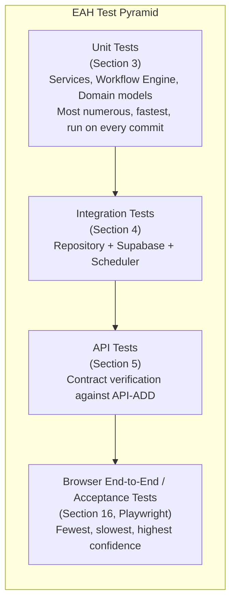
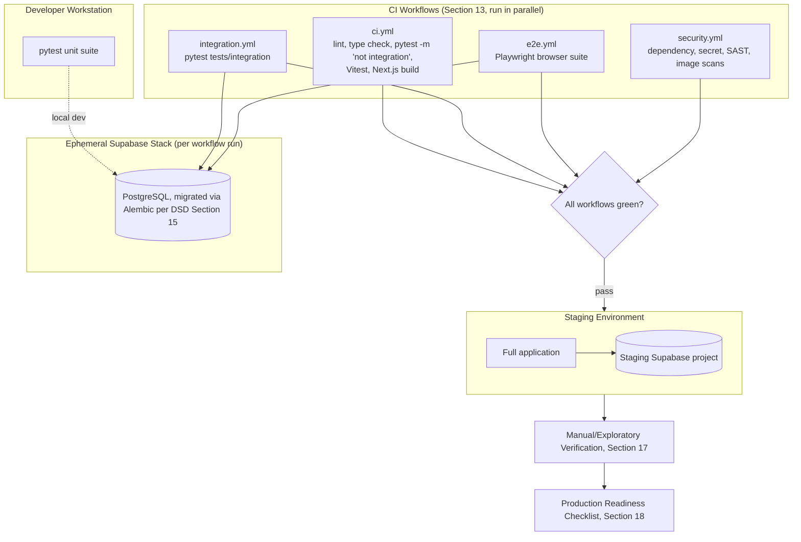
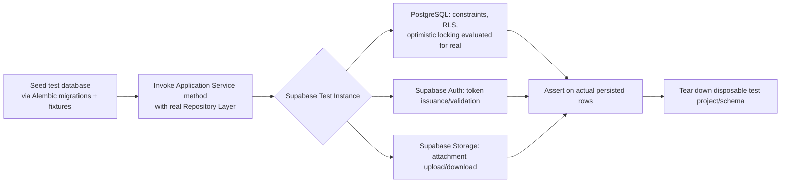
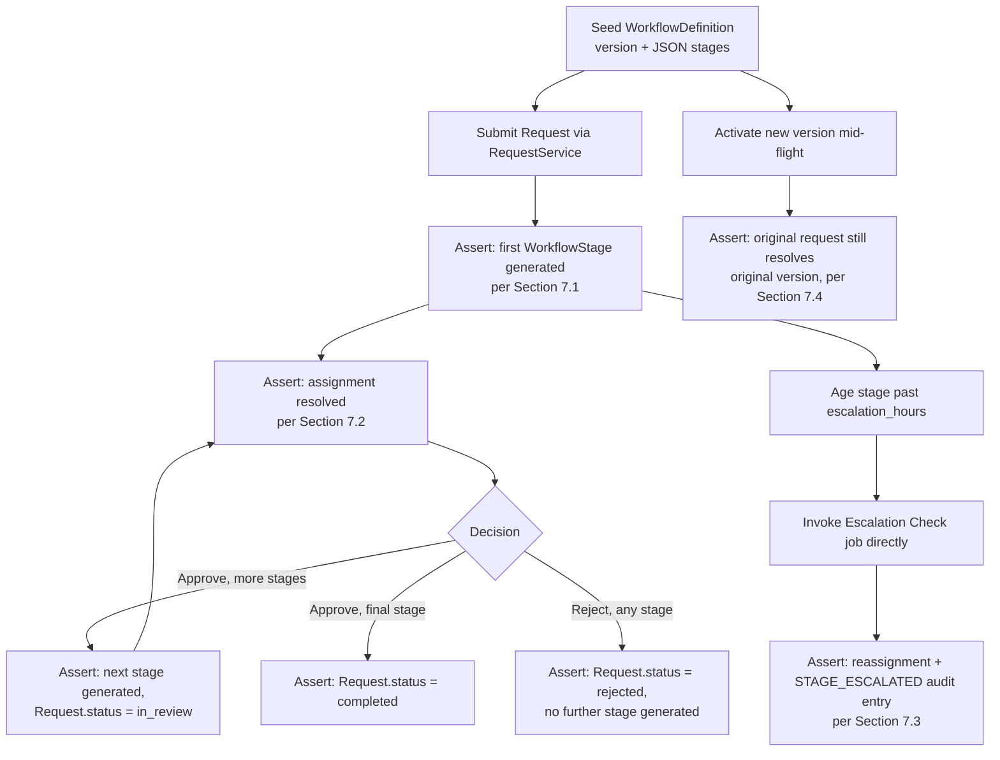
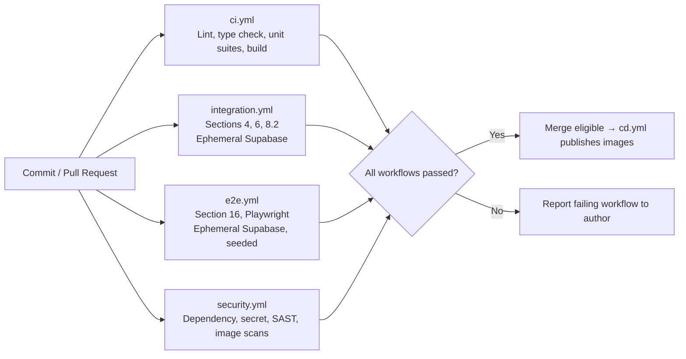

# Enterprise Automation Hub (EAH)
## Testing Strategy Document (TSD)

**Version:** 1.1
**Status:** Finalized — consistent with the SRS, Architecture Design Document (ADD), Database Schema Design Document (DSD), API Design Document (API-ADD), and Workflow Engine Design Document (WEDD)
**Revision 1.1:** Reconciled with the implemented test suites — module paths (`src/` → `app/`), the browser end-to-end suite (Sections 2.1–2.3, 13, 16), the parallel-workflow CI pipeline (Section 13), and three claims that no longer matched the code: the staging-based acceptance process (Section 16), the enforced coverage gate (Section 14), and the `tests/regression/` directory (Section 15)
**Author:** Principal QA Architect
**Testing Frameworks:** pytest (backend), Vitest + Testing Library (frontend unit/component), Playwright (browser end-to-end)

> **Superseded note:** Written against the original Streamlit-based
> Presentation Layer (`src/ui`), which has since been fully replaced by a
> FastAPI backend (`app/`, tested with pytest substantially as described
> below) plus a separate Next.js/React frontend (`frontend/`). Three
> corrections apply throughout, and the affected sections have been
> updated in place rather than left to this note alone:
>
> 1. **Module paths.** Every `src/...` path below is now `app/...`
>    (`src/workflows` → `app/workflow`, `src/repositories` →
>    `app/database/repositories`, `src/ui` → the `frontend/` application).
> 2. **The frontend is genuinely tested**, not "manual/exploratory only"
>    as the original Presentation Layer section had it — Vitest +
>    Testing Library cover components and pages, ESLint and `tsc` gate
>    every change, and a Playwright suite drives a real browser.
> 3. **Acceptance testing is automated in a browser** (Section 16), not
>    against "Streamlit UI driven via automated interaction." It runs in
>    CI on every commit against an ephemeral local Supabase stack, not
>    on a nightly schedule against a long-lived staging project.
>
> The pyramid shape and per-layer coverage philosophy remain accurate.

---

## Table of Contents

1. Overview
2. Testing Architecture
3. Unit Testing
4. Integration Testing
5. API Testing
6. Database Testing
7. Workflow Testing
8. Security Testing
9. Performance Testing
10. Failure Testing
11. Test Data Strategy
12. Mocking Strategy
13. CI Testing Pipeline
14. Code Coverage Strategy
15. Regression Testing
16. Acceptance Testing
17. Manual Testing
18. Production Readiness Checklist
19. Mermaid Diagrams Index
20. Future Improvements

---

## 1. Overview

### 1.1 Purpose

This document specifies how the Enterprise Automation Hub is verified, at every level from an isolated function call to a fully assembled, production-representative deployment. It exists so that "tested" has one precise, shared meaning across the project: a specific test category, running against a specific layer, verifying a specific guarantee already promised by the SRS, ADD, DSD, API-ADD, or WEDD. Nothing in this document tests a behavior that those five documents did not already commit to.

### 1.2 Scope

This document covers automated testing (unit, integration, API, database, workflow, security, performance, failure/chaos-style, regression) and the manual and acceptance processes that surround it, all built exclusively on `pytest`, per the project's fixed technology stack. It does not cover requirements elicitation (SRS), architectural design (ADD, WEDD), schema design (DSD), or the API contract itself (API-ADD) — it verifies that the system, as built, actually satisfies what those documents specify.

### 1.3 Testing Philosophy

EAH's testing strategy follows directly from the ADD's own stated priorities — maintainability, separation of concerns, testability, and production readiness — applied to the discipline of testing itself:

- **A test verifies a documented guarantee, never an implementation detail.** Every test in this project can be traced to a specific sentence in one of the five source documents (a transaction boundary in the DSD, a state transition in the WEDD, a status code in the API-ADD). A test that cannot be so traced is either testing something undocumented (a documentation gap to be fixed first) or testing an incidental implementation detail (which should not be locked in by a test at all).
- **Layer boundaries are test boundaries.** Because the ADD enforces a strict layering (Presentation → Application → Domain → Repository → Database), each layer can — and must — be tested in isolation, with the layer beneath it replaced by a test double where appropriate (Section 12). This is what makes unit tests fast and deterministic, and it is the same layering discipline that makes the codebase maintainable in the first place.
- **The database is a first-class thing under test, not an implementation detail to be mocked away everywhere.** Because the DSD assigns real behavioral guarantees to PostgreSQL itself (foreign keys, check constraints, RLS, optimistic-locking predicates), a testing strategy that only ever mocks the Repository Layer would leave the DSD's own guarantees unverified. Section 4 and Section 6 exist specifically to close that gap.
- **Concurrency and failure are tested deliberately, not left to chance.** The WEDD makes explicit claims about optimistic locking, atomic transactions, and recovery after restart; a testing strategy that never actually induces a race or a mid-transaction failure would leave those claims as assertions, not verified facts. Sections 9 and 10 exist to make them verified facts.

### 1.4 Relationship with Other Architecture Documents

| Document | What It Establishes | What This Document Verifies |
|---|---|---|
| SRS | Functional and non-functional requirements | Acceptance-level confirmation that the built system satisfies them (Section 16) |
| ADD | Layering, component responsibilities, error-handling and security philosophy | Layer-isolated unit tests (Section 3), security tests (Section 8) |
| DSD | Table structure, constraints, RLS, transaction list, optimistic locking | Database tests (Section 6), transaction/concurrency verification (Sections 6.2–6.3) |
| API-ADD | REST contract, status codes, error codes, idempotency, state transitions | API tests (Section 5) |
| WEDD | Workflow Engine internals, stage generation, assignment, escalation, versioning | Workflow tests (Section 7) |

This document introduces no table, endpoint, business rule, or technology not already defined in the five documents above. Every fixture, mock, and test scenario described below operates on entities already named in those documents (`requests`, `workflow_stages`, `comments`, `attachments`, `notifications`, `workflow_definitions`, `audit_logs`, `profiles`; `RequestService`, `ApprovalService`, `CommentService`, `AttachmentService`, `AuditService`, `NotificationService`, `AnalyticsService`, `AuthService`; the Workflow Engine's `DefinitionResolver`, `StageGenerator`, `AssignmentResolver`, `EscalationPlanner`).

---

## 2. Testing Architecture

### 2.1 Test Pyramid

EAH follows a conventional test pyramid, shaped by the ADD's layering: the majority of tests are fast, isolated unit tests against the Domain and Application layers; a smaller number of integration tests exercise the Repository Layer against a real Supabase/PostgreSQL instance; a still smaller number of browser end-to-end and acceptance tests exercise the full stack, per Section 16.



The pyramid's shape is a direct consequence of the ADD's own design: because business logic lives in the Application and Domain layers, independent of the presentation layer and largely independent of Supabase (per the ADD's Testability principle), the overwhelming majority of meaningful behavior — validation rules, workflow decisions, assignment resolution, error handling — can be verified without a database connection at all, which is what keeps the base of the pyramid both large and fast.

### 2.2 Testing Layers

| Layer | Corresponds To | Test Category |
|---|---|---|
| Presentation | `frontend/src` | Vitest + Testing Library component/page tests, gated by ESLint and `tsc`; user-facing flows additionally covered by the Playwright suite (Section 16) |
| Application | `app/services` | Unit tests (Section 3.1), with repositories replaced by fakes |
| Domain | `app/models` | Unit tests (Section 3.5), pure Pydantic v2 validation, no test doubles needed |
| Workflow Engine | `app/workflow` | Unit tests (Section 3.2), pure functions, no I/O |
| Repository | `app/database/repositories` | Integration tests (Section 4.1) against a real test-instance database |
| Database | Supabase PostgreSQL | Database tests (Section 6), directly exercising constraints, RLS, and transactions |
| Scheduler | `app/scheduler` | Integration tests (Section 4.6) and failure tests (Section 10.3) |
| API Contract | Section 19 of the API-ADD | API tests (Section 5), exercised against the same Application Services layer per the API-ADD's Section 1.2 clarification that the REST contract is a specification over in-process calls today |

### 2.3 Test Organization

Backend test code mirrors the source tree, per the ADD's folder-responsibility discipline (ADD Section 6): a module at `app/services/request_service.py` is tested at `tests/unit/test_request_service.py`. Tests requiring a database are kept in a distinct `integration/` subtree so that a developer or CI stage can run the fast unit suite alone (`pytest -m "not integration"`) without provisioning one. Frontend tests are colocated with the code they cover — `page.tsx` is tested by `page.test.tsx` in the same directory, the prevailing Next.js convention — while the browser end-to-end suite, which belongs to no single component, sits in its own top-level `frontend/e2e/` tree.

```
tests/                     # Backend (pytest)
├── unit/                  # Services, workflow engine, models, utils, API
│                          #   contracts — in-memory fakes, no database
├── integration/           # Repositories, Supabase, scheduler, database
│                          #   constraints/RLS/transactions (Sections 4, 6)
├── security/              # RBAC, RLS, injection (Section 8)
├── performance/           # load/stress/concurrency (Section 9)
├── acceptance/            # SRS-traced full-lifecycle scenarios through the
│                          #   real service and Workflow Engine classes,
│                          #   wired to in-memory fakes (Section 16)
├── fixtures/              # Shared factories and test data (Section 11)
└── conftest.py            # Shared pytest fixtures

frontend/
├── src/**/*.test.tsx      # Vitest + Testing Library, colocated with source
└── e2e/                   # Playwright browser suite (Section 16)
    ├── tests/             #   *.spec.ts — one file per user-facing flow
    ├── fixtures/          #   auth helpers, seeded test users
    └── setup/             #   authentication setup project
```

Note that `tests/acceptance/` and `frontend/e2e/` are both "end-to-end" in the ordinary sense but differ in what they assemble: the former wires the real service and Workflow Engine classes to in-memory fakes and asserts on the resulting domain state, running in milliseconds with no infrastructure; the latter drives a real browser against a real backend, database, and auth provider. Both are retained deliberately — the first localizes a lifecycle regression to a specific service interaction, the second proves the assembled system actually works.

### 2.4 Test Environment

| Environment | Purpose | Database |
|---|---|---|
| Local developer | Fast feedback during development | A local or ephemeral Supabase project (or a plain PostgreSQL instance matching the DSD's schema, for tests that do not require Supabase Auth/Storage specifically) |
| CI | Automated verification on every commit/PR (Section 13) | An ephemeral local Supabase stack (`supabase start`), migrated with Alembic and seeded per run, torn down afterwards — no hosted project and no secrets are involved |
| Staging | Pre-production manual and exploratory testing (Section 17) | A dedicated Supabase project mirroring production configuration, seeded with representative test data (Section 11). Acceptance testing (Section 16) no longer waits for this environment — it is automated and runs in CI |
| Production | Live system | Not a test target for any automated suite in this document; production readiness is instead verified via the checklist in Section 18 |

No environment in this table introduces infrastructure beyond Supabase and PostgreSQL, consistent with the ADD's and DSD's fixed technology constraint — "ephemeral local stack" and "staging project" are configuration/deployment distinctions within Supabase, not additional infrastructure.

### 2.5 Test Architecture Diagram



---

## 3. Unit Testing

### 3.1 Services

Every public method on every Application Service (`RequestService`, `ApprovalService`, `CommentService`, `AttachmentService`, `AuditService`, `NotificationService`, `AnalyticsService`, `AuthService`) is unit tested with its repository dependencies replaced by in-memory fakes, per the ADD's constructor-injection pattern (ADD Section 7). This verifies orchestration logic — the order in which repositories and the Workflow Engine are called, and what is passed between them — without requiring a database.

| Service | Representative Unit Test Scenarios |
|---|---|
| `RequestService` | Rejects an unknown `request_type` before any repository call; correctly assembles the `Request` + first `WorkflowStage` payload for a resolved definition; enforces the `PATCH` immutability rule for `status`/`current_stage_id` (API-ADD Section 3.6) |
| `ApprovalService` | Rejects a decision from a non-assignee before touching the Repository Layer; requires `decision_note` on rejection but not approval (WEDD Section 6.6); correctly determines completion vs. next-stage generation from `StageGenerator`'s return value (WEDD Section 6.5) |
| `CommentService` | Rejects a `parent_comment_id` that does not resolve to an existing, non-deleted comment on the same request (API-ADD `PARENT_COMMENT_NOT_FOUND`) |
| `AttachmentService` | Rejects a disallowed `content_type` or non-positive `size_bytes` before invoking Storage (API-ADD Section 23); never inserts `attachments` metadata if the (faked) Storage call fails |
| `AuditService` | Exposes only `insert` and read methods; no `update`/`delete` method exists to test against, which is itself verified as an absence (Section 3.6) |
| `NotificationService` | Correctly selects `notification_type` per triggering event (WEDD Section 15.1); in-app insert and SMTP dispatch are independent — a faked SMTP failure does not prevent the in-app row from being asserted as created |
| `AnalyticsService` | Aggregation and data-shaping logic produces correct output structures independent of any chart library, per the ADD's explicit separation of analytics computation from Plotly rendering |
| `AuthService` | Correctly resolves `profiles.role` from a valid (faked) JWT claim; rejects before any downstream call on a missing/expired token |

### 3.2 Workflow Engine

Per the WEDD's explicit design (WEDD Section 2.1), the Workflow Engine's four internal components (`DefinitionResolver`, `StageGenerator`, `AssignmentResolver`, `EscalationPlanner`) perform no I/O and are tested as pure functions — the single largest concentration of fast, deterministic unit tests in the project, owing precisely to the "no I/O" design choice the WEDD calls out as enabling this.

| Component | Representative Unit Test Scenarios |
|---|---|
| `DefinitionResolver` | Given a set of candidate definition rows, selects the one with `is_active = true`; returns a clear failure signal when none is active (WEDD Section 5.3) |
| `StageGenerator` | Given a definition and a current stage order, returns the correct next-stage shape or `None` at the final stage (WEDD Section 6.5); rejects a definition whose `stages` array has a non-sequential `order` (WEDD Section 13.2) |
| `AssignmentResolver` | Correctly dispatches on `specific_user`, `department_queue`, and `requester_manager` (WEDD Section 7); falls back to `assigned_role = 'admin'` with an audit-metadata marker when `requester_manager` resolution fails (WEDD Section 7.5) |
| `EscalationPlanner` | Correctly computes the escalation threshold from `created_at` + `escalation_hours` (WEDD Section 8.2); correctly identifies eligibility at, just before, and just after the threshold (boundary testing) |

### 3.3 Repositories (Unit-Level)

Repository classes themselves are primarily covered by integration tests (Section 4.1), since their entire purpose is to talk to Supabase. At the unit level, only their non-I/O logic is tested in isolation — for example, a repository method's translation of a raw Supabase response shape into a Pydantic model, exercised against a hand-constructed fake response payload rather than a live database call, verifying the mapping logic without needing a real connection.

### 3.4 Utilities

Functions in `src/utils` (date/time formatting, ID generation helpers, the Configuration Loader's parsing logic) are unit tested directly, with particular attention to the Configuration Loader's JSON-only parsing (DSD Section 1 changelog — YAML explicitly excluded) and its typed Pydantic settings objects, since a misconfigured environment variable here would silently propagate incorrect behavior into every other layer.

### 3.5 Validation

Every Pydantic v2 model in `src/models` is unit tested directly against its own validators, independent of any service — this is the fastest and most exhaustive category of test in the project, since Domain layer models have no dependencies at all (ADD Section 3.3). Boundary conditions are tested explicitly: a `title` of exactly 200 characters succeeds, 201 fails (API-ADD Section 22); a negative `stage_order` or `size_bytes` fails the corresponding DSD check constraint's application-level mirror (DSD Section 4.1); every enum field (`user_role`, `request_status`, `stage_status`, `notification_type`) is tested against both valid and invalid values.

### 3.6 Error Handling

Unit tests explicitly assert that each documented exception type is raised under its documented condition, and only under that condition: `DuplicateRequestError`, `InvalidStageTransitionError`, `ConcurrentUpdateError` (DSD Section 3.9, WEDD Section 6.10), `RepositoryError`, `RecordNotFoundError`, `ConstraintViolationError` (ADD Section 8). A dedicated negative-test suite confirms that no other exception type leaks past a service boundary uncaught, since the ADD requires that the UI never receive a raw internal exception.

---

## 4. Integration Testing

### 4.1 Repository Integration

Every repository method is exercised at least once against a real, migrated test-instance PostgreSQL database (Section 2.4), verifying the actual SQL/PostgREST interaction the unit tests in Section 3.3 deliberately did not cover: that a `RequestRepository.insert()` call truly persists a row satisfying every DSD-declared constraint, that a `get_pending_for_approver` query returns results consistent with the composite index it is designed to use (DSD Section 10.2), and that mapping from a live database row back into a Pydantic model round-trips correctly for every field, including nullable ones.

### 4.2 Supabase Integration

Beyond plain PostgreSQL query behavior, a dedicated integration suite exercises the Supabase-specific surfaces the DSD and ADD assign real behavior to: Supabase Auth token issuance and validation (Section 4.4), Supabase Storage upload/download for attachments (mirroring API-ADD Section 23's file-handling discipline against a real test bucket), and the service-role vs. anon-key connection distinction (DSD Section 9.3) — confirming, concretely, that an anon-key connection is in fact subject to RLS and a service-role connection is not, rather than trusting that distinction as an assumption.

### 4.3 API Integration

Because the API-ADD specifies the REST contract as a specification layer over the same in-process Application Service calls (API-ADD Section 1.2), "API integration testing" in EAH means exercising a full request path — from a simulated Presentation Layer call, through the documented Application Service method, through the real Repository Layer, to a real test database and back — verifying that the entire vertical slice behaves exactly as Section 19 of the API-ADD specifies, including status codes and response shapes (Section 5 of this document expands this further as contract-level testing).

### 4.4 Authentication

Integration tests confirm the full authentication flow against a real (test-instance) Supabase Auth: issuing a token via test credentials, presenting it as a bearer token, and confirming `AuthService` correctly resolves the corresponding `profiles` row — as well as the negative path, confirming an expired or tampered token is rejected before any Application Service method executes (API-ADD Section 5.3).

### 4.5 Workflow Execution

An end-to-end workflow integration test submits a request against a real, seeded `workflow_definitions` row, decides each stage in sequence via `ApprovalService`, and asserts, at each step, against the real database: that the correct `workflow_stages` row was generated, that `requests.current_stage_id` and `status` advanced correctly (WEDD Section 10.1's state table), and that the request reaches `completed` or `rejected` exactly when the WEDD specifies it should (Section 7 of this document expands this into a dedicated workflow-testing category).

### 4.6 Scheduler Integration

APScheduler's Escalation Check, Reminder Dispatch, and Nightly Analytics Aggregation jobs (WEDD Section 8.3, ADD Component Breakdown) are integration tested by invoking each job function directly (not by waiting for its real-time trigger), against a seeded test database containing stages at various ages relative to their configured `escalation_hours`, confirming the job acts on exactly the rows it should and none it should not — including the boundary case of a stage exactly at its threshold.

### 4.7 Integration Testing Flow Diagram



---

## 5. API Testing

### 5.1 Endpoint Validation

Every endpoint enumerated in API-ADD Section 18 (the Endpoint Summary Table) has a corresponding contract test confirming its method, path, and minimum required role match the specification exactly — a structural check that runs before any behavioral test, so that a change to a route's shape is caught immediately.

### 5.2 Request Validation

For each endpoint, tests confirm every validation rule in API-ADD Section 22 (UUID format, string length boundaries, ISO-8601 timestamp strictness, JSON well-formedness) is enforced exactly as documented, with explicit boundary-value tests (e.g., a `title` of 200 vs. 201 characters, per Section 3.5 of this document).

### 5.3 Response Validation

Tests assert that every response matches its documented Resource Schema (API-ADD Section 10) field-for-field, including that every documented field is present even when `null` (API-ADD Section 3.5's field-omission policy) and that pagination metadata (`page`, `page_size`, `total_records`, `total_pages`) is arithmetically correct relative to the seeded data.

### 5.4 Authentication Testing

Every endpoint requiring authentication is tested against a missing, malformed, and expired bearer token, asserting `401 AUTHENTICATION_REQUIRED` in each case, per API-ADD Section 11.3 — and that `POST /api/v1/auth/login` and `GET /api/v1/health` are the only two endpoints where absence of a token does not produce this result (the latter unauthenticated by design, API-ADD Section 27).

### 5.5 Authorization Testing

For each of the three roles (`employee`, `approver`, `admin`), a matrix of tests confirms exactly the permission set documented in API-ADD Section 6.2 — including negative cases (an `employee` calling an approval endpoint, a non-assigned `approver` attempting to decide a stage not theirs) and the specific API-ADD Section 11.2 rule that an out-of-scope resource returns `404`, not `403`, to avoid confirming existence to an unauthorized caller.

| Role | Endpoint Category | Expected Outcome |
|---|---|---|
| employee | `POST /workflow-stages/{id}/approve` | `403 PERMISSION_DENIED` |
| employee | `GET /requests/{id}` (another user's request) | `404 RESOURCE_NOT_FOUND` |
| approver | `POST /workflow-definitions` | `403 PERMISSION_DENIED` |
| approver | `POST /workflow-stages/{id}/approve` (stage not assigned to them, role mismatch) | `403 PERMISSION_DENIED` |
| admin | `PATCH /requests/{id}` (attempting to set `status` directly) | `422 IMMUTABLE_FIELD` |

### 5.6 Error Responses

Every `error.code` value in API-ADD Section 11.3's catalog has at least one corresponding test that induces exactly that error and asserts the full standard error shape (API-ADD Section 11.1): `error.code`, `error.message`, optional `error.details`, and `meta.request_id`/`meta.timestamp` presence.

---

## 6. Database Testing

### 6.1 Constraints

Every constraint declared in the DSD is directly tested by attempting to violate it and asserting PostgreSQL itself rejects the operation, independent of any Application Layer guard: foreign key `RESTRICT`/`CASCADE` behavior (DSD Section 4), unique constraints (`(request_type, version)` on `workflow_definitions`, `(request_id, stage_order)` on `workflow_stages`, `storage_path` on `attachments`), and every check constraint in DSD Section 4.1 (`stage_order > 0`, `version > 0`, `size_bytes > 0`, `completed_at >= created_at`, `decided_at >= created_at`).

### 6.2 Transactions

**Transaction verification** is performed by directly asserting the all-or-nothing behavior of every multi-statement transaction named in DSD Section 11 and elaborated in WEDD Section 11: a test deliberately induces a failure partway through (e.g., a simulated constraint violation on the final `INSERT` of a transaction) and asserts that **none** of the transaction's earlier statements are visible in a subsequent read — confirming atomicity is real, not merely documented. Each of the following transactions has its own dedicated test:

| Transaction | Verification Performed |
|---|---|
| Request creation (DSD 11, WEDD 5.4) | Failure at the audit-insert step leaves no `requests` or `workflow_stages` row behind |
| Approval decision (DSD 11, WEDD 6.2) | Failure after the stage update but before the request update leaves the stage `pending` again on rollback, never observably `approved` with a stale `current_stage_id` |
| Comment creation (DSD 11) | Failure at the audit-insert step leaves no `comments` row behind |
| Attachment upload (DSD 11, API-ADD 23) | A Storage write with no corresponding committed `attachments` row is never left in a state the application would treat as valid (Section 10.5 covers orphan handling explicitly) |
| Workflow definition activation (DSD 11, WEDD 9.2) | Failure at the target-row update leaves the *previous* version still active — never a state with zero active versions for that `request_type` |

### 6.3 Optimistic Locking

**Optimistic locking verification** is performed with tests that simulate two concurrent writers against the same row: the first `UPDATE ... WHERE version = expected_version` is allowed to commit, and the second (using the same, now-stale `expected_version`) is asserted to affect zero rows and to surface as `409 CONCURRENT_UPDATE` / `STAGE_ALREADY_DECIDED` at the Application Layer (WEDD Section 12.3–12.4). This is tested for every table carrying a `version`/`row_version` column: `profiles`, `requests`, `workflow_stages`, `workflow_definitions`.

**Concurrency verification** goes further than the two-writer case above: a dedicated test harness issues many simulated concurrent decision attempts against a single seeded `pending` stage (using real database connections, not mocks, since the guarantee being tested is a database-level one) and asserts that **exactly one** succeeds and every other attempt receives a `409`, with the winning attempt's identity nondeterministic but its uniqueness guaranteed — directly verifying WEDD Section 12.5's race-condition table rather than merely asserting it by inspection.

**Rollback verification** confirms, for each of the transactions in the table above, that a rollback truly restores the pre-transaction state and not merely "no new error" — the test reads the affected rows both before the induced failure and after the rollback and asserts byte-for-byte equality (including `version` columns being unchanged, since a rollback must not leave a stray version increment behind).

### 6.4 Row-Level Security (RLS)

**RLS verification** is performed by connecting directly with the anon-key credential as each of the three roles (never through the Application Layer, so that a defective Application Layer check cannot mask a defective policy) and confirming the exact policy table in DSD Section 9.2 for every table: a `submitter` can `SELECT`/`INSERT` only their own `requests`; an `approver` can `SELECT` a request only when assigned to one of its stages; only `admin` can `SELECT` all rows; no role, including `admin`, can `UPDATE`/`DELETE` `audit_logs` (DSD Section 6); a service-role connection is confirmed to bypass every one of these policies, and this bypass is itself tested only against the specific server-side operations documented as legitimately cross-cutting in DSD Section 9.3, never asserted as a blanket "service role can do anything is fine" without a corresponding Application Layer check having already run.

### 6.5 Index Verification

For every index declared in DSD Sections 10.1–10.2, a test issues the exact query pattern that index is meant to serve and inspects the database's query plan (`EXPLAIN`) to confirm the planner actually chooses an index scan rather than a sequential scan at a realistic seeded data volume — verifying that the index exists **and** that it is actually used for its intended query, which are two distinct claims.

### 6.6 Data Integrity

Beyond individual constraints (Section 6.1), integrity tests confirm cross-table invariants that no single constraint expresses alone: that every `requests` row's `current_stage_id`, when non-null, points to a `workflow_stages` row that is itself `pending` (never to an already-decided stage); that a soft-deleted (`deleted_at` populated) `requests`, `comments`, or `attachments` row is excluded from every default repository list method (DSD Section 3.10) while remaining fully resolvable by `audit_logs` referencing it.

---

## 7. Workflow Testing

### 7.1 Stage Generation

Tests confirm `StageGenerator` produces exactly the stage sequence implied by a given `workflow_definitions.definition` document, in `stage_order` order, and confirms the incremental-generation design (WEDD Section 4.6): after the first stage is created at request submission, no other stage exists in `workflow_stages` for that request until the first is decided, at which point exactly one new stage appears (or none, if the request completed).

### 7.2 Assignment Resolution

Each assignment strategy (`specific_user`, `department_queue`, `requester_manager`) is tested end-to-end against a seeded `workflow_definitions` document and a seeded `profiles` table, confirming the resolved `assigned_to`/`assigned_role` on the generated `workflow_stages` row matches WEDD Section 7's specification exactly, including the documented fallback (WEDD Section 7.5) when `requester_manager` resolution fails — asserting both the fallback assignment **and** the corresponding `ASSIGNMENT_FALLBACK_APPLIED` marker in the resulting `audit_logs.metadata`.

### 7.3 Escalation

**Scheduler verification**, specific to the Escalation Check job (WEDD Section 8), is performed by seeding stages at ages both before and after their configured `escalation_hours` threshold and invoking the job function directly (Section 4.6), asserting: stages before threshold are untouched; stages past threshold are reassigned exactly as WEDD Section 8.4 specifies, with the reassignment itself guarded by the same optimistic-locking check as a human decision (confirmed by a test that has a human decision "win" a simulated race against an escalation attempt on the same stage); and a corresponding `STAGE_ESCALATED` audit entry is written. A separate **recovery-after-restart** test (WEDD Section 8.6) seeds an overdue stage, simulates a process restart (by tearing down and re-instantiating the Scheduler component against the same database), and confirms the next Escalation Check run acts on the stage identically to a run that had never been interrupted — directly verifying the WEDD's durability claim rather than assuming it.

### 7.4 Versioning

Tests confirm: a newly created `workflow_definitions` row defaults to `is_active = false` (WEDD Section 9.1); activation atomically deactivates the prior active version for the same `request_type` (WEDD Section 9.2, verified the same way as Section 6.2's transaction tests); and, critically, **running workflow isolation** (WEDD Section 9.6) — a test creates a request under version 1 of a definition, activates version 2, and confirms the original request's subsequent stage generation still resolves against version 1's document, never version 2's, by asserting on the generated stage's `stage_name`/`assigned_role` matching version 1's configuration exactly.

### 7.5 Approval Progression

An end-to-end test walks a multi-stage request through every stage in sequence, asserting at each step against WEDD Section 10.1's state transition table: `requests.status` moves `pending → in_review → ... → completed` exactly as specified, `current_stage_id` always points at the correct stage, and the request never observably skips a documented state.

### 7.6 Rejection Handling

Tests confirm a rejection at any stage — first, intermediate, or final — immediately terminates the workflow: `requests.status` moves to `rejected`, `completed_at` is set, `current_stage_id` is cleared, and no further `workflow_stages` row is ever generated after a rejection (WEDD Section 6.3), including the specific rule that `decision_note` is required on rejection and its absence is rejected before any transaction opens (WEDD Section 6.6).

### 7.7 Workflow Testing Flow Diagram



---

## 8. Security Testing

### 8.1 RBAC

Beyond the endpoint-level authorization matrix in Section 5.5, a dedicated RBAC suite confirms the permission table in API-ADD Section 6.2 holds for every Application Service method directly (not only through the API layer), since the ADD requires authorization to be enforced at the Application Layer independent of any particular entry point.

### 8.2 RLS

Section 6.4 already specifies the primary RLS verification strategy; the security suite additionally includes negative tests specifically designed to catch a defective Application Layer check being silently compensated for by RLS (a scenario that should never happen given correct code, but which the defense-in-depth principle in the ADD and DSD Section 9.3 is specifically designed to catch when it does) — confirming both layers independently reject the same unauthorized operation, rather than only one of them being exercised.

### 8.3 Injection Prevention

Because all persistence goes through the Repository Layer's parameterized Supabase client calls (ADD Section 9, API-ADD Section 24), injection tests focus on confirming that free-text fields (`title`, `description`, `body`, `decision_note`) containing SQL metacharacters or script-like content are stored and returned verbatim as inert text, never interpreted, executed, or used to alter a query's structure — a test that exists to catch a regression (e.g., a future change that concatenates a filter value into a query string) rather than to test Supabase's own client library.

### 8.4 Authentication

Section 4.4 and Section 5.4 cover integration- and API-level authentication testing; the security suite adds tests specifically targeting token tampering (a JWT with an altered payload but an unchanged signature is rejected) and clock-skew edge cases around token expiry.

### 8.5 Authorization

Complementing Sections 5.5 and 8.1, the security suite includes a full matrix confirming DSD Section 9.2's RLS policy table and API-ADD Section 6.2's Application Layer permission table are consistent with each other for every role/resource/action combination — any divergence between the two (a case the Application Layer permits that RLS would deny, or vice versa) is treated as a defect, since the ADD's defense-in-depth principle assumes the two layers agree on the same authorization decision, not merely that both independently reject unauthorized access.

---

## 9. Performance Testing

### 9.1 Load Testing

Load tests simulate the DSD's stated scale (DSD Section 12.1: 100,000+ cumulative requests, 50 concurrent users) against a seeded test database of representative size, confirming the latency targets in API-ADD Section 25.2 (e.g., p95 < 150 ms for indexed single-resource reads, < 300 ms for filtered/paginated lists) hold at that volume, not only against an empty or trivially small test database.

### 9.2 Stress Testing

Stress tests exceed the stated concurrency figure (beyond 50 simultaneous simulated users) specifically to observe *how* the system degrades — confirming that Supabase's connection pooling (DSD Section 12.4) produces graceful queuing/backpressure rather than connection exhaustion errors propagating as unhandled exceptions, and that the rate-limiting figures in API-ADD Section 15 correctly shed excess load with `429 RATE_LIMITED` rather than allowing it to degrade every other caller's latency.

### 9.3 Concurrency

Beyond the correctness-focused concurrency verification in Section 6.3, performance-focused concurrency tests measure the *throughput* cost of optimistic-locking retries under contention — confirming that a realistic level of `department_queue` contention (WEDD Section 7.3, multiple approvers eligible for the same stage) produces an acceptable rate of `409` responses relative to successful decisions, rather than a pathological level of wasted work.

### 9.4 Scheduler Performance

Scheduler performance tests confirm the Escalation Check and Reminder Dispatch jobs (WEDD Section 8.3) complete within their own scheduling interval even at the DSD's stated scale — an hourly Escalation Check job that takes longer than an hour to run against a large `workflow_stages` table would be a genuine defect, and this is tested directly against a seeded table sized to the DSD's stated scale, confirming the composite index `(assigned_to, status)` (DSD Section 10.2) keeps the job's query cost bounded as intended.

### 9.5 Database Performance

Database performance tests exercise the specific query patterns named in DSD Sections 10.1–10.2 and API-ADD Section 13 (filtering, sorting, composite-index-backed lookups) at the stated data volume, confirming query latency remains consistent with Section 9.1's targets as the underlying tables grow — a complement to Section 6.5's index-verification tests, which confirm an index is *used*, while this section confirms it is *fast enough* at scale.

---

## 10. Failure Testing

### 10.1 Transaction Rollback

Section 6.2 and 6.3 already specify the primary rollback-verification strategy; this section's failure-testing suite extends it to failure modes that are not simple constraint violations — a simulated network interruption mid-transaction, a simulated connection-pool exhaustion — confirming the same all-or-nothing guarantee holds regardless of *why* the transaction failed, not only for the specific failure types easiest to induce deterministically.

### 10.2 Notification Failures

Tests confirm the specific independence the ADD and WEDD both specify (WEDD Section 15.2): a simulated SMTP failure during request creation, approval, or rejection does not roll back or fail the triggering transaction, and the in-app `notifications` row is still asserted as created with `email_sent = false`, distinct from a scenario where the in-app insert itself fails (which is retried per the ADD's bounded-retry policy for transient repository failures, and is tested as a repository-level failure, not a notification-specific one).

### 10.3 Scheduler Failures

Beyond the restart-recovery test in Section 7.3, failure tests confirm a single job run that encounters an error partway through its batch (e.g., the third of ten overdue stages fails to reassign due to a genuine, unrelated database error) does not abort the remaining seven — each stage in a scheduler batch is processed as its own independent transaction (WEDD Section 11.4's flat, non-nested transaction design), so a failure on one has no bearing on the others, and this test exists specifically to confirm that independence holds in practice.

### 10.4 API Failures

Tests confirm that an unexpected exception anywhere in the Application or Domain layers is caught by the top-level exception boundary (ADD Section 8) and surfaced as `500 INTERNAL_ERROR` with no stack trace in the response body, while the full trace and a correlating `request_id` are confirmed present in the structured server-side log output (API-ADD Section 27) — verifying both halves of the ADD's "never leak internals, but never lose the detail either" requirement.

### 10.5 Database Failures

Tests simulate a full loss of database connectivity mid-request and confirm the Application Layer's documented behavior (ADD Section 8: bounded retries for transient failures, then a `RepositoryError` surfaced as a generic, user-safe message) rather than an unhandled exception propagating to the Presentation Layer.

---

## 11. Test Data Strategy

| Data Category | Strategy |
|---|---|
| `profiles` | A fixed, version-controlled fixture set covering all three roles (`employee`, `approver`, `admin`) across at least two departments, so `department_queue` and `requester_manager` assignment strategies (WEDD Section 7) have realistic pools to resolve against |
| `workflow_definitions` | At least one seeded active definition per request type used in acceptance scenarios (Section 16), plus deliberately malformed definitions used only in validation tests (Section 3.5, WEDD Section 13.1) and never activated |
| `requests` / `workflow_stages` | Generated programmatically per test, via the same `RequestService`/`ApprovalService` entry points the application itself uses — never inserted by direct SQL fixture, so that test data always satisfies every constraint and transaction rule it is meant to be tested against |
| Large-volume data (Section 9) | Synthetically generated at the DSD's stated scale (100,000+ requests) via a dedicated seeding script, isolated to the performance-testing environment and never used in the fast unit/integration suites |
| Sensitive-shaped data | Test fixtures never contain real personal data; names, emails, and departments are synthetic, consistent with the ADD's Sensitive Data Handling principle applied to the test estate itself |

Test data is never shared as mutable global state across tests: each test either constructs its own fixtures within an isolated transaction that is rolled back at test end (for fast, repeatable database-touching unit-adjacent tests) or operates against a freshly migrated, disposable test project (for full integration and end-to-end suites, Section 2.4).

---

## 12. Mocking Strategy

| What Is Mocked | When | Why |
|---|---|---|
| Repository classes | Unit tests (Section 3.1) | Isolates Application Service orchestration logic from database behavior, per the ADD's constructor-injection pattern designed exactly for this purpose |
| Supabase Storage client | Unit tests for `AttachmentService` | Verifies validation-before-upload logic (Section 3.1) without a real Storage call |
| SMTP client | Unit and failure tests (Sections 3.1, 10.2) | Allows deterministic simulation of delivery success/failure without a real mail server |
| APScheduler's real-time trigger | Integration tests (Section 4.6) | Job *logic* is tested by direct invocation; the *timing* mechanism itself is not re-tested, since it is a third-party library's own responsibility, not EAH's |
| Nothing is mocked in database, RLS, transaction, or optimistic-locking tests (Sections 6, 7.3–7.4) | Never | These tests exist specifically to verify guarantees PostgreSQL itself provides; mocking the database would make the test assert nothing about the actual guarantee in question |

The governing rule: **a component is mocked only when the test's purpose is to verify the caller's behavior, never when the test's purpose is to verify the mocked component's own guarantee.** This is why Section 6's database tests deliberately use a real PostgreSQL instance rather than an in-memory substitute — an in-memory fake would not enforce the DSD's actual constraints, RLS policies, or transaction semantics, and a test built on top of one would verify nothing about them.

---

## 13. CI Testing Pipeline

### 13.1 Pipeline Stages

CI runs on every commit and pull request as **parallel GitHub Actions workflows**, rather than the single strictly-ordered chain this section originally specified. The ordering rationale in 13.2 still holds *within* each workflow — cheap checks first, fast-failing before expensive ones — but the workflows themselves run concurrently, because a slow browser suite blocking lint feedback costs developer time without catching anything earlier.

| Workflow | Runs | Infrastructure |
|---|---|---|
| [`ci.yml`](../.github/workflows/ci.yml) | Lockfile-drift check, ruff, mypy, then `pytest -m "not integration"` — the unit, security, performance, and acceptance suites (Sections 3, 5, 8, 9, 16); ESLint, `tsc`, Vitest, production Next.js build | None — in-memory fakes only |
| [`integration.yml`](../.github/workflows/integration.yml) | `pytest tests/integration` — repository, database, transaction, and RLS-policy suites (Sections 4, 6, 8.2) | Ephemeral local Supabase stack, Alembic-migrated |
| [`e2e.yml`](../.github/workflows/e2e.yml) | Playwright browser suite (Section 16) | Ephemeral local Supabase stack, migrated and seeded; boots the backend and a production frontend build |
| [`security.yml`](../.github/workflows/security.yml) | pip-audit, npm audit, Gitleaks secret scan, Bandit SAST, Trivy image scans | Builds both container images locally |
| [`cd.yml`](../.github/workflows/cd.yml) | Image build and publish on merge to `main` | GHCR |



The Playwright suite retries twice in CI (`retries: 2` in `playwright.config.ts`) and uploads an HTML report — including traces, screenshots, and video for failures — as a build artifact retained for 14 days, so a failure that does not reproduce locally remains diagnosable after the ephemeral stack is gone.

### 13.2 Stage Ordering Rationale

Lint/type-check runs first because a type error is cheaper to catch than any test failure and would make every subsequent stage's results meaningless. Unit tests run before any database provisioning because they require none and catch the largest volume of defects per unit of CI time.

This section originally excluded performance tests (Section 9) and acceptance tests (Section 16) from the per-commit pipeline, on the expectation that both would be too expensive to run on every commit. Both now run per-commit, for different reasons than the original assumption anticipated:

- **Acceptance tests** are automated in a browser and run in their own workflow, so their cost is paid in parallel rather than in series. An ephemeral Supabase stack provisions in roughly the time the frontend build takes, which makes the "disproportionate on every commit" judgment no longer true.
- **Performance tests** as implemented (`tests/performance/`, concurrency and optimistic-locking contention) run against in-memory fakes and complete in milliseconds. The sustained load generation and large-volume seeding this document envisioned — the actual justification for the nightly schedule — are still **not** implemented, and remain future work (Section 20).

### 13.3 Migration Verification in CI

Per the DSD's migration strategy (DSD Section 15), every CI run applies the full Alembic migration history from empty to the current head against the disposable test project before any test executes — this both provisions the test database and serves as a continuous verification that the migration history itself is valid and forward-applying, catching a broken migration before it would ever reach staging or production.

---

## 14. Code Coverage Strategy

| Layer | Target Coverage | Rationale |
|---|---|---|
| Domain (`app/models`) | ≥ 95% | Pure validation logic with no external dependencies; nearly every branch is cheaply and deterministically testable, so a lower target would represent untested validation rules, not an acceptable gap |
| Workflow Engine (`app/workflow`) | ≥ 95% | Pure functions, no I/O (WEDD Section 2.1); the same rationale as Domain applies directly |
| Application Services (`app/services`) | ≥ 90% | Orchestration logic with mocked repositories; the small gap below 95% accommodates defensive branches for genuinely rare failure combinations that are also covered at the integration level |
| Repositories (`app/database/repositories`) | ≥ 80% (unit) + full integration coverage of every public method | Repository logic is thin by design (ADD Section 6); the majority of confidence here comes from integration tests (Section 4.1), not unit-level line coverage |
| Utilities (`app/utils`) | ≥ 90% | Small, isolated, and cheap to cover fully |
| Presentation (`frontend/src`) | Not coverage-gated | Covered by Vitest component tests and the Playwright suite (Section 16) against user-facing behavior, rather than by a line-coverage percentage |

Coverage is a **diagnostic signal, not a goal in itself** — a change that increases coverage by testing an implementation detail unrelated to any documented guarantee (Section 1.3's core philosophy) is not a quality improvement. Coverage percentages are never used as the sole criterion for judging an individual pull request's test adequacy.

> **Implementation note:** the targets above are the standard this document sets, not a mechanically enforced gate. `pytest.ini` measures branch coverage on every run (`--cov=app --cov-branch`) and reports it, but **no `--cov-fail-under` threshold is configured**, so CI does not currently fail a build on a coverage regression — the per-layer figures are reviewed rather than enforced. Backend branch coverage stands at 79% aggregate across `app/` as of this revision. Wiring up an enforced threshold is tracked as future work (Section 20).

---

## 15. Regression Testing

Every defect fixed in EAH is accompanied by a new test reproducing the original failure, added to the appropriate suite in this document's structure (Section 2.3) before the fix itself is committed — ensuring the defect cannot silently reappear. The full unit and integration suites (Sections 3–7) run on every commit (Section 13.1) and constitute the primary regression safety net.

> **Implementation note:** this section originally also specified a dedicated, append-only `tests/regression/` directory holding tests tied to historical defects by reference. **That directory does not exist.** In practice, regression tests have been placed alongside the feature tests for the behavior they cover, and traceability comes from the commit that introduces them (each fix commit carries its regression test) rather than from a separate tree. This is a deliberate divergence — colocating a regression test with its feature keeps the failure legible to whoever next edits that code — but it does mean the project's regression history is not separately enumerable, which is the property the original design was reaching for.

---

## 16. Acceptance Testing

Acceptance testing is split across two suites with complementary strengths, both automated and both running on every commit (Section 13.1).

**Browser end-to-end (`frontend/e2e/`, Playwright).** Drives a real Chromium browser against the assembled system — a production Next.js build, the FastAPI backend, and an ephemeral Supabase stack providing real authentication and a real Alembic-migrated database, seeded by `scripts/seed_e2e_fixtures.py`. Nothing is faked: a login in this suite is a genuine `signInWithPassword` against GoTrue, and a request submitted through the form is a real row behind real RLS policies. This is what verifies that the layers, each individually correct, are also correctly wired together.

| Spec | Covers |
|---|---|
| `auth.spec.ts` | Valid and invalid login, protected-route redirection while signed out, sign-out clearing the session |
| `requests.spec.ts` | An employee submits a leave request through the real form |
| `approvals.spec.ts` | An approver approves a pending request; an approver rejects one with a reason |
| `dashboard.spec.ts` | Employee and approver dashboards render the KPIs and widgets appropriate to each role, and no others |
| `analytics.spec.ts` | An employee is denied analytics data (backend 403 surfaced as an error state); an approver's panels resolve without a silent error |
| `platform-admin.spec.ts` | A platform admin sees every seeded company; an ordinary company admin is denied Platform Administration entirely |
| `tenant-isolation.spec.ts` | A Globex request is never visible to an Acme employee by direct URL, and a Globex pending stage never appears in an Acme approver's inbox |
| `session-expiry.spec.ts` | A dead session redirects to `/login` on both a full reload and a client-side soft navigation |
| `error-handling.spec.ts` | Unknown routes render the 404 page; missing form fields show inline errors; a backend 500 surfaces a retryable error state rather than a blank page |

`tenant-isolation.spec.ts` deserves particular note: it verifies through the browser the same boundary that Section 8.2's RLS tests verify at the database level and the repository suite verifies in application code. Testing one guarantee independently at three layers is deliberate — the multi-tenancy boundary is the guarantee whose failure would be most severe, and a defect in any single layer alone should not be able to breach it.

**Service-level lifecycle (`tests/acceptance/`, pytest).** Walks a complete two-stage approval lifecycle — user creation, workflow definition, submission, first-stage approval, second-stage approval, completion — through the real, unmodified service and Workflow Engine classes wired to in-memory fakes, asserting on the request record, workflow stages, audit log, and notifications at every step. It requires no infrastructure and runs in milliseconds, which is what lets it stay in the fast per-commit suite and localize a lifecycle regression to a specific service interaction rather than reporting only that a browser flow broke.

Between them, these two suites cover the submission, multi-stage approval, rejection, and completion steps of the WEDD's worked end-to-end example.

> **Known gap:** two scenarios this section originally specified are **not** covered by either suite today — *an overdue approval is escalated without manual intervention* (SRS escalation requirement; WEDD Section 8) and *an administrator activates a new workflow version without disrupting in-flight requests* (SRS workflow-configurability requirement; WEDD Section 9.6). Both behaviors are unit-tested (escalation in `tests/unit/`, version pinning in the Workflow Engine's versioning tests), but neither is exercised end-to-end. Escalation is awkward to drive from a browser because it is time-triggered rather than user-triggered; version activation is straightforwardly automatable and is the more valuable of the two to add next. Both are tracked in Section 20.

---

## 17. Manual Testing

Manual and exploratory testing is scoped to what automated assertions genuinely cannot judge: visual layout and hierarchy, responsive behavior across viewport sizes, transition and loading-state feel, keyboard navigation and focus order, and overall usability. This is a narrower scope than this section originally defined — the frontend's *functional* correctness is no longer a manual concern, since Vitest covers component behavior and the Playwright suite (Section 16) covers user-facing flows end-to-end.

A structured manual checklist accompanies every release candidate, covering each page group in the ADD's Component Breakdown (Requests, Approvals, Admin, Analytics, Login) and referencing the frontend interaction principles in [Design Philosophy](design_philosophy.md). Its purpose is to catch what a passing Playwright run cannot: a flow that works correctly but reads confusingly.

---

## 18. Production Readiness Checklist

| Category | Checklist Item | Verified By |
|---|---|---|
| Automated Tests | Full unit, integration, API, database, workflow, and security suites pass | CI pipeline (Section 13) |
| Coverage | Aggregate coverage meets every target in Section 14 | CI coverage gate |
| Migrations | Alembic migration history applies cleanly, forward-only, from empty to head (DSD Section 15) | CI migration verification (Section 13.3) |
| RLS | Every policy in DSD Section 9.2 independently verified at the database connection level | Security suite (Section 8.2) |
| Optimistic Locking | Every `version`/`row_version` column's conflict behavior verified under concurrent load | Database and performance suites (Sections 6.3, 9.3) |
| Transactions | Every transaction in DSD Section 11 verified atomic under induced failure | Database suite (Section 6.2) |
| Scheduler | Escalation Check, Reminder Dispatch, and Nightly Analytics Aggregation jobs verified correct and within their scheduling interval at stated scale | Workflow and performance suites (Sections 7.3, 9.4) |
| Performance | Latency targets (API-ADD Section 25.2) met at the DSD's stated scale under load and stress | Performance suite (Section 9) |
| Security | RBAC, RLS, injection, authentication, and authorization suites all pass | Security suite (Section 8) |
| Acceptance | Every scenario in Section 16 passes — the Playwright suite green in `e2e.yml`, and the service-level lifecycle suite green in `ci.yml` | Acceptance testing |
| Manual Verification | Presentation-layer checklist (layout, responsiveness, keyboard navigation, usability) completed for the release candidate | Manual testing (Section 17) |
| Rollback Readiness | A rollback plan for the release (application version and, if applicable, associated migration) is documented and has itself been exercised in staging | Release process, cross-referencing DSD Section 15's forward-only philosophy and its stated expectation that a downgrade path is tested where one exists |

A release is not eligible for production promotion until every row in this table is satisfied; no row is waived on the basis of schedule pressure, consistent with the ADD's stated priority of production readiness over expediency.

---

## 19. Mermaid Diagrams Index

| Diagram | Location |
|---|---|
| Test pyramid | Section 2.1 |
| Test architecture | Section 2.5 |
| Integration testing flow | Section 4.7 |
| Workflow testing flow | Section 7.7 |
| CI pipeline | Section 13.1 |

---

## 20. Future Improvements

**Contract-drift detection.** A future enhancement would automatically diff the OpenAPI document generated per API-ADD Section 28.1 against the contract tests in Section 5, failing CI if a documented endpoint has no corresponding test or vice versa — tightening the traceability this document already requires (Section 1.3) from a code-review convention into an automated check.

**Mutation testing.** Applying a mutation-testing pass specifically to the Workflow Engine (Section 3.2, Section 7) — given its pure-function design and outsized importance to correct request routing — would give a stronger signal than line coverage alone (Section 14) that the existing test suite would actually catch a logic defect, not merely execute the affected lines.

**Synthetic production monitoring.** A lightweight, read-only synthetic check against production (distinct from the health endpoint already specified in API-ADD Section 27) that periodically exercises a small, safe subset of read endpoints could extend this document's acceptance testing (Section 16) into continuous post-deployment verification, without introducing any new infrastructure beyond the API surface already specified.

**Expanded escalation boundary testing.** As workflow definitions grow in number and complexity (WEDD Section 20's future evolution, particularly parallel approvals and conditional branching), the escalation and versioning test scenarios in Sections 7.3–7.4 should be expanded to cover those new stage-state possibilities as they are implemented, keeping this document's workflow-testing coverage aligned with the WEDD's own stated extensibility points rather than lagging behind them.

**Closing the two acceptance gaps (Section 16).** End-to-end coverage for workflow-version activation against in-flight requests, and for time-triggered escalation. The former is straightforwardly automatable in Playwright and is the higher-value of the two. The latter needs a way to advance or inject time — exposing a test-only trigger for the escalation job, so the browser suite can assert the resulting state transition without waiting out a real interval, is the likeliest approach.

**An enforced coverage threshold (Section 14).** Adding `--cov-fail-under` to `pytest.ini` at, or just below, current aggregate branch coverage would convert this document's per-layer targets from a reviewed standard into a ratchet that prevents silent regression. The threshold should be set at the level actually held today and raised deliberately, rather than set aspirationally and immediately waived.

**Genuine load and stress testing (Section 9).** The performance suite currently exercises concurrency and optimistic-locking contention against in-memory fakes. The sustained load generation and large-volume seeding this document specifies — verifying the API-ADD's latency targets at the DSD's stated scale — remain unimplemented, and are what Section 18's Performance row genuinely requires.

Of the improvements above, only load testing would likely introduce a tool beyond the project's existing `pytest`/Vitest/Playwright stack; the rest are expansions of rigor within the existing testing architecture (Section 2), not departures from it.