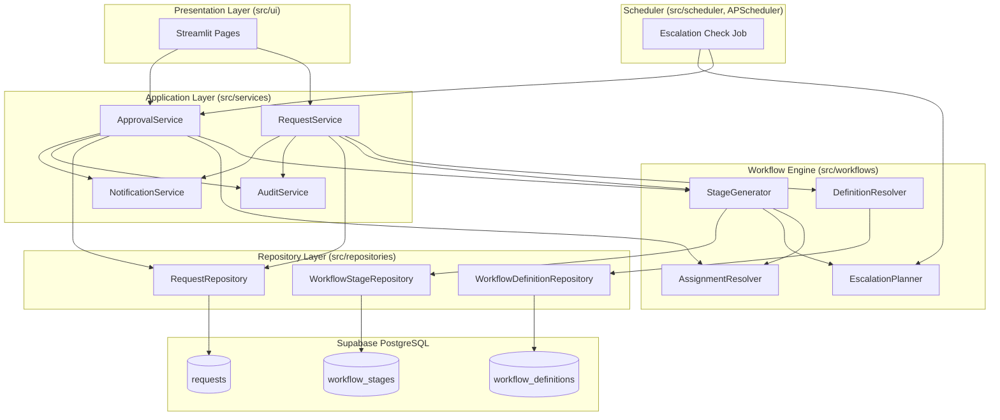
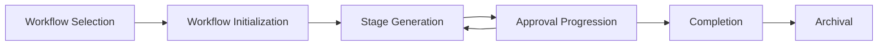
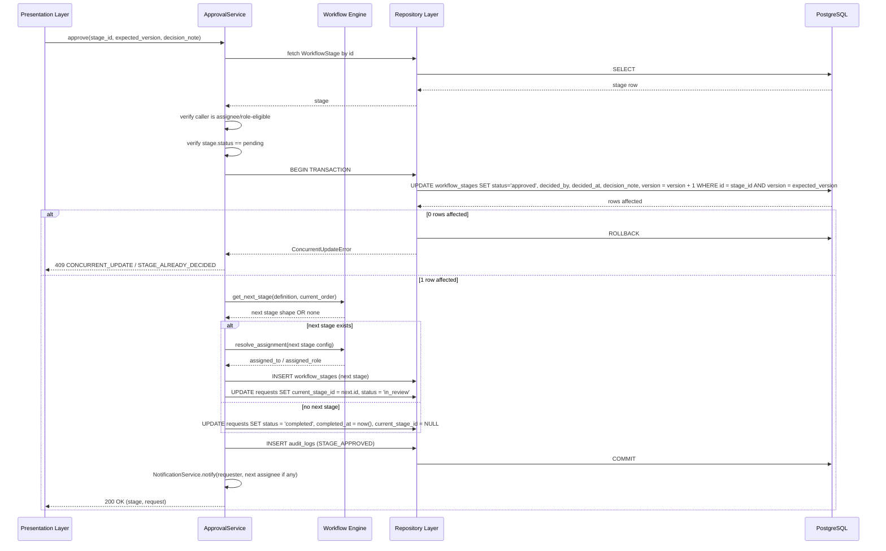
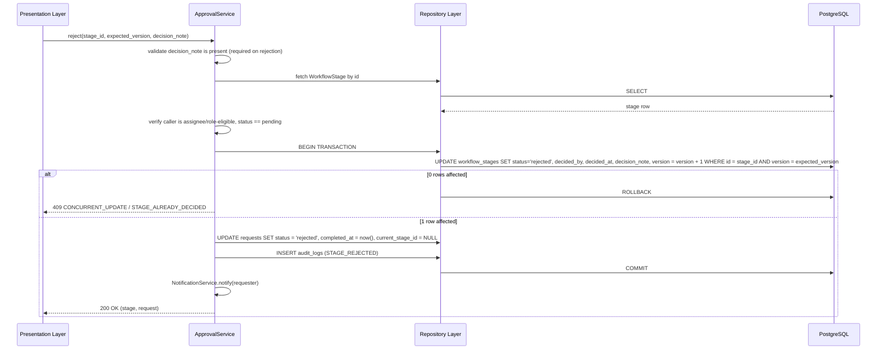
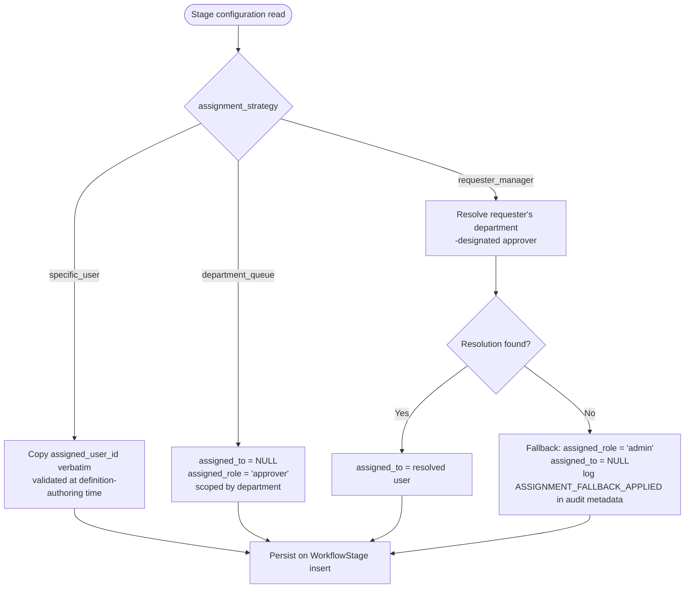
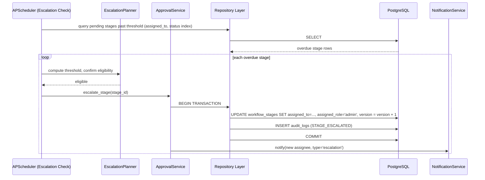
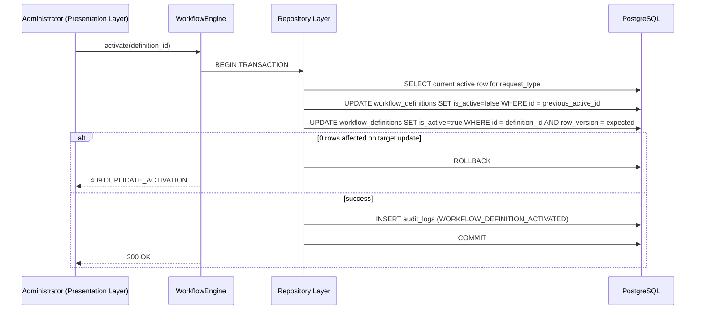
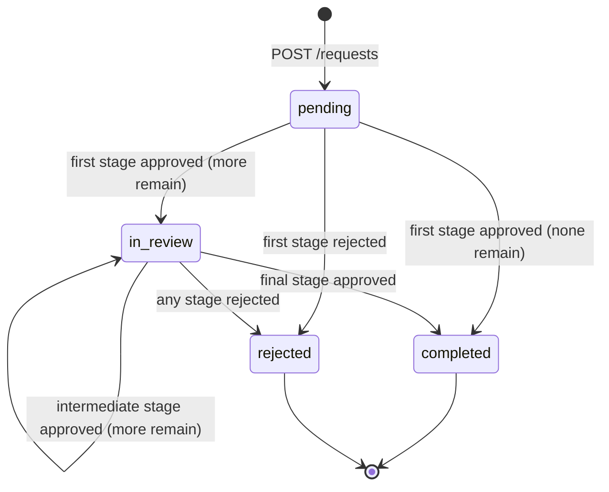
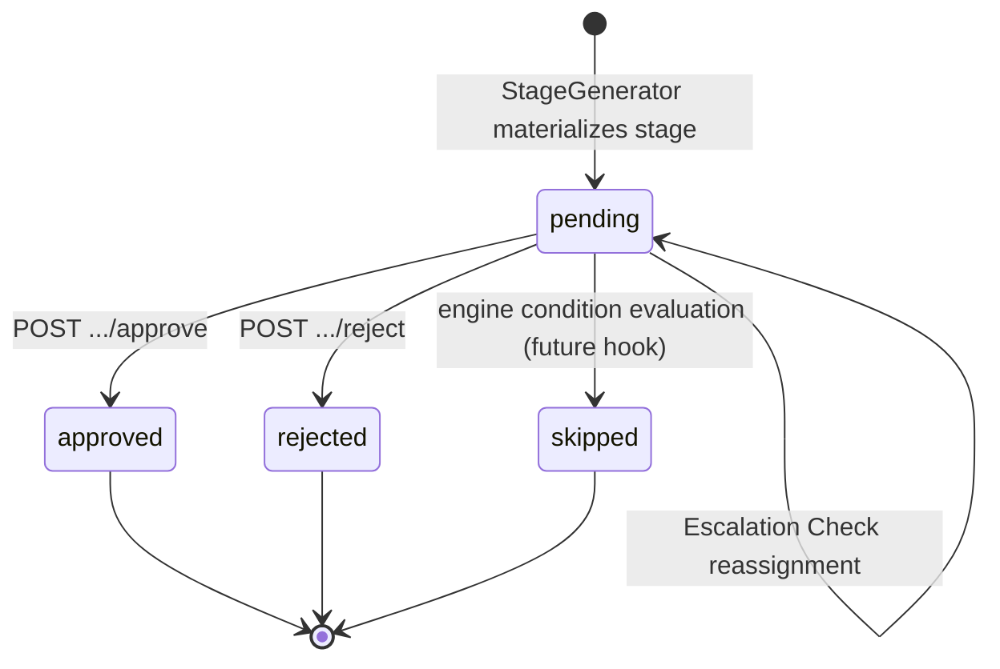
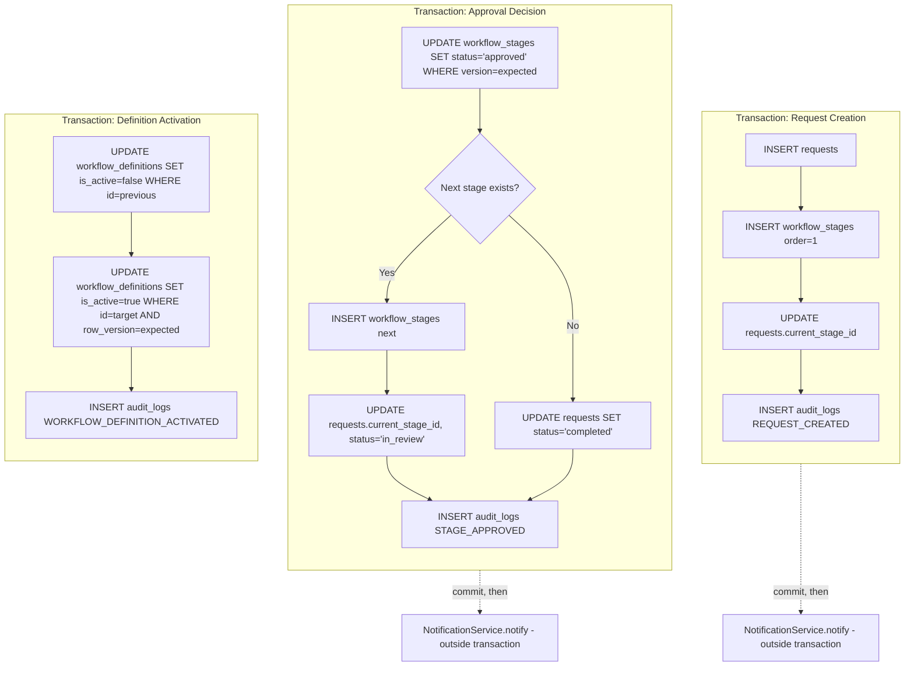

# Enterprise Automation Hub (EAH)
## Workflow Engine Design Document (WEDD)

**Version:** 1.0
**Status:** Finalized — consistent with the SRS, Architecture Design Document (ADD), Database Schema Design Document (DSD), and API Design Document (API-ADD)
**Author:** Principal Software Architect
**Component Under Design:** `src/workflows` (the Workflow Engine) and its immediate collaborators (`ApprovalService`, `RequestService`, `AuditService`, `NotificationService`, the APScheduler-based Scheduler)

---

## 1. Overview

### 1.1 Purpose

This document specifies the design of the Workflow Engine — the component responsible for determining, at every point in a request's life, what approval stage exists, who is responsible for it, what happens when it is decided, and when the request is finished. Every other document in this project's architecture set treats the Workflow Engine as a black box that "resolves stages" and "advances requests." This document opens that box.

### 1.2 Scope

This document covers the Workflow Engine proper (`src/workflows`), its direct collaboration with `ApprovalService`, `RequestService`, `AuditService`, and `NotificationService` (all in `src/services`, per the ADD), and its relationship to the Scheduler's escalation and reminder jobs (`src/scheduler`). It does not re-specify the REST contract (API-ADD owns that), the table structures (DSD owns that), or the general layered architecture (ADD owns that) — it references all three and adds the operational detail specific to workflow execution that none of them fully expand.

### 1.3 Objectives

- Provide a single, precise account of how a `WorkflowDefinition`'s JSON document becomes a running sequence of `WorkflowStage` rows.
- Make explicit every transaction boundary, concurrency control, and audit obligation the Workflow Engine participates in, so that behavior under failure or concurrent access is never left to inference.
- Establish the extensibility points (assignment strategies, escalation configuration, future branching) so that the engine's configuration-driven design is demonstrably capable of absorbing new requirements without a rewrite.

### 1.4 Relationship to Other Architecture Documents

| Document | What It Owns | What This Document Adds |
|---|---|---|
| SRS | Functional requirements (what workflows must accomplish) | How the engine satisfies them mechanically |
| ADD | Layering, component responsibilities, the Workflow Engine's place among other components | The Workflow Engine's *internal* architecture |
| DSD | Table structure, constraints, RLS, transaction list | The *sequencing and rationale* behind each transaction the Workflow Engine triggers |
| API-ADD | The REST contract, endpoint-level transaction guarantees, state transition tables | The *engine-internal* logic that those endpoints invoke |

This document introduces no new tables, no new enums, and no new endpoints. Every entity, column, enum value, and endpoint referenced below is defined in one of the four documents above and is used here exactly as defined there.

### 1.5 Workflow Engine Responsibilities

The Workflow Engine is responsible for exactly four things, and nothing beyond them:

1. **Resolving** which `WorkflowDefinition` version governs a given request type, at the moment a request is submitted (never re-resolved afterward — see Section 9.6).
2. **Generating** the ordered sequence of `WorkflowStage` rows implied by that definition, one stage at a time, as the request progresses (not all at once — see Section 4.3).
3. **Resolving assignment** — determining which user or role is responsible for a given stage, according to that stage's configured assignment strategy.
4. **Determining what comes next** — given a decided stage, whether another stage exists, and if not, what terminal state the request reaches.

The Workflow Engine does **not** decide approvals (that is `ApprovalService`, Section 6), does **not** write audit entries or send notifications itself (those are `AuditService` and `NotificationService`, invoked by the orchestrating Application Service), and does **not** touch Supabase directly (that is the Repository Layer, per the ADD). This separation is deliberate: the Workflow Engine is a pure decision-making component, and every side effect it implies is executed by the service that orchestrates it.

### 1.6 Design Philosophy

The Workflow Engine exists because approval processes in the target organization vary by request type and change over time, and hard-coding each variant as a Python conditional would violate the ADD's Single Responsibility and configuration-driven-workflow principles. The engine's entire design follows from one governing idea, stated in the DSD and repeated here because everything else depends on it:

> **A workflow definition is data. A request's execution of that definition is state. The two are never conflated.**

Concretely, this means: editing a `WorkflowDefinition` never alters a request already in flight (Section 9.6); a `WorkflowStage` is a durable, decided-once record of what actually happened, not a live pointer into the definition's JSON; and every transition the engine causes is expressed as an ordinary database transaction, never as an in-memory-only decision that could be lost on process restart (Section 8.6 addresses this directly for the Scheduler).

---

## 2. Workflow Engine Architecture

### 2.1 Internal Architecture

The Workflow Engine is not a single class; it is a small internal module composed of four focused collaborators, each with one responsibility, living entirely inside `src/workflows`:

| Internal Component | Responsibility |
|---|---|
| `DefinitionResolver` | Given a `request_type`, retrieves the active `WorkflowDefinition` and parses its `definition` JSON into an in-memory, validated structure (Section 13.1). |
| `StageGenerator` | Given a resolved definition and a request, materializes the *next* `WorkflowStage` row — either the first stage at request creation, or the successor stage after a decision (Section 4.3, Section 6.4). |
| `AssignmentResolver` | Given a stage's configured `assignment_strategy`, determines the concrete `assigned_to` (a specific user) or `assigned_role` (a role-eligible pool) for that stage (Section 7). |
| `EscalationPlanner` | Given a stage's `escalation_hours` configuration, computes the timestamp after which that stage is eligible for the Scheduler's Escalation Check job to act on it (Section 8). |

None of these four components perform I/O. They are pure functions over data already fetched by the calling Application Service, which keeps the Workflow Engine trivially unit-testable (per the ADD's Testability principle) without a database or Supabase client in the test harness — every scenario in Section 13 is expressed as a plain pytest case against these four components in isolation.

### 2.2 Components and Responsibilities Diagram

### 2.3 Service Interactions

`RequestService` calls the Workflow Engine exactly twice in a request's lifetime under normal operation: once at creation (`DefinitionResolver` + `StageGenerator` to produce the first stage) and never again directly — every subsequent stage is generated by `ApprovalService` as a *consequence* of a decision, not by `RequestService` re-invoking the engine independently. This asymmetry is intentional: it keeps "what happens after a decision" logic in exactly one place (`ApprovalService`, Section 6), rather than splitting stage-advancement logic between two Application Services.

`ApprovalService` calls the Workflow Engine once per decision: after recording the outcome of the current stage, it asks `StageGenerator` whether another stage follows, and if so, calls `AssignmentResolver` to resolve the new stage's assignee before persisting it.

### 2.4 Repository Interactions

The Workflow Engine itself never calls a repository. All repository calls needed to serve the engine's decisions are made by the orchestrating Application Service (`RequestService` or `ApprovalService`), which fetches the data the engine's pure functions need (the active `WorkflowDefinition`, the current `WorkflowStage`, candidate assignees for a role) and passes it in as plain Python arguments. This keeps the boundary between "decision logic" (the engine) and "data access" (repositories) exact, per the ADD's layering rule that repositories are the only components that touch the Supabase client.

### 2.5 Database Interactions

By extension, the Workflow Engine has no direct database interaction. Every database interaction implied by its decisions — inserting a `WorkflowStage` row, updating `requests.current_stage_id`, writing an `AuditLogEntry` — is executed by the Repository Layer, within transaction boundaries owned by the calling Application Service (Section 11), not by the engine.

---

## 3. Workflow Definition Model

### 3.1 Workflow Definitions

A workflow definition is a versioned JSON document, stored in `workflow_definitions.definition` (DSD Section 3.2), describing the ordered list of stages that apply to one `request_type`. The Workflow Engine treats this JSON as its sole configuration source — there is no Python code anywhere in `src/workflows` that hard-codes a specific request type's approval chain, per the ADD's configuration-driven-workflows principle.

### 3.2 Versioning Strategy

Each row in `workflow_definitions` is one immutable version of one request type's definition, identified by the pair (`request_type`, `version`), unique per the DSD's constraint. A version, once created, is never mutated in place if it has ever been activated or referenced by a request (DSD relationship rules, Section 4 of that document); the only mutable window is between creation and first activation (API-ADD Section 19.9.2). This gives the Workflow Engine a critical guarantee it relies on throughout this document: **a `WorkflowDefinition` a request was created under is exactly the same document today as it was at creation time.** No part of the engine's logic needs to account for a definition changing underneath a running request, because the schema and the activation workflow make that impossible.

### 3.3 Active / Inactive Workflows

At most one version per `request_type` has `is_active = true` at any moment (DSD Section 3.2's business rule, enforced by the atomic activation transaction in Section 9.3 of this document). `DefinitionResolver` always resolves the active version at request-creation time; inactive versions are retained purely as historical record and as edit targets for administrators preparing a future version (API-ADD Section 19.9.2).

### 3.4 Request Type Mapping

`requests.request_type` is a denormalized text field (DSD Section 3.3) that both identifies which definition governs the request and is retained on the row after creation, independent of `workflow_definition_id`. The Workflow Engine uses `request_type` only at the moment of resolution (Section 5.2); after that moment, `requests.workflow_definition_id` — not `request_type` — is the authoritative pointer to the exact version this specific request is running under, which is what makes the guarantee in Section 3.2 operative in practice, not just in principle.

### 3.5 Stage Configuration

Each entry in `definition.stages` (DSD Section 5.2) is validated (Section 13.1) to include, at minimum:

| Field | Purpose |
|---|---|
| `order` | The stage's position (1-indexed, `> 0`, unique within the document) — `StageGenerator` reads stages strictly in this order. |
| `name` | Human-readable label, copied verbatim into `workflow_stages.stage_name` at generation time. |
| `assigned_role` | The role eligible to act on this stage, used when `assignment_strategy` does not resolve to a single specific user. |
| `assignment_strategy` | One of the strategies in Section 7 (`requester_manager`, `department_queue`, `specific_user`). |
| `escalation_hours` | The duration after which this stage becomes eligible for escalation (Section 8). |

Additional strategy-specific fields (`department`, `assigned_user_id`) are present conditionally, per the strategy in use (Section 7).

### 3.6 Assignment Strategies

Summarized here and detailed in Section 7: `requester_manager` (resolve to the requester's manager, itself a `profiles` lookup), `department_queue` (resolve to the `approver` role pool within a named department, left unassigned to a specific user until claimed), and `specific_user` (a fixed, named individual, by `profiles.id`).

### 3.7 Escalation Configuration

`escalation_hours` on each stage is the sole escalation input the Workflow Engine's `EscalationPlanner` consumes; it is a duration, not an absolute timestamp, so definitions remain portable across time zones and are unaffected by when a particular request happens to be created. Section 8 covers how this duration becomes an actionable escalation.

---

## 4. Workflow Lifecycle

### 4.1 Lifecycle Overview

A request's workflow passes through six conceptual phases. This section describes each; Section 5 (Request Processing) and Section 6 (Approval Engine) provide the detailed execution flow behind the middle phases.

### 4.2 Workflow Selection

Triggered by `POST /api/v1/requests` (API-ADD Section 19.3.1). `DefinitionResolver` looks up the single active `WorkflowDefinition` row for the submitted `request_type`. If none is active, the request is rejected at the API boundary with `422 INVALID_REQUEST_TYPE` (API-ADD Section 11.3) before any `requests` row is created — selection failure is a validation failure, not a workflow-execution failure, and is deliberately kept out of the transactional path described in Section 5.

### 4.3 Workflow Initialization

Once a definition is resolved, `RequestService` begins the transaction described in Section 5.4: the `requests` row is inserted with `workflow_definition_id` pinned to the resolved version's `id`. Initialization does **not** materialize every stage in the definition up front. Only the first (`order = 1`) `WorkflowStage` row is created at this point. This is a deliberate design choice, expanded in Section 4.6.

### 4.4 Stage Generation

Each time a stage is decided (approved), `StageGenerator` is invoked again — this time by `ApprovalService` — to materialize the next stage in sequence, if one exists (Section 6.4). Stage generation is therefore incremental across the request's lifetime, not a single batch operation at creation.

### 4.5 Approval Progression

The cycle of "a pending stage exists → it is decided → the next stage is generated (or the request completes)" repeats until no further stage exists in the definition. This is the loop drawn as `D → C → D` in Section 4.1's diagram.

### 4.6 Why Stages Are Generated Incrementally, Not Eagerly

An eager design — materializing all `N` stages at request-creation time — was considered and rejected for three reasons:

- **Assignment resolution can depend on prior decisions.** A future extension (Section 20.2, conditional branching) may need a stage's assignee, or even its existence, to depend on an earlier stage's outcome. Eager generation would require re-computing or discarding speculatively-created rows; incremental generation has no such problem because a stage is only ever created once its predecessor's outcome is known.
- **Audit clarity.** An eagerly-generated "future" stage sitting in `pending` status before any prior stage has been touched would be indistinguishable, from the audit trail's perspective, from a stage that is genuinely next in line to act on. Incremental generation means a `WorkflowStage` row's mere existence is itself meaningful: it exists because it is either the current stage or a completed one.
- **Consistency with the DSD's transaction list.** DSD Section 11 defines "Approval decision" as a transaction that conditionally inserts the *next* stage — this document's design is the reason that transaction is defined the way it is, not an independent choice made later.

### 4.7 Completion

A request reaches `completed` when the final stage in the definition is approved, or `rejected` when any stage is rejected (API-ADD Section 20.1's state transition table, reproduced and expanded in Section 10 of this document). Completion is a property of the `requests` row (`status`, `completed_at`); no `workflow_stages` row is created to represent "the request is now done" — the absence of a next stage, combined with the terminal `Request.status`, is a sufficient and sufficiently auditable signal.

### 4.8 Archival

EAH does not implement a distinct "archival" data state — a completed or rejected request remains in `requests` indefinitely, at full fidelity, per the DSD's design (no partitioning is required at the stated scale, DSD Section 12.4, though DSD Section 14 identifies partitioning by `created_at` as the natural future extension for `audit_logs` and `notifications` if volume ever demands it). "Archival," for the Workflow Engine's purposes, means only that a request in a terminal `status` is no longer eligible for the Scheduler's Escalation Check job (Section 8.2) — archival is a behavioral exclusion, not a data migration.

---

## 5. Request Processing

### 5.1 Overview

This section describes, in full, the internal execution path of `POST /api/v1/requests` (API-ADD Section 19.3.1), from the moment `RequestService.submit_request(...)` is invoked to the moment control returns to the Presentation Layer.

### 5.2 Validation

Before any Workflow Engine involvement, the submitted payload is validated as a Pydantic v2 `RequestCreate` model (ADD Domain Layer): `title` length, `description` length, and the `request_type` string's basic shape. This is *shape* validation, distinct from *workflow* validation (Section 13.1), and happens first because there is no point resolving a definition for a payload that is not even structurally well-formed.

### 5.3 Workflow Lookup

`RequestService` calls `DefinitionResolver.resolve(request_type)`. This is a single indexed read against `workflow_definitions` (DSD Section 10.1: partial index on `is_active`), not a transactional operation — a failed lookup (no active definition) short-circuits before any transaction begins, returning `422 INVALID_REQUEST_TYPE`.

### 5.4 Stage Creation and Transaction Boundaries

With a definition resolved, `RequestService` opens a single database transaction (DSD Section 11, "Request creation"; API-ADD Section 21.1) that performs, in order:

1. `INSERT` into `requests` (`status = pending`, `workflow_definition_id` pinned).
2. `StageGenerator` produces the first stage's shape (`stage_order = 1`, `stage_name`, `assigned_role`) from the resolved definition.
3. `AssignmentResolver` resolves the concrete `assigned_to`/`assigned_role` for that first stage (Section 7).
4. `INSERT` into `workflow_stages` for the resolved first stage.
5. `UPDATE requests.current_stage_id` to point at the newly created stage.
6. `INSERT` into `audit_logs` (`REQUEST_CREATED`).

All six steps commit atomically or not at all. This is the same transaction already named in the DSD and API-ADD; this document's contribution is the explicit ordering above and the rationale that assignment resolution (step 3) must occur *inside* the transaction, not before it — resolving an assignee is itself a read against `profiles` (Section 7) that could, in principle, race against a concurrent role change (e.g., an administrator reassigning a manager relationship); performing it inside the same transaction as the stage insert means the resolved assignee and the persisted stage are always consistent with each other at the instant of commit.

### 5.5 Assignment Resolution

Detailed fully in Section 7; summarized here as step 3 above, occurring after the definition is resolved but before the stage row is written, so that `assigned_to`/`assigned_role` are populated at insert time, never as a follow-up update.

### 5.6 Audit Logging

The `audit_logs` insert (step 6) is not a side effect bolted onto the transaction — it is one of the six statements that must commit atomically, per the ADD's Immutable Audit Logs principle and the DSD's transaction list. If the audit insert were to fail (e.g., a constraint violation on `action`), the entire transaction rolls back, including the `requests` and `workflow_stages` inserts — a request is never observably created without a corresponding audit trail entry.

### 5.7 Notification Generation

`NotificationService.notify(...)` is invoked **after** the transaction in Section 5.4 commits, not inside it. This is a deliberate boundary, distinct from the treatment of the audit insert: a notification (in-app row plus SMTP dispatch, per the ADD) is a best-effort side effect of a fact that is already durably true (the request and its first stage exist), whereas the audit entry is part of the fact itself. A failure to send the notification email does not roll back the request's creation — it is logged and, at most, retried by the Scheduler's Reminder Dispatch job later (Section 8.3) — consistent with the ADD's explicit statement that in-app and email notification are independent effects.

### 5.8 Failure Handling and Rollback Strategy

| Failure Point | Behavior |
|---|---|
| Payload fails shape validation (Section 5.2) | Rejected before any transaction begins; no rows written. |
| No active `WorkflowDefinition` for `request_type` (Section 5.3) | Rejected before any transaction begins; `422 INVALID_REQUEST_TYPE`. |
| Any statement within the Section 5.4 transaction fails (constraint violation, connection loss) | Full transaction rollback; no `requests`, `workflow_stages`, or `audit_logs` row persists; the client receives `500 INTERNAL_ERROR` or a specific `422`/`409`, per API-ADD Section 11, and may safely retry per API-ADD Section 14.3 since nothing committed. |
| `AssignmentResolver` cannot resolve any assignee (Section 7.5) | Handled as a fallback within the transaction (assignment to an escalation-eligible unassigned role state), not a hard failure — Section 7.5 details this explicitly; the request is still created. |
| Notification dispatch fails (Section 5.7) | Logged; does not roll back or fail the request-creation response, since it occurs after commit. |

There is no compensation/undo logic required for request creation, because the only failure modes that matter (everything in Section 5.4) are handled by the transaction's own atomicity — there is no scenario in which a partial, inconsistent state is observably persisted.

---

## 6. Approval Engine

### 6.1 Overview

The Approval Engine is not a separate module from the Workflow Engine; it is `ApprovalService` (`src/services`), which owns the act of deciding a stage and orchestrates the Workflow Engine's `StageGenerator` to determine what follows. This section describes that orchestration in full, corresponding to `POST /api/v1/workflow-stages/{id}/approve` and `/reject` (API-ADD Section 19.5).

### 6.2 Approval Processing

### 6.3 Rejection Processing

Rejection never generates a next stage — `StageGenerator` is not invoked at all on the rejection path, since a rejected request's workflow is, by definition, finished (API-ADD Section 20.1).

### 6.4 Stage Completion and Next-Stage Generation

"Stage completion" refers to a `WorkflowStage` reaching a terminal per-stage status (`approved`, `rejected`, or `skipped`, per API-ADD Section 20.2). Only an `approved` outcome triggers next-stage generation; `rejected` terminates the request; `skipped` (Section 6.7) behaves like `approved` for the purpose of advancing to the next stage, but is never the direct result of a user action — it is the Workflow Engine's own determination that a stage's configured condition does not apply to this request (a forward-looking hook for Section 20.2's conditional branching, not exercised by any strategy in this baseline).

### 6.5 Workflow Completion

A request transitions to `completed` under exactly one condition: the stage just approved was the last (`order = N`, no `order = N+1` in the definition). This check is a simple comparison performed by `StageGenerator.get_next_stage` — it returns `None` when no further stage exists, and `ApprovalService` treats a `None` result as the completion trigger, per the sequence diagram in Section 6.2.

### 6.6 Decision Notes

`decision_note` is optional on approval and **required** on rejection (API-ADD Section 19.5.2), a business rule enforced by `ApprovalService` before the transaction begins (a missing note on rejection fails fast, per the ADD's Fail Fast Validation principle, without ever opening a transaction that would need to be rolled back). The rationale: an approval's absence of commentary is unremarkable, but a rejection without a stated reason leaves the requester with no actionable path forward, which the SRS's usability expectations do not tolerate.

### 6.7 Audit Generation

Every decision — approve or reject — writes exactly one `audit_logs` entry (`STAGE_APPROVED` or `STAGE_REJECTED`) within the same transaction as the stage and request updates (DSD Section 11, "Approval decision"; API-ADD Section 21.4). No decision is ever observable in `workflow_stages` without a corresponding, atomically-committed audit entry.

### 6.8 Notification Generation

Per Section 5.7's rationale, notification dispatch happens after the transaction commits: a `decision` notification to the requester always; an `assignment` notification to the next stage's resolved assignee, only when a next stage was created; nothing further on completion beyond the `completion` notification (also post-commit) when the request reaches a terminal state.

### 6.9 Concurrent Approval Handling

Two approvers (or an approver and a role-eligible peer) may load the same `pending` stage simultaneously. The engine does not prevent this at read time — no row lock is taken on `SELECT` — because doing so would hold a database lock for the duration of a human's review, which is unacceptable for interactive latency at the DSD's stated concurrency (DSD Section 12.4, 50 concurrent users). Instead, the conflict is detected, not prevented, exactly once, at the moment of the conditional `UPDATE` in Section 6.2's diagram (Section 12 expands this fully).

### 6.10 Optimistic Locking

The `UPDATE ... WHERE id = stage_id AND version = expected_version` pattern (DSD Section 3.9) is the single mechanism by which a second, late decision against an already-decided stage is rejected. `expected_version` is supplied by the client from the last state it observed (API-ADD Section 19.5.1); if omitted, the server uses the version it itself just fetched in the same request-handling flow (Section 6.2's "fetch WorkflowStage by id" step), which still detects any conflict that occurred between that fetch and the subsequent `UPDATE`, though supplying it explicitly narrows the window further by making the check meaningful even against a `GET` performed several UI interactions earlier.

---

## 7. Assignment Resolution

### 7.1 Overview

`AssignmentResolver` is the Workflow Engine component responsible for turning a stage's `assignment_strategy` configuration (DSD Section 5.2) into a concrete `assigned_to` and/or `assigned_role` value on the `WorkflowStage` row about to be inserted (Section 5.4, Section 6.4).

### 7.2 User Assignment (`specific_user`)

The definition names an exact `profiles.id` (`assigned_user_id`). `AssignmentResolver` validates, at the time the *definition* is created or edited (API-ADD Section 19.9.1, `422 UNKNOWN_ASSIGNEE` otherwise), that this id resolves to an existing profile — this validation happens once, at definition-authoring time, not repeated at every request's stage-generation time, since the definition is immutable once activated (Section 3.2). At stage-generation time, resolution is a pure copy: `assigned_to = definition.assigned_user_id`, `assigned_role = NULL`.

### 7.3 Role Assignment (`department_queue`)

The definition names an `assigned_role` (always `approver` in practice, since that is the only role eligible to decide stages, per API-ADD Section 6.2) and a `department`. `AssignmentResolver` does **not** resolve this to a single user — `assigned_to` is left `NULL`, and `assigned_role`/an implied department scope is what makes the stage visible to the correct pool of approvers via `GET /api/v1/approvals/pending` (API-ADD Section 19.5.3), which filters on `assigned_to = caller.id OR (assigned_role = caller.role AND caller.department matches)`. This is a deliberate "queue" semantic: the first eligible approver from that department to act on the stage decides it, and the optimistic-locking check in Section 6.10 is what prevents two members of that pool from both successfully deciding it.

### 7.4 Manager Assignment (`requester_manager`)

The definition specifies no user at all; instead, `AssignmentResolver` performs a lookup — the requester's own `profiles` row is expected to carry a `manager_id`-style relationship (or, in the current baseline, department-based resolution to the department's designated approver where an explicit manager hierarchy is not yet modeled — Section 7.6 discusses this limitation candidly). This is the one assignment strategy that depends on data outside the definition itself (the requester's own profile), which is why it is resolved fresh at stage-generation time rather than validated once at definition-authoring time, unlike `specific_user` (Section 7.2).

### 7.5 Fallback Behavior and Missing Assignee Handling

If `requester_manager` resolution fails to find an eligible manager (e.g., the requester's department has no designated approver configured), the Workflow Engine does not fail the request-creation transaction (Section 5.8's table). Instead, it falls back to `assigned_role = 'admin'`, `assigned_to = NULL` — routing the stage to administrator attention as a safety net, and logs this fallback explicitly in the `audit_logs` entry's `metadata` (Section 14.1) so the gap in department configuration is visible to whoever reviews the audit trail, rather than silently swallowed. This fallback is the one case in this document where the Workflow Engine's decision is influenced by an operational gap rather than a clean configuration path, and it is documented here precisely so it is never mistaken for a bug during a future review.

### 7.6 Known Limitation

The current data model (DSD Section 3.1, `profiles`) does not include an explicit manager-hierarchy column; `requester_manager` in this baseline resolves via the requester's `department`, treating "the department's designated approver" as a practical stand-in for "the requester's manager." This is a scoped, documented simplification, not an oversight — Section 20 identifies a proper manager hierarchy as a natural, additive schema extension (a nullable `profiles.manager_id` self-reference) that would slot into this exact resolution point without altering the Workflow Engine's external behavior.

### 7.7 Future Extensibility

Because `AssignmentResolver` dispatches purely on the `assignment_strategy` string, adding a new strategy (e.g., `round_robin`, `load_balanced`) is an additive change: a new branch in the resolver, a new strategy-specific field or two in the JSON schema (DSD Section 5.3's rationale for choosing JSON specifically applies here), and no change whatsoever to `StageGenerator`, `ApprovalService`, or any table structure.

---

## 8. Escalation Engine

### 8.1 Overview

The Escalation Engine is not a fifth Workflow Engine component; it is the combination of `EscalationPlanner` (a pure function, Section 2.1) and the Scheduler's **Escalation Check** job (`src/scheduler`, per the ADD), which is the only part of this entire document that runs outside the request/response cycle of Sections 5–7.

### 8.2 Escalation Scheduling

`EscalationPlanner` does not schedule anything itself in the sense of creating a timer; "scheduling" here means computing, from a stage's `created_at` and its definition's `escalation_hours`, the threshold timestamp after which that stage is *eligible* for escalation. This threshold is not persisted as a separate column — it is computed on demand by the Escalation Check job each time it runs, from `workflow_stages.created_at + interval` (definition-supplied `escalation_hours`), keeping the schema exactly as specified in the DSD (no new column was introduced to support this document).

### 8.3 Timeout Handling and Reminder Generation

The Scheduler runs two distinct jobs, per the ADD's Scheduler component:

- **Escalation Check** (hourly): finds `workflow_stages` rows with `status = pending` whose computed threshold (Section 8.2) has passed, for requests whose `status` is not yet terminal (Section 4.8's archival exclusion), and invokes `ApprovalService`'s escalation path — reassigning the stage to `assigned_role = 'admin'` (mirroring the fallback in Section 7.5) or to a configured escalation contact, and dispatching an `escalation` notification.
- **Reminder Dispatch** (daily): finds the same class of overdue-but-not-yet-escalated stages on an earlier timeline and dispatches a `reminder` notification (including email, per the ADD's baseline) to the current assignee, without altering the stage's assignment.

Both jobs query `workflow_stages` through the same composite index used by the approver's own pending-approvals view (`(assigned_to, status)`, DSD Section 10.2), so escalation and reminder queries are index-backed at the same cost as an interactive request, never a full-table scan.

### 8.4 Escalation Routing

When the Escalation Check job acts on a stage, it does not create a new `workflow_stages` row — it *reassigns* the existing pending stage (an `UPDATE` of `assigned_to`/`assigned_role`, guarded by the same optimistic-locking `version` column, Section 12.2, so that an escalation reassignment cannot race against a human decision arriving at the same moment) and writes an `audit_logs` entry (`STAGE_ESCALATED`) documenting the reassignment, including the prior assignee for traceability.

### 8.5 Scheduler Interaction

The Escalation Check job calls into `ApprovalService` (specifically, a narrow `escalate_stage` method, not the public `approve`/`reject` API surface) exactly the way the Presentation Layer calls into it, per the ADD's explicit statement that scheduled jobs "call into Application Services exactly the way the UI does." No separate code path exists for system-initiated stage reassignment; the same transaction and audit guarantees in Sections 6.7 and 11 apply identically whether the caller is a human approver or the Scheduler.

### 8.6 Recovery After Restart

Because escalation eligibility is computed on demand from durable columns (`workflow_stages.created_at`, the definition's `escalation_hours`) rather than from an in-memory timer, a process restart loses nothing: the next Escalation Check run (per APScheduler's own persisted or immediately-rescheduled job trigger, running in-process per the ADD) simply re-evaluates every currently-pending stage against the same threshold calculation and acts on any that qualify, exactly as if no restart had occurred. This is the direct payoff of the design principle in Section 1.6 — because a workflow definition is data and a request's state is data, there is no engine-internal state that could be lost between a shutdown and the next scheduler tick.

---

## 9. Workflow Versioning

### 9.1 Creation

`POST /api/v1/workflow-definitions` (API-ADD Section 19.9.1) inserts a new `workflow_definitions` row with `is_active = false`. Creation is not transactionally coupled to anything else — it is a single-row insert, since no request yet depends on this version (DSD Section 11 does not list definition creation as a multi-statement transaction, only activation, Section 9.3 below).

### 9.2 Activation

`POST /api/v1/workflow-definitions/{id}/activate` (API-ADD Section 19.9.3) is the one versioning operation that is genuinely transactional: it deactivates the previously active version for the same `request_type` and activates the target version atomically (DSD Section 11, "Workflow definition activation"; API-ADD Section 21.7), guaranteeing the DSD's invariant of at most one active version per type at any instant.

### 9.3 Deactivation

Deactivation is never performed as an independent operation against an isolated row — it only ever happens as the automatic first half of an activation transaction (Section 9.2). There is no standalone "deactivate" endpoint or engine method, because a `request_type` with no active version would silently block all future submissions of that type, a state the system deliberately makes unreachable through its own API surface rather than defending against after the fact.

### 9.4 Version History

Every version ever created for a `request_type` remains queryable indefinitely (`GET /api/v1/workflow-definitions`, API-ADD Section 19.9.4, admin-only for inactive versions), giving a complete, ordered history of how that request type's approval chain has evolved — itself a form of configuration audit trail, distinct from but complementary to `audit_logs`.

### 9.5 Migration Strategy

Moving requests from an old version of a definition to a new one is explicitly **not** supported, and this is a design decision, not a gap: per Section 3.2's guarantee, a request's `workflow_definition_id` is permanent. "Migrating" a running request to a new definition version would require the Workflow Engine to reconcile a potentially different stage count, different assignment strategies, and different escalation timing against stages that may already be decided — a class of problem this document deliberately keeps out of scope by making the guarantee in Section 3.2 absolute rather than conditional. If a definition must change, in-flight requests finish under the version they started with; only newly submitted requests observe the new version.

### 9.6 Running Workflow Isolation

This is the same guarantee stated in Sections 3.2 and 9.5, named explicitly here because it is the single most important invariant in this document: **no code path anywhere in the Workflow Engine ever re-reads `workflow_definitions` for a request that already has a `workflow_definition_id`.** `StageGenerator.get_next_stage` (Section 6.5) operates against the specific version pinned to the request at creation, retrieved via `requests.workflow_definition_id`, never via a fresh `DefinitionResolver.resolve(request_type)` call. This is what makes concurrent definition editing (an administrator activating a new version while thousands of requests are mid-flight under the old one) completely safe without any additional locking: the two populations of requests are reading from physically different, immutable rows.

---

## 10. State Management

### 10.1 Request States

Identical to API-ADD Section 20.1, restated here with the Workflow-Engine-specific trigger column added:

| From | To | Trigger | Workflow Engine Involvement |
|---|---|---|---|
| *(none)* | `pending` | `POST /requests` | `DefinitionResolver` + `StageGenerator` (first stage) |
| `pending` | `in_review` | First stage approved, further stages remain | `StageGenerator.get_next_stage` returns a stage |
| `pending` | `rejected` | First stage rejected | None (rejection path, Section 6.3) |
| `pending` | `completed` | First (only) stage approved | `StageGenerator.get_next_stage` returns `None` |
| `in_review` | `in_review` | Intermediate stage approved, further stages remain | `StageGenerator.get_next_stage` returns a stage |
| `in_review` | `completed` | Final stage approved | `StageGenerator.get_next_stage` returns `None` |
| `in_review` | `rejected` | Any stage rejected | None |

### 10.2 Workflow States (Definition-Level)

| From | To | Trigger |
|---|---|---|
| *(none)* | `is_active = false` (draft) | `POST /workflow-definitions` |
| `is_active = false` | `is_active = true` | `POST /workflow-definitions/{id}/activate`, only if this `request_type` has no other active version at commit time |
| `is_active = true` | `is_active = false` | Only as the automatic first half of a different version's activation (Section 9.3) |

No definition ever transitions out of `is_active = true` without a replacement simultaneously transitioning in — this is the same atomic pairing described in Section 9.2, expressed here as a state table for completeness.

### 10.3 Stage States

Identical to API-ADD Section 20.2, restated with Workflow Engine detail:

| From | To | Trigger |
|---|---|---|
| *(none)* | `pending` | `StageGenerator` materializes the stage (at request creation or after a prior approval) |
| `pending` | `approved` | `POST /workflow-stages/{id}/approve` |
| `pending` | `rejected` | `POST /workflow-stages/{id}/reject` |
| `pending` | `skipped` | `StageGenerator` determines the stage's condition does not apply (Section 6.4; not exercised by any strategy in this baseline — a forward-looking hook, Section 20.2) |
| `pending` | `pending` (reassigned) | Scheduler's Escalation Check job (Section 8.4) — `status` itself does not change, only `assigned_to`/`assigned_role` |

### 10.4 Invalid Transitions

Every transition not listed in Sections 10.1–10.3 is invalid and is prevented by a combination of mechanisms, listed from earliest to latest point of prevention:

1. **API contract** — the endpoint surface itself (API-ADD Section 19) exposes no operation that could express an invalid transition (there is no `PATCH /workflow-stages/{id}` that accepts an arbitrary `status` value).
2. **Application Layer guard clause** — `ApprovalService` checks `status == pending` before accepting a decision, independent of the database.
3. **Optimistic locking** — even if two guard-clause checks both pass (a race), the `WHERE version = expected_version` predicate ensures only the first `UPDATE` actually commits (Section 6.10, Section 12).
4. **Database check constraint** — `status` is a native `stage_status`/`request_status` enum (DSD Section 1.5); a value outside the enum's declared set is rejected by PostgreSQL itself, independent of any application-level bug.

### 10.5 State Transition Diagram — Request

### 10.6 State Transition Diagram — Workflow Stage

---

## 11. Transaction Design

### 11.1 Atomic Operations

Every Workflow-Engine-triggering operation is exactly one PostgreSQL transaction, per DSD Section 11 and API-ADD Section 21. This document does not introduce any transaction not already named in those two documents; it specifies the internal statement ordering within each.

### 11.2 ACID Guarantees Applied

- **Atomicity.** Every multi-statement sequence in Sections 5.4, 6.2, 6.3, and 9.2 commits or rolls back as a unit — there is no code path that leaves, for example, a `workflow_stages` row inserted without the corresponding `requests.current_stage_id` update.
- **Consistency.** Every transaction leaves the database satisfying all declared constraints (foreign keys, enum types, the DSD Section 4.1 check constraints such as `stage_order > 0`) at commit; a transaction that would violate one is rejected by PostgreSQL itself as a final backstop behind Application Layer validation (Section 13).
- **Isolation.** `READ COMMITTED` (PostgreSQL's default, per API-ADD Section 26) is sufficient because every genuinely conflict-prone operation (a stage decision) is additionally protected by the explicit optimistic-locking predicate (Section 12), rather than relying on isolation level alone to prevent lost updates.
- **Durability.** Once a transaction in this document commits, its effect (a new stage, an advanced request status, an audit entry) survives any subsequent process restart, per Supabase's own durability guarantees (DSD Section 13) — this is what makes the recovery property in Section 8.6 true without any engine-specific persistence logic.

### 11.3 Rollback Behavior

A rollback in any transaction described in this document is a full rollback of every statement in that transaction, never a partial one — PostgreSQL does not support partial transaction commit, and this design never attempts to simulate one. The only conditional branching within a transaction (e.g., "insert next stage OR mark the request completed," Section 6.2) is a choice between two mutually exclusive statement sequences decided *before* any statement in that branch executes, not a retry of a failed statement within the same transaction.

### 11.4 Nested Operations

No transaction described in this document is nested inside another. `RequestService.submit_request` and `ApprovalService.approve`/`reject`/`escalate_stage` are each a single top-level transaction; none of them calls another Application Service method that itself opens a transaction. This flatness is intentional — nested transactions (via savepoints) would allow a partial rollback within a larger operation, which Section 11.3 explicitly states this design never requires, since every operation in this document is small enough to express as one flat sequence of statements.

### 11.5 Compensation Strategy

Because every operation is a single atomic transaction (Section 11.1), no compensating-transaction pattern (e.g., a Saga) is needed or used anywhere in the Workflow Engine — a failure at any point simply rolls back to the pre-transaction state, which is always a valid, already-correct state (the prior stage's `pending` status, the request's prior `status`), not a state requiring a separate corrective action. The one operation with a cross-boundary dependency — attachment upload, which writes to Supabase Storage before its PostgreSQL transaction (DSD Section 11) — is not a Workflow Engine operation and is out of this document's scope, though its own compensation (orphan cleanup, API-ADD Section 23) follows the same "no engine-internal state to reconcile" philosophy.

### 11.6 Transaction Boundary Diagram

---

## 12. Concurrency Design

### 12.1 Optimistic Locking

Every mutable table the Workflow Engine writes to (`workflow_stages`, `requests`, `workflow_definitions` via `row_version`) carries a `version`/`row_version` integer column, per DSD Section 3.9. Every `UPDATE` the engine or its orchestrating services issue includes a `WHERE ... AND version = expected_version` predicate and increments `version` in the same statement.

### 12.2 Version Columns in Practice

| Table | Column | Incremented By |
|---|---|---|
| `workflow_stages` | `version` | Every decision (approve/reject) and every Escalation Check reassignment |
| `requests` | `version` | Every stage advancement, completion, or rejection (since `status`/`current_stage_id` change) |
| `workflow_definitions` | `row_version` | Every activation/deactivation pair (Section 9.2) |

### 12.3 Conflict Detection

Detection, not prevention, is the chosen strategy (Section 6.9's rationale). A conflict is detected exactly at the moment the `UPDATE ... WHERE version = expected_version` statement executes and affects zero rows — this is the single, uniform detection point for every concurrency scenario in this document, whether the race is between two human approvers, between a human approver and the Escalation Check job, or between two administrators activating competing definition versions.

### 12.4 Duplicate Approval Prevention

Once a stage's `status` moves to `approved` or `rejected` within a committed transaction, its `version` has also incremented. Any subsequent decision attempt — whether a genuine duplicate submission (API-ADD Section 14.2) or a second approver who loaded the stage before the first decision committed — supplies a now-stale `expected_version` (or the server's own guard-clause check of `status == pending` fails first, per Section 10.4's layered prevention), and is rejected with `409` before any second decision is ever persisted. There is structurally no way for `workflow_stages.decided_by`/`decided_at` to be overwritten by a second decision, because the row's `status` is no longer `pending` at the time the second `UPDATE`'s `WHERE` clause is evaluated.

### 12.5 Race Condition Mitigation Summary

| Race Scenario | Mitigation |
|---|---|
| Two approvers decide the same stage simultaneously | Optimistic locking on `workflow_stages.version` (Section 12.4) |
| Escalation Check reassigns a stage while a human is mid-decision | Same `version` column; whichever `UPDATE` commits first wins, the second receives `409` and the Scheduler job logs and skips rather than retries indefinitely (Section 18.3) |
| Two administrators activate different versions of the same `request_type` concurrently | `row_version`-guarded activation transaction (Section 9.2); the second activation attempt receives `409 DUPLICATE_ACTIVATION` |
| A request's `current_stage_id` is read by a client at the same moment `ApprovalService` is advancing it | No mitigation required — `current_stage_id` is only ever read, never written, by the Presentation Layer; the read simply reflects whichever value was committed most recently, per `READ COMMITTED` isolation (Section 11.2) |

---

## 13. Validation Strategy

### 13.1 Workflow Validation

A `WorkflowDefinition`'s `definition` JSON is validated at creation/edit time (API-ADD Section 19.9.1–19.9.2), not at every stage-generation time, since the document is immutable once activated (Section 3.2). Validation checks: `stages` is a non-empty array; every `order` is a positive integer, unique within the document; every `name` is present; every `assignment_strategy` is a recognized value (Section 7); strategy-specific required fields are present (`assigned_user_id` for `specific_user`, `department` for `department_queue`); every `escalation_hours` is a positive number. A definition failing any of these checks is rejected with `422 INVALID_WORKFLOW_DEFINITION` and is never persisted, per DSD Section 5.3's acknowledgment that a JSON column cannot enforce this structurally — the Application Layer is the sole enforcement point for the JSON document's internal shape.

### 13.2 Stage Validation

At stage-generation time (Sections 5.4, 6.4), `StageGenerator` validates only that the *next* `order` value is exactly one greater than the current stage's `order` — defensive safeguard against unexpected data corruption or legacy data inconsistencies, not a repeat of the full validation in Section 13.1, since that already ran at definition-authoring time and the definition is immutable thereafter.

### 13.3 Assignment Validation

For `specific_user`, validated once at definition-authoring time (Section 7.2, `422 UNKNOWN_ASSIGNEE`). For `requester_manager` and `department_queue`, validated at resolution time (Sections 7.3–7.4) since these strategies depend on data (the requester's department, the department's approver roster) that can legitimately change between definition authoring and any given request's submission — the Workflow Engine tolerates this variability via the fallback in Section 7.5 rather than treating it as a validation failure.

### 13.4 Business Rules

Rules that depend on request or stage *state*, not merely payload shape (a stage must be `pending` to be decided; a request must be `pending` to be edited or withdrawn; only one definition version may be active per type) are enforced by the orchestrating Application Service as guard clauses before opening a transaction, and independently by the optimistic-locking predicate within the transaction (Section 12), per the same defense-in-depth pattern used throughout this project's architecture.

### 13.5 Configuration Validation

Beyond per-definition validation (Section 13.1), the Workflow Engine performs one cross-definition check at activation time (Section 9.2): confirming that activating this version will not leave any other `request_type` momentarily without an active definition — a check that is structurally guaranteed by the activation transaction only ever touching one `request_type`'s rows, never a cross-type operation, making this "check" a property of the transaction's scope rather than a separate query.

---

## 14. Audit Integration

### 14.1 Events Recorded

| Action Code | Written By | Trigger |
|---|---|---|
| `REQUEST_CREATED` | `RequestService` | Section 5.4 |
| `STAGE_APPROVED` | `ApprovalService` | Section 6.2 |
| `STAGE_REJECTED` | `ApprovalService` | Section 6.3 |
| `STAGE_ESCALATED` | `ApprovalService` (invoked by Scheduler) | Section 8.4 |
| `WORKFLOW_DEFINITION_ACTIVATED` | `WorkflowEngine` (via `WorkflowDefinitionRepository`) | Section 9.2 |
| `ASSIGNMENT_FALLBACK_APPLIED` | `RequestService`/`ApprovalService` | Section 7.5, recorded in `metadata`, not as a separate action code, since it is a detail of the stage's own creation/reassignment event, not an independent occurrence |

### 14.2 Ordering

Within a single request's history, audit entries are strictly ordered by `created_at`, and because every entry is written inside the same transaction as the state change it documents (Section 11), the audit trail's order is always identical to the true order of state changes — there is no scenario in which an entry could be written out of sequence relative to the stage/request rows it describes, since they commit together.

### 14.3 Integrity Guarantees

Per the DSD (Section 6) and unchanged by this document: `audit_logs` is append-only at the database grant level (`INSERT`/`SELECT` only), and no Workflow Engine or Application Service code path ever issues an `UPDATE` or `DELETE` against it. This document adds no exception to that rule for workflow-specific events.

### 14.4 Failure Behavior

Because the audit insert is part of the same transaction as the state change it documents (Section 5.6, 6.7), there is no failure mode in which a workflow state change is committed without its audit entry, or vice versa — the two either both commit or both roll back. This is stronger than "eventual" audit consistency; it is atomic audit consistency, by construction.

---

## 15. Notification Integration

### 15.1 Notification Generation Points

| Event | Notification `notification_type` | Recipient |
|---|---|---|
| Request created | `assignment` | First stage's resolved assignee |
| Stage approved, next stage generated | `assignment` | Next stage's resolved assignee |
| Stage approved, request completed | `completion` | Requester |
| Stage rejected | `decision` | Requester |
| Stage escalated | `escalation` | New assignee (per Section 8.4's reassignment) |
| Stage nearing threshold, not yet escalated | `reminder` | Current assignee |

### 15.2 Delivery Flow

As established in Sections 5.7 and 6.8, every notification is generated **after** its triggering transaction commits, never inside it — this is a deliberate, uniform rule across every Workflow Engine event, so that a notification-delivery failure (in-app write or SMTP dispatch) never has the power to roll back a workflow state change that has already, correctly, become true.

### 15.3 Unread State

Per the DSD (Section 8.2) and API-ADD (Section 10.6), unread state is a plain `is_read` boolean on the `notifications` row, unrelated to any Workflow Engine state — the engine only ever *creates* notifications; it never reads or reasons about their read/unread status, which is purely a Presentation Layer and `NotificationService` concern.

### 15.4 Failure Recovery

A failed in-app notification insert is retried by the calling Application Service with the same bounded-retry policy the ADD specifies for transient repository failures generally; SMTP failures are logged. The notification remains available in-app, and subsequent reminder notifications provide an eventual secondary communication channel. (Section 8.3) to effectively "catch up" on the next cycle, since a reminder for a still-pending stage is a superset of the original assignment notification's informational content — there is no dedicated retry queue for notifications specifically, consistent with the ADD's decision not to introduce a message broker.

---

## 16. Performance Considerations

### 16.1 Efficient Workflow Lookup

`DefinitionResolver`'s active-definition lookup uses the DSD's partial index on `workflow_definitions.is_active` (DSD Section 10.1), making this a near-constant-time lookup regardless of how many historical versions a `request_type` accumulates over the system's lifetime.

### 16.2 Caching Opportunities

An active `WorkflowDefinition`'s parsed JSON (post-validation, Section 13.1) is a natural candidate for short-lived, per-process in-memory caching, since it changes only on an explicit administrative activation (Section 9.2) — an infrequent event relative to request-submission volume. This mirrors the caching opportunity already identified in the API-ADD (Section 25.1) for the same endpoint; this document adds that the cache key is naturally `(request_type)` and the cache is invalidated by the activation transaction itself (a simple in-process cache-bust call from `WorkflowEngine` after Section 9.2 commits), requiring no distributed cache invalidation mechanism given the single-process deployment model (ADD Section 10). This cache strategy is intentionally limited to the baseline single-process deployment described in the ADD.

### 16.3 Database Indexing

No new index is required beyond those already specified in the DSD (Sections 10.1–10.2); this document's operations — stage lookup by `request_id`, pending-stage lookup by `(assigned_to, status)`, active-definition lookup by `is_active` — are each already served by an existing index, which is itself a consequence of this document's design having been anticipated by the DSD's indexing strategy rather than the reverse.

### 16.4 Scalability Assumptions

Consistent with the DSD's stated scale (100,000+ cumulative requests, 50 concurrent users, DSD Section 12.1), the Workflow Engine's per-request work is O(1) relative to total system size at every step described in this document — resolving a definition, generating a stage, resolving an assignment, and deciding a stage are all single-row or small-index-range operations, never operations whose cost grows with the total number of requests or historical definition versions in the system.

### 16.5 Large Workflow Support

A definition with a large number of stages (tens, not the two-or-three-stage examples used throughout this document) imposes no additional design burden: `StageGenerator`'s incremental generation (Section 4.6) means the cost of "advancing" a workflow is always the cost of generating one stage, regardless of how many stages the definition eventually contains, and the `unique (request_id, stage_order)` constraint (DSD Section 3.4) scales identically at any stage count.

---

## 17. Security Considerations

### 17.1 Authorization

Every Workflow Engine operation is reachable only through the Application Services described in this document, which enforce the RBAC rules in API-ADD Section 6 before invoking any engine logic — the engine itself performs no authorization checks, trusting its caller (an Application Service) to have already done so, consistent with the ADD's layering (the engine is a pure decision component, Section 1.5).

### 17.2 Workflow Modification Permissions

Only `admin` may create, edit, or activate a `WorkflowDefinition` (API-ADD Section 19.9), enforced at the Application Layer and independently by RLS (DSD Section 9.2's Administrator policy table) — an `employee` or `approver` attempting any of these operations is rejected with `403 PERMISSION_DENIED` before reaching the Workflow Engine.

### 17.3 Approval Permissions

Only the resolved assignee (`assigned_to`) or a role-eligible approver (`assigned_role` matching, and, for `department_queue` stages, department matching) may decide a stage (API-ADD Section 19.5.1), enforced identically at the Application Layer and via RLS (DSD Section 9.2's Approver policy table).

### 17.4 Data Integrity

Every constraint discussed in Sections 10.4 and 13 (enum-backed status columns, unique `(request_id, stage_order)`, `stage_order > 0`) is a database-level guarantee, independent of the Workflow Engine's own correctness — a defect in the engine's logic cannot produce a `workflow_stages` row that violates these constraints, because PostgreSQL itself rejects such a row at commit time (Section 11.2's Consistency guarantee).

### 17.5 Least Privilege

The Workflow Engine's own code never holds or requires the Supabase service-role credential (DSD Section 9.3) — it operates entirely on data already fetched by its calling Application Service and returns plain Python values; only the Repository Layer, one layer below the engine's callers, ever touches a Supabase client, and it is that layer, not the engine, whose privilege level is a security-relevant question.

### 17.6 RLS Interaction

Row-Level Security (DSD Section 9) is the final enforcement layer behind every Workflow Engine decision: even if an Application Service's own guard clause were defective, the underlying `UPDATE`/`INSERT` against `workflow_stages` or `requests` would still be scoped by the caller's RLS policy — a non-assignee approver's attempted decision is blocked by RLS even if an application-layer authorization defect were introduced, per the defense-in-depth principle stated throughout the ADD and DSD.

---

## 18. Error Handling

### 18.1 Workflow Errors

A "workflow error" — no active definition for a `request_type`, or a definition that fails structural validation (Section 13.1) — is surfaced as `422 INVALID_REQUEST_TYPE` or `422 INVALID_WORKFLOW_DEFINITION` (API-ADD Section 11.3) before any transaction begins, per Section 5.8's table.

### 18.2 Configuration Errors

A configuration error specific to assignment (an `assigned_user_id` that does not resolve, Section 13.3) is caught at definition-authoring time (`422 UNKNOWN_ASSIGNEE`), never at request-submission time, because Section 3.2's immutability guarantee means every assignee reference in an *activated* definition was already validated before it could ever be activated.

### 18.3 Approval Conflicts

A conflicting decision (Section 12.4) is surfaced as `409 CONCURRENT_UPDATE` or `409 STAGE_ALREADY_DECIDED`. When the conflicting party is the Scheduler's Escalation Check job rather than a second human (Section 12.5's second row), the job does not treat this as an error requiring operator attention — it logs the skipped stage at an informational level and proceeds to the next candidate in its batch, since "a human decided the stage between the query and the reassignment attempt" is the desired outcome, not a fault.

### 18.4 Assignment Failures

Covered fully in Section 7.5: a failure to resolve `requester_manager` is not an error state at all, by design — it is an anticipated fallback path, logged in audit metadata (Section 14.1) rather than surfaced to the requester as a failure, since from the requester's perspective the request was still created successfully and is simply awaiting administrator attention instead of a specific manager's.

### 18.5 Recovery Strategies

| Failure Class | Recovery |
|---|---|
| Transaction failure mid-sequence (Section 5.8, 11.3) | Automatic rollback; safe client retry (API-ADD Section 14.3) |
| Optimistic-locking conflict (Section 12) | Client re-fetches current state and, if still applicable, resubmits with the new `expected_version` |
| Assignment resolution gap (Section 7.5) | Automatic fallback to administrator attention; no manual recovery required |
| Notification delivery failure (Section 15.4) | Superseded by the next Reminder Dispatch cycle; no dedicated retry queue |
| Process restart during a pending escalation window (Section 8.6) | No recovery action needed — state is fully durable and re-evaluated fresh on the next Scheduler tick |

---

## 19. Mermaid Diagrams — Index

Every diagram requested for this section is provided in full within its most relevant section above, so that each diagram sits next to the explanatory text it illustrates rather than being separated from its context. This section indexes them for quick navigation.

| Diagram | Location |
|---|---|
| Workflow Engine architecture | Section 2.2 |
| Workflow lifecycle | Section 4.1 |
| Request processing (transaction/detail) | Section 5 (see also Section 11.6) |
| Approval processing | Section 6.2 |
| Rejection processing | Section 6.3 |
| Assignment resolution | Section 7.1 |
| Escalation flow | Section 8.6 |
| Version activation | Section 9.2 |
| State transitions (request) | Section 10.5 |
| State transitions (workflow stage) | Section 10.6 |
| Transaction boundaries | Section 11.6 |

---

## 20. Future Evolution

### 20.1 Parallel Approvals

The current model generates exactly one `pending` stage at a time (Section 4.6). Supporting parallel stages (e.g., two departments reviewing simultaneously, both required before advancing) would extend `definition.stages` with a `parallel_group` field and extend `StageGenerator` to materialize every stage in a group at once, with `ApprovalService` checking "have all stages in this group reached a terminal status" rather than "has this single stage" before advancing — an additive change to the engine's internal logic, requiring no change to `workflow_stages`' existing columns (a `parallel_group` column would be the only schema addition, itself additive per DSD Section 14).

### 20.2 Conditional Branching

The `skipped` stage status (Section 6.4, Section 10.3) already exists precisely as a forward-looking hook for this: a future `condition` field per stage (e.g., "only if `requests.department == 'finance'`") would let `StageGenerator` evaluate the condition against the request's own fields at generation time and immediately mark a non-applicable stage `skipped` rather than `pending`, advancing past it without any human action — the state model in Section 10.3 already accommodates this outcome without modification.

### 20.3 Dynamic Workflow Generation

A definition's `stages` array could, in the future, be generated programmatically (e.g., a stage per approval level implied by a monetary threshold in the request payload) rather than authored statically — this would change how `workflow_definitions.definition` is *produced* (an administrative tool, not the Workflow Engine) without changing how it is *consumed*, since `StageGenerator` only ever reads a finished JSON document regardless of how it was constructed.

### 20.4 External Approval Providers

A stage's `assignment_strategy` space (Section 7) could be extended with an `external_provider` strategy, where decision authority is delegated to a system outside EAH (e.g., a separate corporate approval tool) — the stage would remain `pending` in EAH's own model until a webhook or polling mechanism records the external decision via the same `ApprovalService.approve`/`reject` entry points already specified in Section 6, keeping the external integration point at the edge of the system rather than requiring internal changes to the transaction or audit design.

### 20.5 Event-Driven Execution

The current design invokes `NotificationService` synchronously (if after-commit, Section 15.2) from within the same process and call stack as the state change. A future event-driven variant — publishing a durable event when a stage is decided rather than calling `NotificationService` directly — would formalize the Section 15.2 "after commit" boundary as an explicit event emission, but is not required at the current scale and would need to be weighed carefully against the ADD's constraint of introducing no message broker; any such change remains a future, explicitly evaluated decision, not an assumed direction.

### 20.6 Distributed Workflow Execution

Should EAH ever need to run workflow evaluation across more than one process (beyond the single-process, in-process Scheduler model this document assumes throughout, per ADD Section 10), the guarantee in Section 9.6 — that all workflow state lives in PostgreSQL, never in engine-internal memory — is precisely what would make that transition tractable: any process holding a valid Supabase connection can resolve a definition, generate a stage, or decide an approval identically, because no part of this design depends on affinity to a specific process instance. This document does not propose implementing distributed execution; it notes that today's design does not foreclose it.

---

**Document End.** This Workflow Engine Design Document introduces no table, column, enum, endpoint, or technology not already present in the SRS, ADD, DSD, or API-ADD. Every mechanism described above — stage generation, assignment resolution, escalation, optimistic locking, transaction boundaries, and audit integration — is an elaboration of behavior those four documents already committed to, made explicit here so that implementation requires interpretation of intent as little as possible.